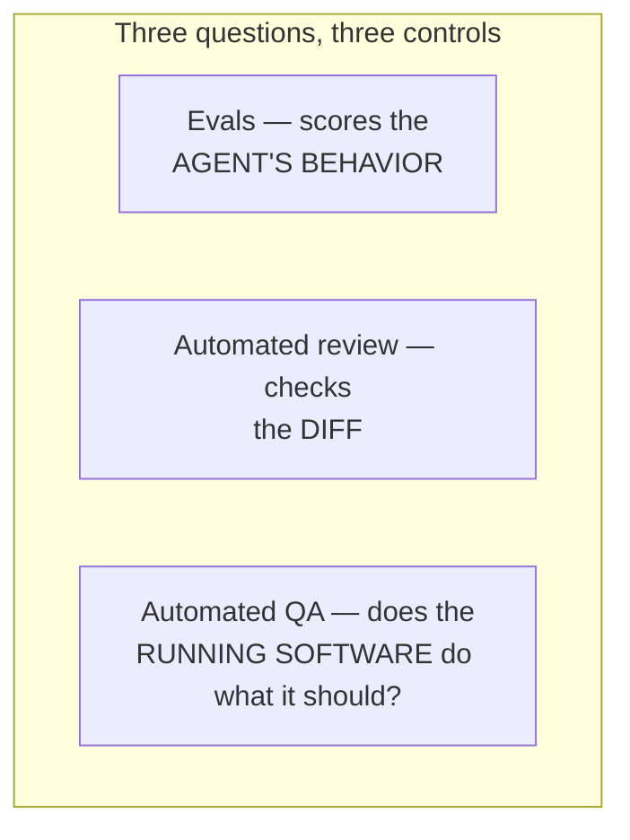

# Automated QA

Using agents to do **quality assurance at the pace agents produce code**:
generating and maintaining tests, running suites, exercising the running app
end-to-end, and surfacing regressions — so *"is it tested"* keeps up with *"is
it written."* Where humans can no longer read every diff, they certainly can't
hand-test every change, so QA itself has to be automated and agent-driven.

## Writing a catching test is its own hard problem

**SWT-Bench** (ETH Zurich + SRI Lab, NeurIPS 2024) tasks agents with writing a
test that **reproduces** a real GitHub issue: it must **fail on the broken code
and pass once the fix lands.** The leaderboard shows the difficulty — the best
entry (LogicStar's L\*Agent v1) reproduces **67.7%** of issues on SWT-Bench
Verified; strong general agents (OpenHands on GPT-5) close behind at 66.3%.

Crucially, the benchmark authors found the difficulty of **writing the test** and
the difficulty of **fixing the bug** are **not correlated** at the instance
level. Generating a test that actually catches the bug is its own hard problem —
**not a free byproduct** of generating the fix. (Reinforces
[TDD's five practices](tdd-five-practices.md) and the prove-it pattern.)

## Three complementary quality controls

Automated QA complements the other two rather than duplicating them:

- [**Evals**](evals-llm-as-a-judge.md) score the *agent's behavior*.
- [**Automated review**](automated-review-verification.md) checks the *diff*.
- **QA** asks the third question — does the *running software* actually do what
  it should?

Increasingly a step **inside a [loop](loop-engineering.md)** rather than a manual
gate: the same agents write code, write and run its tests, drive a browser to
exercise their own work, and re-run regression suites on every change.

## The honest caveat

Agents both **write and check** the tests, so QA only counts **if the tests are
real.** *An agent that writes a green test for broken code has done worse than
nothing.* SWT-Bench's grading reflects this — it credits an instance only when a
generated test **fails on the original code AND doesn't spuriously fail on the
fixed code**, because a test that passes regardless of correctness proves
nothing. With even specialized testing agents topping out around **two-thirds**
of real issues reproduced, automated QA reduces the manual testing burden
**without eliminating** the need to verify the safety net has holes in the
*right* places, not the wrong ones.

## Related

- [Evals & LLM-as-a-Judge](evals-llm-as-a-judge.md) — scores behavior, not the
  running software.
- [TDD and Its Five Supporting Practices](tdd-five-practices.md) — reproducing
  tests as spec-by-example.
- [Loop Engineering](loop-engineering.md) — QA as a loop step, not a gate.

## References
- [Automated QA — Tessl Patterns](https://tessl.io/patterns/quality-security/automated-qa/)
