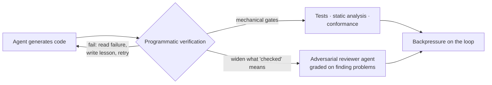

# Automated Review & Verification

Checking AI-generated code with **machines, not just human eyes** — because
agents now produce code faster than people can read it. As generation gets
cheap, **review becomes the bottleneck**, so verification **shifts left and goes
programmatic.** Geoffrey Huntley: *"A loop without verification just produces
wrong software faster."*

## What "programmatic review" means

- Tests the agent **cannot bypass**.
- **Static analysis** and **architecture-conformance** checks.
- A **separate adversarial reviewer agent** — graded on *finding problems*
  rather than finishing work.

## The asymmetry of verification

The principle underneath: **many tasks are far easier to check than to solve**,
and coding suits this because so much verification can be made mechanical. The
feedback pays off — an agent that reads its test failures, writes a short lesson,
and retries scored **91%** on a coding benchmark vs **80%** for the same model
without that loop (Reflexion).

## Why it matters

When humans stop reviewing every line, **verification is the control that
replaces them** — the gate the [eval service](evals-llm-as-a-judge.md) runs and
the **backpressure** that keeps a [loop](loop-engineering.md) from shipping wrong
code quickly.

**The sharp caveat:** *verification catches what you specified and nothing more.*
The Bun port passed **99.8%** of its test suite while accumulating **thousands of
unsafe blocks no test was looking for** — the review system is only ever as good
as what it's told to check. **Pair mechanical gates with adversarial review** to
widen what "checked" means.

## Where it sits: three quality controls

- [**Evals**](evals-llm-as-a-judge.md) score the *agent's behavior*.
- **Automated review** (this note) checks the *diff*.
- [**Automated QA**](automated-qa.md) asks whether the *running software* works.

It's the programmatic face of the **feedback** half of
[harness engineering](harness-engineering.md) (sensors + simulators) and the
verification the [dark factory](dark-factory.md) leans on entirely.

## References
- [Automated Review & Verification — Tessl Patterns](https://tessl.io/patterns/quality-security/automated-review-verification/)
