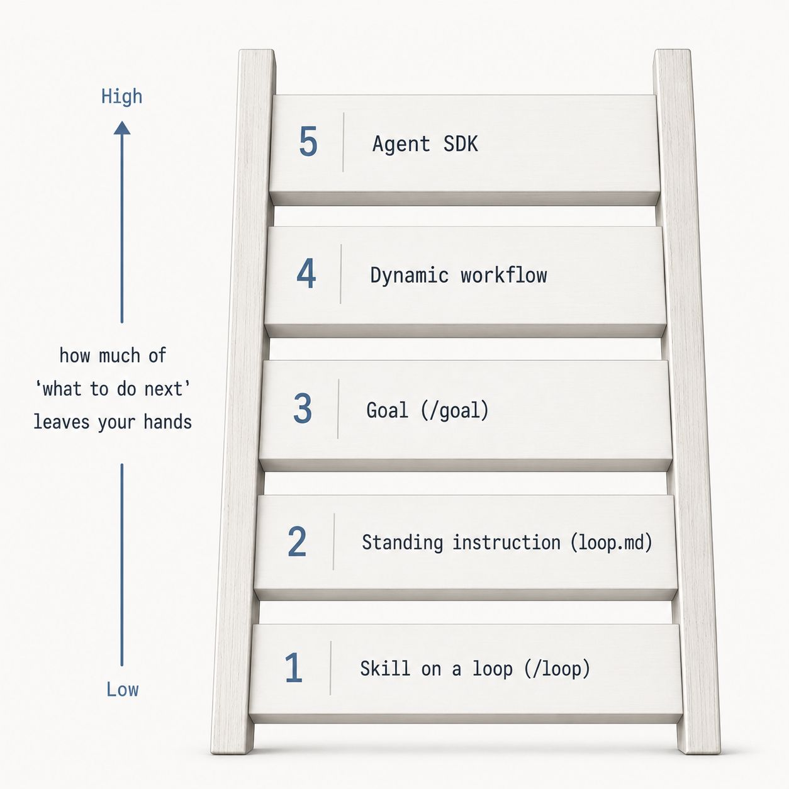

# The Autonomy Ladder

A ladder ranking approaches by **how much of "what to do next" leaves your hands** — low
autonomy at the bottom, high at the top.

| Rung | Approach |
|---|---|
| 1 (low) | Skill on a loop (`/loop`) |
| 2 | Standing instruction (`loop.md`) |
| 3 | Goal (`/goal`) |
| 4 | Dynamic workflow |
| 5 (high) | Agent SDK |

Climbing the ladder hands progressively more of the next-step decision to the system:
from re-running a fixed skill, to a written standing instruction, to a verifiable goal,
to a workflow that decides its own steps, to a full Agent SDK.

## Cross-links

Rungs 1–3 (`/loop`, `/goal`) are the mechanisms described in
[Engineer the Loop, Not the Prompt](engineer-the-loop.md). Higher rungs correspond to
the orchestration layer in [Agent Harness Engineering](agent-harness-engineering.md).

## References

- 
