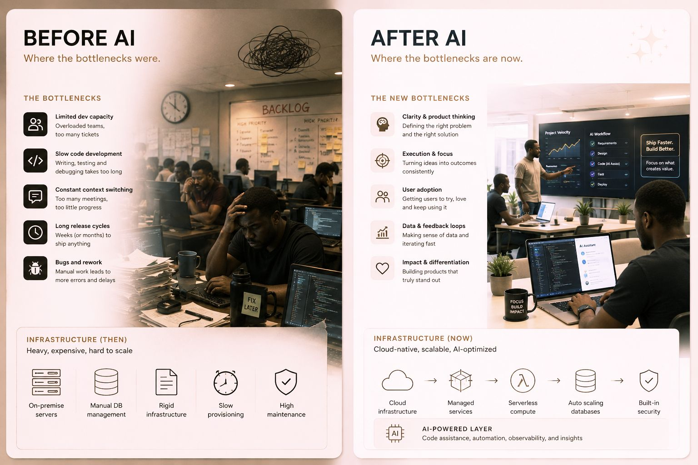

# Before AI / After AI: Where the Bottlenecks Moved

A two-panel contrast of where engineering constraints sit before and after AI.

## Before AI — the old bottlenecks

Limited dev capacity (too many tickets), slow code development (writing/testing/
debugging), constant context switching, long release cycles, bugs and rework.
**Infrastructure (then):** on-premise servers, manual DB management, rigid
infrastructure, slow provisioning, high maintenance — heavy, expensive, hard to scale.

## After AI — the new bottlenecks

The constraint moves *up the stack* to judgment and adoption: clarity & product
thinking (defining the right problem), execution & focus (turning ideas into outcomes),
user adoption, data & feedback loops, impact & differentiation.
**Infrastructure (now):** cloud → managed services → serverless compute → auto-scaling
databases → built-in security, plus an **AI-powered layer** (code assistance,
automation, observability, insights) — cloud-native, scalable, AI-optimized.

Takeaway: AI removes the mechanical bottlenecks, so the scarce skills become deciding
*what* to build and getting it adopted.

## Cross-links

The infrastructure-level version of the workflow shift in
[A Developer's Day With the Harness](developer-day-with-the-harness.md) — the human's
job moves from typing to direction-setting.

## References

- 
