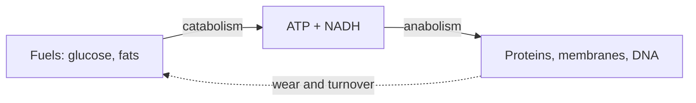
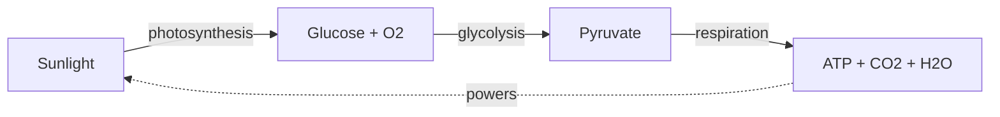

# Biochemistry and Metabolism

Biochemistry is the point where [organic chemistry](../chemistry/organic-chemistry.md)
becomes life. The same carbon-centered bonding and functional groups that organic
chemistry describes are used by cells to build a small vocabulary of molecular
families, run them through catalyzed reactions, and thereby extract energy and
maintain order against the pull of the [second law of thermodynamics](../chemistry/chemical-thermodynamics.md).
Metabolism is the totality of those reactions: the chemistry of staying alive.

## The four molecules of life

Almost everything a cell is made of falls into four families, each a polymer (or
assembly) of simpler building blocks.

| Family | Monomer / unit | Primary roles |
| --- | --- | --- |
| Proteins | amino acids (20 kinds) | catalysis (enzymes), structure, transport, signaling |
| Nucleic acids | nucleotides | information storage and transfer (DNA, RNA) |
| Carbohydrates | monosaccharides (e.g. glucose) | energy storage/supply, structure (cellulose) |
| Lipids | fatty acids, glycerol, etc. | membranes, long-term energy storage, signaling |

Proteins are the workhorses. A linear chain of amino acids folds — driven largely by
how its side chains interact with water and each other — into a specific
three-dimensional shape, and that shape *is* the function. Nucleic acids carry the
instructions for building those proteins (see
[molecular-biology-and-the-central-dogma.md](molecular-biology-and-the-central-dogma.md)).
Lipids, because one end is water-loving and the other water-fearing, spontaneously
form the bilayer membranes that define [the cell](the-cell.md).

## Enzymes: biological catalysts

Most cellular reactions are, left to themselves, far too slow to sustain life.
Enzymes — almost always proteins — solve this. Like any
[catalyst](../chemistry/chemical-kinetics.md), an enzyme lowers the activation
energy of a reaction without being consumed and without changing the reaction's
equilibrium; it only changes the *rate*. It does so by binding its substrate(s) in a
precisely shaped **active site** that stabilizes the transition state.

Because enzymes are catalysts, they obey the logic of chemical kinetics: reaction
rate rises with substrate concentration until the enzyme is saturated (the basis of
Michaelis–Menten kinetics). And because they cannot change equilibrium, they cannot
force a thermodynamically uphill reaction on their own — the cell must *couple* such
reactions to an energy source.

## ATP: the energy currency

That energy source is overwhelmingly **ATP** (adenosine triphosphate). Hydrolyzing
ATP to ADP releases a large, usable amount of free energy. Cells routinely couple an
unfavorable (endergonic) reaction to ATP hydrolysis so the *combined* free-energy
change is negative and the process proceeds — a direct application of
[Gibbs free energy](../chemistry/chemical-thermodynamics.md). ATP is not long-term
storage; it is a rapidly recycled intermediate, made and spent millions of times a day.

## Catabolism and anabolism

Metabolism splits into two coupled directions:

- **Catabolism** breaks large molecules down, releasing energy (captured as ATP and
  reduced electron carriers like NADH).
- **Anabolism** builds large molecules up, spending that energy.

The two are kept in balance by regulation — feedback on key enzymes — which is why a
cell doesn't simultaneously synthesize and destroy the same molecule.

## Core pathways

**Glycolysis** splits one glucose into two pyruvate molecules in the cytoplasm,
netting a small amount of ATP and NADH. It requires no oxygen and is nearly universal
across life — evidence of its ancient origin.

**Cellular respiration** finishes the job when oxygen is available: pyruvate feeds
the citric acid (Krebs) cycle, and the electron carriers built up there drive the
electron transport chain, which pumps protons across the mitochondrial membrane. The
resulting gradient powers ATP synthase — a molecular turbine — to make the bulk of
the cell's ATP. This is a [redox](../chemistry/redox-and-electrochemistry.md) process:
electrons flow "downhill" from fuel to oxygen, and that flow does the work.

**Photosynthesis** runs the opposite way. Plants and other autotrophs use light
energy to push electrons "uphill," reducing carbon dioxide into sugar. It is the
entry point through which almost all energy enters the biosphere (see
[ecology.md](ecology.md)), and it is the source of the oxygen respiration later spends.

## Why it matters

Metabolism is how living systems obey thermodynamics while looking like they defy it:
they maintain low internal entropy only by exporting more disorder to their
surroundings. It is also the substrate for [homeostasis](physiology-and-homeostasis.md)
— steady internal conditions require constant, regulated chemical work. Understanding
these pathways underlies medicine, nutrition, [microbiology](microbiology.md), and
much of [biotechnology](genomics-and-biotechnology.md). The canonical reference is
[Lehninger's *Principles of Biochemistry*](lehninger-principles-of-biochemistry.md),
with cellular context in [Campbell Biology](campbell-biology.md) and
[Alberts' *Molecular Biology of the Cell*](alberts-molecular-biology-of-the-cell.md).

## References

- [Lehninger Principles of Biochemistry](lehninger-principles-of-biochemistry.md)
- [Campbell Biology](campbell-biology.md)
- [Molecular Biology of the Cell (Alberts)](alberts-molecular-biology-of-the-cell.md)
