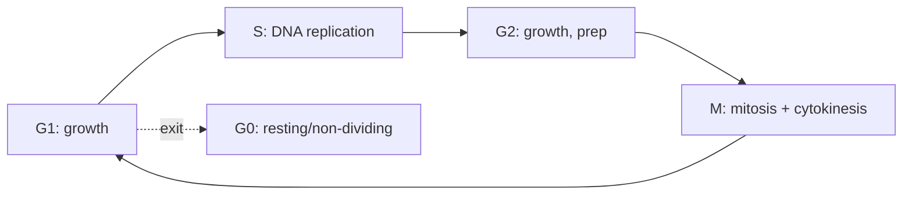

# Cell Division and Reproduction

Cells make more cells. This is the third pillar of cell theory (*all cells arise from
pre-existing cells* — see [the-cell](the-cell.md)) and the physical mechanism behind
heredity: when a cell divides, it must copy its genome and hand a complete set to each
daughter. How faithfully — and how the copies are shuffled — determines whether the result
is growth, a new organism, or a tumor. This is where
[genetics-and-heredity](genetics-and-heredity.md) meets its cellular machinery.

## The cell cycle

A dividing eukaryotic cell moves through an ordered cycle:

- **Interphase** (G1, S, G2) is the long working phase: the cell grows, does its job, and in
  **S phase** replicates its DNA (the semiconservative copying from
  [molecular-biology-and-the-central-dogma](molecular-biology-and-the-central-dogma.md)).
- **M phase** is the actual division.

The cycle is policed by **checkpoints** that halt progress until conditions are right (DNA
intact, replication complete, chromosomes properly attached). These checkpoints are the
brakes; losing them is central to cancer, below.

## Mitosis — for growth and repair

**Mitosis** produces two daughter cells genetically identical to the parent. After S phase
the cell holds duplicated chromosomes (each a pair of sister chromatids); mitosis separates
the sisters so each daughter gets one full copy. The classic phases — prophase, metaphase,
anaphase, telophase — are a choreography run by the cytoskeleton (see [the-cell](the-cell.md)),
followed by **cytokinesis** splitting the cytoplasm. Mitosis builds bodies, replaces dead
cells, and heals wounds. It is also **asexual reproduction** in single-celled eukaryotes and
underlies the (mechanistically simpler) binary fission of prokaryotes in
[microbiology](microbiology.md).

## Meiosis — for gametes and variation

**Meiosis** produces gametes (sperm, eggs) and does two things mitosis does not:

1. **Halves the chromosome number** — one round of replication followed by *two* divisions
   yields four cells, each with a single (haploid) set. Fertilization then restores the full
   (diploid) count. This is why offspring get one allele of each gene from each parent —
   Mendel's law of segregation from [genetics-and-heredity](genetics-and-heredity.md).
2. **Generates genetic variation** — through **crossing over** (homologous chromosomes swap
   segments) and **independent assortment** (each pair lines up randomly). No two gametes are
   alike, so siblings differ.

That manufactured variation is the raw material for
[evolution-by-natural-selection](evolution-by-natural-selection.md): meiosis is the engine
that keeps a sexually reproducing population diverse enough to adapt.

| | Mitosis | Meiosis |
|---|---|---|
| Daughter cells | 2 | 4 |
| Chromosome number | Same as parent (diploid) | Halved (haploid) |
| Genetically | Identical to parent | Unique (recombined) |
| Purpose | Growth, repair, asexual reproduction | Gametes, variation |

## Sexual vs. asexual reproduction

**Asexual** reproduction (via mitosis or fission) is fast and needs no partner, producing
clones — efficient in a stable environment. **Sexual** reproduction (via meiosis plus
fertilization) is costlier but mixes two genomes, producing variable offspring that a
changing environment can select among. The trade-off between the two is a recurring theme in
[ecology](ecology.md) and evolution.

## Cancer — division without brakes

Cancer is the cell cycle gone rogue: mutations disable the checkpoints, and cells divide
when they should not, ignoring the signals that normally tell them to stop or die. Because
it takes several such mutations to accumulate, cancer risk rises with age and with anything
that raises the mutation rate. Seen this way, cancer is not a foreign invader but the body's
own division machinery — the machinery of growth and repair — running without its
regulators. Understanding the cycle's checkpoints is therefore also understanding how to
target the disease, a link to
[genomics-and-biotechnology](genomics-and-biotechnology.md).

## Why it matters

Every multicellular body is a controlled explosion of cell division held in balance against
cell death. Get the control right and you have a growing, healing organism; lose it in one
direction and you get degeneration, in the other cancer. And because division is where the
genome is copied and reshuffled, it is the hinge connecting the molecular story of DNA to the
population story of inheritance and evolution.

## References

- [campbell-biology](campbell-biology.md) — anchoring treatment of the cell cycle,
  mitosis, and meiosis.
- [alberts-molecular-biology-of-the-cell](alberts-molecular-biology-of-the-cell.md) —
  molecular control of the cell cycle and cancer.
