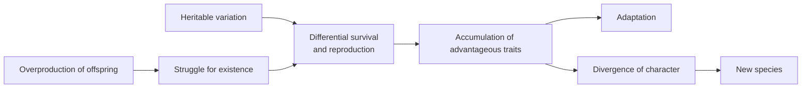

# On the Origin of Species

Charles Darwin's *On the Origin of Species by Means of Natural Selection* (1859) is the
founding work of evolutionary biology. Written for a general educated audience as "one
long argument," it proposes that the diversity of life arose through descent with
modification from common ancestors, driven mainly by natural selection. It is in the
public domain and freely available through Project Gutenberg and Darwin Online.

## The argument

Darwin builds his case cumulatively across the book:

1. **Variation under domestication.** Breeders reshape pigeons, dogs, and crops by
   selecting which individuals reproduce. This *artificial selection* is Darwin's proof
   of concept: heritable variation exists, and selecting on it changes populations.
2. **Variation under nature.** The same individual variability is present in wild
   populations; the line between "variety" and "species" is one of degree.
3. **The struggle for existence.** Organisms produce far more offspring than can
   survive. Populations tend to increase geometrically while resources do not, so most
   individuals die before reproducing. Competition, predation, and climate impose a
   constant check.
4. **Natural selection.** Given heritable variation plus a struggle for existence, any
   variation that gives even a slight advantage will tend to be preserved and passed on.
   Over many generations this accumulates into adaptation and, through divergence of
   character and the extinction of intermediates, into new species. Darwin's single
   diagram — a branching tree — captures the whole model.

He then confronts the difficulties honestly: the evolution of complex organs like the
eye, the gaps in the fossil record, instinct, and hybrid sterility. He marshals
evidence from geographical distribution, comparative anatomy (homologous structures),
embryology, and classification, arguing that all of it falls into place if species share
common ancestors.

## Significance

The *Origin* established that the living world has a history and a mechanism that
requires no designer — a naturalistic explanation for apparent design. It is the direct
source of the modern account in
[evolution-by-natural-selection.md](evolution-by-natural-selection.md). Darwin lacked a
theory of inheritance; the fusion of his selection mechanism with Mendelian and later
molecular genetics ([genetics-and-heredity.md](genetics-and-heredity.md),
[molecular-biology-and-the-central-dogma.md](molecular-biology-and-the-central-dogma.md))
came only in the 20th century, and the gene's-eye refinement of the logic appears in
[dawkins-the-selfish-gene.md](dawkins-the-selfish-gene.md).

## References

- [On the Origin of Species — Project Gutenberg](https://www.gutenberg.org/ebooks/1228)
