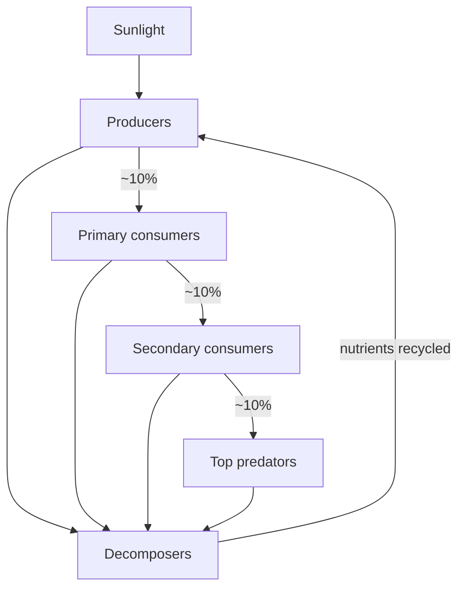

# Ecology

Ecology is the study of how organisms interact with one another and with their physical
environment — life placed in context. Where [evolution by natural selection](evolution-by-natural-selection.md)
explains *why* organisms have the traits they do, ecology explains *how* those organisms
distribute, abound, and depend on each other in the present. The two are inseparable:
ecological pressures are the selective pressures that drive evolution, and evolved traits
determine ecological roles.

## Levels of organization

Ecology is studied at a nested hierarchy of scales, each with its own questions:

| Level | Unit | Central questions |
|-------|------|-------------------|
| Organism | one individual | How does it survive and reproduce in its habitat? |
| Population | same-species individuals in an area | What drives its size and growth? |
| Community | all interacting populations | How do species coexist, compete, prey, cooperate? |
| Ecosystem | community + abiotic environment | How do energy and matter flow through it? |
| Biosphere | all ecosystems | Global cycles of carbon, water, nutrients |

## Population dynamics and carrying capacity

Populations do not grow without bound. Exponential growth is quickly checked by limited
resources, producing **logistic growth** toward a **carrying capacity (K)** — the maximum
population an environment can sustain. Density-dependent factors (food, disease, predation,
competition) tighten as the population approaches K; density-independent factors (drought,
fire) act regardless of size. Carrying capacity is not fixed — it shifts with the
environment and with the population's own effects on it.

## Energy flow and trophic levels

Energy enters most ecosystems as sunlight, is captured by **primary producers**
(photosynthetic plants, algae, some bacteria — see
[biochemistry-and-metabolism](biochemistry-and-metabolism.md)), and passes up through
**trophic levels**: producers → primary consumers (herbivores) → secondary and higher
consumers (carnivores), with **decomposers** breaking everything back down. Energy flows
*one way* and is lost as heat at every transfer — only roughly 10% passes to the next
level. That inefficiency is why food chains are short and why top predators are rare.

## Nutrient cycles

Unlike energy, **matter cycles**. Carbon, nitrogen, phosphorus, and water move
repeatedly between organisms and the abiotic environment. The carbon cycle couples
photosynthesis and respiration; the nitrogen cycle depends on microbial fixation and
denitrification (see [microbiology](microbiology.md)); the water cycle links every
ecosystem to the climate. Human disruption of these cycles — excess atmospheric carbon,
fertilizer runoff — is the mechanism behind much of the current environmental crisis.

## Biodiversity and ecosystems as complex adaptive systems

**Biodiversity** — genetic, species, and ecosystem variety — is not decoration; it
underlies ecosystem stability, productivity, and resilience. Ecosystems are canonical
[complex adaptive systems](../systems-thinking/complex-adaptive-systems.md): large
numbers of components (species) following local rules, with no central controller, whose
interactions produce system-level behavior (nutrient cycling, resilience, succession)
that cannot be read off any single part. This is [emergence](../systems-thinking/emergence.md)
in the biological register.

The web of who-eats-whom and who-depends-on-whom is literally a network, and the tools of
[network science](../systems-thinking/network-science.md) apply directly: food webs have
hubs (keystone species) whose removal cascades through the system, and their topology
predicts robustness to perturbation. Understanding an ecosystem means understanding its
connectivity, not just its inventory of species.

## References

- [Campbell Biology](campbell-biology.md) — standard college reference for ecology.
- [On the Origin of Species](darwin-origin-of-species.md) — the ecological "struggle for existence" underlying selection.
