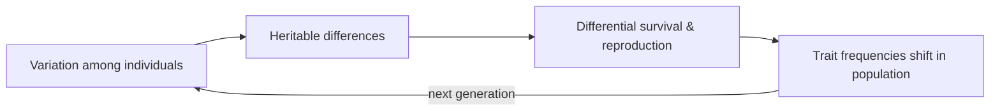

# Evolution by Natural Selection

Natural selection is the mechanism Charles Darwin proposed to explain how populations
change over time and become fitted to their environments. It is the single most
unifying idea in biology: nothing in the living world — the diversity of species, the
apparent design of organs, the behavior of animals, the structure of proteins — makes
coherent sense except in its light. Crucially, evolution is a property of *populations*,
not individuals. Individuals do not evolve; the frequencies of traits in a population
shift across generations.

## The logic in three conditions

Selection is not a mysterious force. It follows deductively whenever three ordinary
conditions hold together:

1. **Variation** — individuals in a population differ in their traits (some finches
   have deeper beaks, some bacteria tolerate more antibiotic).
2. **Heritability** — some of that variation is passed from parent to offspring. The
   heritable substrate is the gene (see [genetics-and-heredity](genetics-and-heredity.md)),
   which Darwin did not know about — the [Origin of Species](darwin-origin-of-species.md)
   predates Mendel's rediscovery.
3. **Differential reproductive success** — some variants leave more surviving offspring
   than others, because their traits happen to work better in the current environment.

Given all three, the successful variants' traits necessarily become more common over
generations. That is the whole engine. It requires no foresight, no goal, and no
designer — it is an algorithm that runs automatically on any population that varies,
inherits, and reproduces unequally.

## Fitness and adaptation

**Fitness** is not "strength" or "health" in the everyday sense — it is a measure of
relative reproductive contribution to the next generation. A trait is favored precisely
because it raises the expected number of descendants carrying it, in a specific
environment. An **adaptation** is a heritable trait shaped by this process to serve a
function: the eye for seeing, the hollow bone for flight. Because environments change,
"fit" is always relative and always provisional — today's adaptation is tomorrow's
liability.

Selection is not the only cause of evolutionary change. **Genetic drift** (random change
in trait frequency, dominant in small populations), **gene flow** (migration mixing
populations), and **mutation** (the ultimate source of new variation) all shift
frequencies too. Selection is the only one that reliably produces *adaptation*.

## The modern (gene-centric) synthesis

Darwin's natural selection and Mendel's particulate inheritance were fused in the early
20th century into the **Modern Synthesis** — evolution reframed as change in allele
frequencies within populations, made rigorous by population genetics. Later,
[The Selfish Gene](dawkins-the-selfish-gene.md) sharpened the unit of selection: the
gene, not the organism or the group, is the entity that persists across generations, and
organisms are the vehicles genes build to copy themselves. This gene's-eye view explains
otherwise puzzling phenomena — altruism toward kin (who share your genes), parent-offspring
conflict, and selfish genetic elements.

## Speciation and the tree of life

When gene flow between two populations is interrupted — geographically, behaviorally, or
reproductively — they accumulate independent changes until they can no longer interbreed.
That is **speciation**, and repeated over deep time it produces the branching pattern of
[common descent](the-tree-of-life-and-taxonomy.md). Every living thing shares ancestry;
the tree is the historical record that selection and drift wrote.

## Why it matters beyond biology

The selection algorithm is substrate-independent. Any system with variation, inheritance,
and differential replication will evolve. This is the direct inspiration for
**evolutionary and genetic algorithms** in AI — populations of candidate solutions are
mutated, recombined, and selected by a fitness function to search spaces too large for
enumeration, a cousin of the reward-driven search in
[reinforcement learning](../ai/reinforcement-learning.md). Evolutionary reasoning also
underpins [evolutionary game theory](../economics/game-theory.md), where "fitness" is
payoff and stable strategies (ESS) are equilibria reached not by rational choosers but by
selection over strategies. The idea recurs wherever adaptive complexity arises without a
designer.

Selection's power and its limits both come from being *local and myopic*: it can only
improve on what is already present, one small step at a time, which is why evolution
produces jury-rigged, "good enough" solutions (the recurrent laryngeal nerve, the blind
spot) rather than optimal engineering.

## References

- [On the Origin of Species](darwin-origin-of-species.md) — Darwin's founding argument.
- [The Selfish Gene](dawkins-the-selfish-gene.md) — the gene-centric view.
- [Campbell Biology](campbell-biology.md) — standard college reference.
