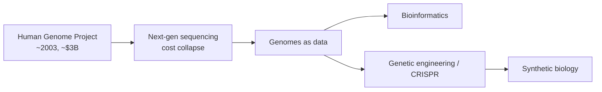

# Genomics and Biotechnology

If [molecular biology](molecular-biology-and-the-central-dogma.md) explained *how* the
genome works, genomics and biotechnology are about **reading and writing** it at scale.
Genomics studies whole genomes — the complete DNA sequence of an organism — rather than
single genes, and biotechnology puts that knowledge to work by deliberately editing
living systems. Together they mark an **engineering turn** in biology: the shift from
observing life to programming it.

## Reading: sequencing and the genome projects

DNA sequencing determines the exact order of the four bases along a strand. The
**Human Genome Project** (completed 2003) produced the first full human sequence at a
cost of roughly three billion dollars over more than a decade. What happened next is
the more important story: sequencing cost collapsed faster than Moore's law, so that a
human genome now costs on the order of a few hundred dollars and can be read in a day.
This price collapse is what turned genomics from a moonshot into a routine tool.

## Bioinformatics: genomes as data

A genome is a multi-gigabyte string, and no one reads it by eye. **Bioinformatics** is
the computational discipline that stores, aligns, compares, and interprets sequence
data — finding genes, spotting mutations, reconstructing evolutionary relationships
(see [the-tree-of-life-and-taxonomy.md](the-tree-of-life-and-taxonomy.md)), and linking
genotype to phenotype. Because the problems are pattern-recognition over huge datasets,
[machine learning](../ai/machine-learning.md) has become central — from predicting
which mutations matter to AlphaFold-style prediction of how a protein sequence folds
into a working shape, a problem that had resisted biochemists for fifty years.

## Writing: genetic engineering and CRISPR

Genetic engineering — deliberately inserting, deleting, or altering DNA — is decades
old (recombinant insulin dates to the 1970s), but it was slow and imprecise. **CRISPR**
changed that. Adapted from a bacterial immune system (bacteria store fragments of past
viral attackers to recognize them again — itself a natural
[immune memory](immunology.md)), CRISPR-Cas9 uses a short guide RNA to steer a
molecular "scissors" to a chosen DNA sequence and cut it, letting researchers edit a
specific gene cheaply and precisely. It democratized editing the way cheap sequencing
democratized reading.

## Synthetic biology: designing life

**Synthetic biology** goes further still: rather than tweaking existing organisms, it
treats DNA as a programming substrate — designing genetic "circuits," standardizing
biological parts, and even synthesizing genomes from scratch. Engineered microbes now
produce drugs, fuels, and materials; the goal is to make biology as composable and
predictable as software.

## Ethics: the engineering turn cuts both ways

The power to rewrite genomes forces hard questions, and this is where genomics stops
being purely technical:

- **Heritable editing.** Editing an embryo's genes changes every descendant. The 2018
  editing of human embryos was condemned as a red line crossed prematurely.
- **Equity and access.** Cheap sequencing generates the most sensitive data imaginable;
  who owns it, who can be discriminated against by it (insurers, employers), and who can
  afford the resulting therapies?
- **Dual use and biosafety.** The same tools that cure disease can, in principle,
  engineer pathogens.

These are governance problems as much as scientific ones, and they parallel the
questions raised by other powerful, dual-use technologies — see
[../ai-governance/index.md](../ai-governance/index.md) for the analogous debate over
governing a fast-moving, high-leverage engineering capability.

## Why it matters

Genomics and biotechnology have already reshaped medicine (personalized cancer therapy,
gene therapies for inherited disease), agriculture, and industry, and they underpin
much of modern [microbiology](microbiology.md) and evolutionary biology. The deeper
significance is conceptual: life has become *legible and editable* as information,
which is why the same data-and-governance concerns that surround artificial
intelligence now surround biology too. General references:
[Molecular Biology of the Cell](alberts-molecular-biology-of-the-cell.md) and
[Campbell Biology](campbell-biology.md).

## References

- [Molecular Biology of the Cell (Alberts)](alberts-molecular-biology-of-the-cell.md)
- [Campbell Biology](campbell-biology.md)
