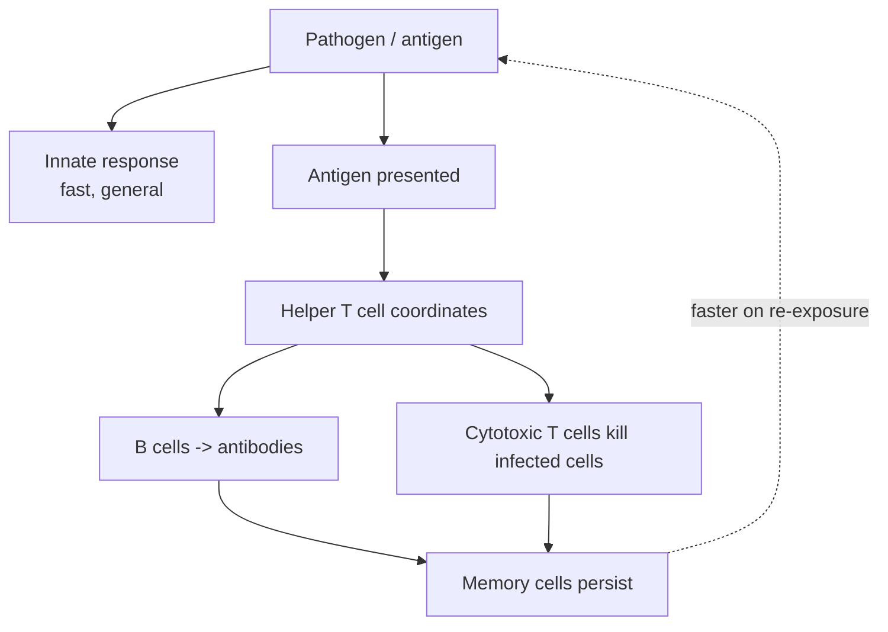

# Immunology

The immune system is how a body defends itself against pathogens — bacteria, viruses,
fungi, parasites (see [microbiology.md](microbiology.md)) — and against its own cells
gone wrong. The hard problem it solves is discrimination: it must recognize and destroy
an essentially unbounded variety of threats it has never seen before, while sparing the
body's own tissue. It is best understood not as a single organ but as a **distributed
pattern-recognition system** — billions of mobile cells, with no central controller,
collectively deciding self from non-self. That framing connects it directly to how
[machine learning](../ai/index.md) systems learn to classify novel inputs from
examples.

## Two layers: innate and adaptive

Vertebrate immunity has two cooperating arms.

| | Innate immunity | Adaptive immunity |
| --- | --- | --- |
| Speed | immediate (minutes–hours) | slow first time (days) |
| Specificity | broad; recognizes general pathogen patterns | exquisitely specific to one antigen |
| Memory | none | yes — remembers past encounters |
| Cells | phagocytes, natural killer cells, complement | T cells and B cells (lymphocytes) |

**Innate immunity** is the first responder. It recognizes conserved molecular
signatures common to whole classes of microbes (bacterial cell-wall components, viral
RNA) using a fixed, genome-encoded set of receptors. It is fast and general but cannot
adapt or remember.

**Adaptive immunity** is the specialist. It generates receptors of astonishing
diversity by randomly shuffling gene segments, producing lymphocytes that between them
can recognize almost any molecular shape — an **antigen**. This is the key to how it
handles novel threats: it doesn't need to have anticipated a pathogen, only to have,
by chance, a cell whose receptor happens to fit.

## Antigens, antibodies, and the two cell types

An **antigen** is any molecule the immune system can recognize — typically a fragment
of a pathogen's protein ([proteins](biochemistry-and-metabolism.md) again being the
readout). Adaptive immunity acts through two lymphocyte lineages:

- **B cells** produce **antibodies** — Y-shaped proteins that bind a specific antigen,
  tagging the pathogen for destruction or neutralizing it directly. This is the
  *humoral* response.
- **T cells** act more directly: helper T cells coordinate the whole response by
  signaling other cells, while cytotoxic T cells kill infected or cancerous cells they
  recognize. This is the *cell-mediated* response.

## Clonal selection and immunological memory

When a lymphocyte's receptor matches an antigen, that cell is stimulated to proliferate
— **clonal selection**, a Darwinian process inside the body ([selection](evolution-by-natural-selection.md)
acting on cell populations in real time). Most of the resulting clones fight the current
infection; some become long-lived **memory cells**. On a second exposure to the same
antigen, these memory cells mount a response that is faster and stronger — which is why
we usually get some diseases only once.

**Vaccines** exploit this directly: they present a harmless version of an antigen (a
weakened microbe, a fragment, or the instructions to make one), letting the adaptive
system build memory without the risk of the disease itself.

## Self, non-self, and autoimmunity

Because adaptive receptors are generated randomly, some will inevitably recognize the
body's own molecules. The system prunes these during development (self-tolerance),
deleting or disabling self-reactive lymphocytes. When that filtering fails, the immune
system attacks the body — **autoimmunity** (type 1 diabetes, rheumatoid arthritis,
multiple sclerosis). The opposite failure — attacking harmless environmental molecules
— is allergy. Immune function is thus itself a
[homeostatic](physiology-and-homeostasis.md) balance: too little response leaves the
body defenseless, too much damages it.

## Why it matters

Immunology underwrites vaccination (arguably the highest-leverage intervention in
public health), transplant medicine (the self/non-self problem is why organs are
rejected), and cancer immunotherapy (retraining T cells to see tumors as non-self). As
a *distributed classifier that learns from labeled examples and generalizes to unseen
inputs*, it is also a standing biological analogy for
[machine learning](../ai/index.md) — and a cautionary one, since its failure modes
(overfitting to self, over-reacting to noise) rhyme with those of learned systems.
General references: [Campbell Biology](campbell-biology.md) and
[Molecular Biology of the Cell](alberts-molecular-biology-of-the-cell.md).

## References

- [Campbell Biology](campbell-biology.md)
- [Molecular Biology of the Cell (Alberts)](alberts-molecular-biology-of-the-cell.md)
