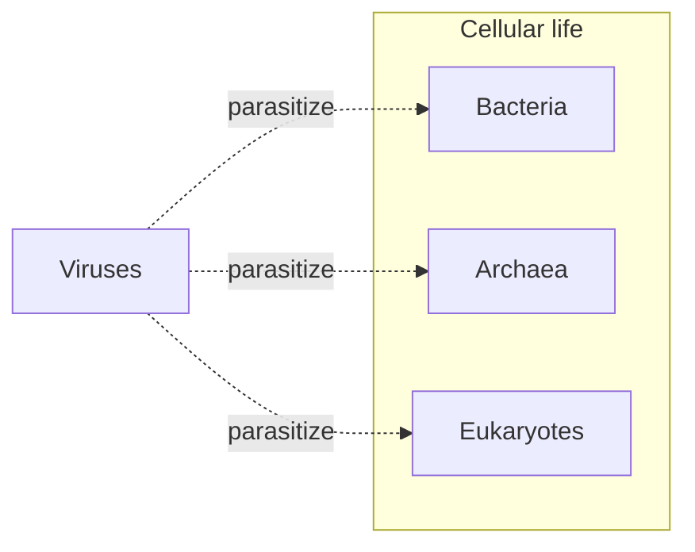

# Microbiology

Microbiology is the study of organisms too small to see — bacteria, archaea, most fungi
and protists, and the viruses that sit at the edge of life itself. This is the invisible
majority: microbes outnumber all visible organisms by orders of magnitude, dominate every
[nutrient cycle](ecology.md), and occupy every branch of the deep
[tree of life](the-tree-of-life-and-taxonomy.md). For most of Earth's history, life *was*
microbial; plants and animals are latecomers.

## Bacteria and archaea

Both are **prokaryotes** — single [cells](the-cell.md) without a nucleus or
membrane-bound organelles — but they are two distinct domains. **Bacteria** are the
familiar ones: *E. coli*, cyanobacteria, pathogens. **Archaea** look bacterial under a
microscope but are biochemically alien, thriving in extreme heat, salt, and acidity, and
are evolutionarily *closer to eukaryotes* than to bacteria. Prokaryotes compensate for
their simplicity with astonishing metabolic versatility and rapid reproduction, and they
share genes horizontally — which is how antibiotic resistance spreads so fast.

## Viruses — alive or not?

A virus is genetic material (DNA or RNA) in a protein coat, sometimes with a lipid
envelope. It has no metabolism, no cellular machinery, and cannot reproduce on its own —
it hijacks a host [cell](the-cell.md) to copy itself, redirecting the host's
[central dogma machinery](molecular-biology-and-the-central-dogma.md) to build new virus.
By the usual criteria for life (metabolism, homeostasis, autonomous reproduction), a
virus fails; it is inert outside a host. So the honest answer is that viruses occupy a
genuine gray zone — best thought of as obligate genetic parasites at the boundary of the
living. Their evolutionary role is enormous regardless: they are the most abundant
biological entities on Earth and major agents of gene transfer.

## Microbial metabolism and ecology

Microbes run the planet's chemistry. Different lineages fix nitrogen from the air,
oxidize sulfur, produce or consume methane, and (in cyanobacteria) invented oxygenic
photosynthesis — the source of Earth's oxygen atmosphere. They anchor the base and the
recycling end of every food web, closing the [nutrient cycles](ecology.md) that keep
ecosystems running. Without microbial decomposition and fixation, matter would not cycle
and larger life would collapse.

## The microbiome

The human body carries roughly as many microbial cells as human cells. This
**microbiome** — concentrated in the gut, but on skin and every mucosal surface — is not
a passenger but a functional organ: it digests fiber we cannot, synthesizes vitamins,
trains and calibrates the [immune system](immunology.md), and competes with pathogens for
space. Disruption (by antibiotics, diet, or disease) is increasingly linked to
metabolic, immune, and even neurological conditions. Microbiome science reframes the
individual as an ecosystem.

## Pathogens

A minority of microbes cause disease. Pathogens gain entry, evade or subvert
[immune defenses](immunology.md), multiply, and damage the host through toxins or the
immune response they provoke. Understanding pathogenesis — plus the microbiome that
resists it — underpins vaccines, antibiotics, and public health. The ongoing arms race
between pathogens and hosts is [natural selection](evolution-by-natural-selection.md)
running fast enough to watch in real time, which is exactly why antibiotic resistance and
viral evolution are perennial threats.

## References

- [Campbell Biology](campbell-biology.md) — standard college reference for microbiology.
- [On the Origin of Species](darwin-origin-of-species.md) — the selective dynamics behind host-pathogen evolution.
