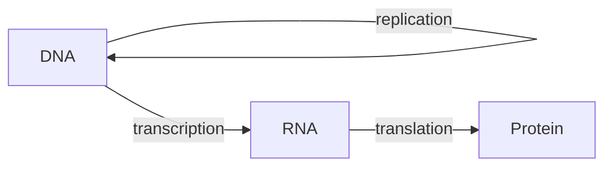

# Molecular Biology and the Central Dogma

Molecular biology studies life at the level of the informational molecules — DNA, RNA, and
protein — and the machinery that copies and reads them. Its organizing principle is the
**central dogma**, Francis Crick's statement of how sequence information flows:

DNA is copied to DNA (replication), read into RNA (transcription), and RNA is read into
protein (translation). Information does **not** flow back from protein to nucleic acid —
that irreversibility is the "dogma." (The one famous elaboration is reverse transcription,
RNA→DNA, used by retroviruses; see [microbiology](microbiology.md).) This machinery lives
inside every cell and is the mechanistic basis of both
[genetics-and-heredity](genetics-and-heredity.md) and
[genomics-and-biotechnology](genomics-and-biotechnology.md).

## DNA structure

DNA is a **double helix** of two antiparallel strands. Each strand is a backbone of sugar
(deoxyribose) and phosphate carrying four bases: adenine (A), thymine (T), guanine (G),
cytosine (C). The two strands are held together by **complementary base pairing** — A pairs
with T, G with C — via hydrogen bonds (see
[../chemistry/chemical-bonding](../chemistry/chemical-bonding.md)). The bases are the
alphabet; their order along a strand *is* the genetic information.

Complementarity is the whole trick: because one strand dictates the other, either strand is
a template for rebuilding the pair. That is what makes the molecule copyable, and it is what
Watson and Crick recognized immediately — "it has not escaped our notice" — when they
proposed the structure (see [watson-double-helix](watson-double-helix.md)).

## Replication

Before a cell divides, it must duplicate its genome (a step in
[cell-division-and-reproduction](cell-division-and-reproduction.md)). Replication is
**semiconservative**: the helix unzips, and each old strand templates a new complementary
strand, so each daughter double helix is one old strand plus one new one. **DNA polymerase**
adds bases matching the template and proofreads as it goes, giving replication its extremely
low error rate. The rare uncorrected errors are **mutations** — the raw material for
[evolution-by-natural-selection](evolution-by-natural-selection.md).

## Transcription

To use a gene, the cell copies it into **messenger RNA (mRNA)**. **RNA polymerase** binds a
gene's promoter, unwinds the DNA, and builds an RNA copy of one strand — same idea as
replication but producing single-stranded RNA (with uracil, U, in place of thymine). In
eukaryotes the raw transcript is processed (spliced, capped, tailed) before it leaves the
nucleus for the ribosomes in the cytoplasm — the compartmentalization described in
[the-cell](the-cell.md).

## The genetic code and translation

Translation reads mRNA three bases at a time. Each triplet — a **codon** — specifies one
amino acid, and the mapping from 64 codons to 20 amino acids (plus start/stop signals) is
the **genetic code**. The code is:

- **Nearly universal** — the same in bacteria and humans, strong evidence of shared ancestry
  ([the-tree-of-life-and-taxonomy](the-tree-of-life-and-taxonomy.md)).
- **Redundant** — most amino acids have several codons, which buffers some mutations.
- **Unambiguous** — each codon means exactly one thing.

At the **ribosome**, transfer RNAs (tRNAs) each carry an amino acid and an anticodon;
they match codons in turn, and the ribosome links the delivered amino acids into a
polypeptide. Chemistry then folds that chain into a functional protein — the topic of
[biochemistry-and-metabolism](biochemistry-and-metabolism.md) and
[../chemistry/organic-chemistry](../chemistry/organic-chemistry.md).

## Gene regulation

A human cell carries ~20,000 genes but expresses only a subset at any moment — a neuron
(see [../neuroscience/neuron](../neuroscience/neuron.md)) and a skin cell hold identical DNA
yet behave completely differently. **Regulation** decides which genes are on, when, and how
strongly. It happens at every step: transcription factors and enhancers gate transcription;
chromatin can be packed away to silence regions; RNA can be spliced multiple ways or
degraded; and proteins can be modified after they are made. Regulation is why one genome can
build hundreds of cell types and respond to a changing environment — the molecular substrate
of development and of [physiology-and-homeostasis](physiology-and-homeostasis.md).

## Why it matters

The central dogma is the reason genetics and biochemistry are the same story told at
different scales: a heritable trait is an inherited DNA sequence, expressed through this
pipeline into a protein that does a job. Nearly all of modern biotechnology — sequencing,
CRISPR editing, mRNA vaccines — is engineering applied to one or another arrow of this
diagram (see [genomics-and-biotechnology](genomics-and-biotechnology.md)).

## References

- [watson-double-helix](watson-double-helix.md) — the discovery of DNA structure.
- [alberts-molecular-biology-of-the-cell](alberts-molecular-biology-of-the-cell.md) — the
  anchoring text on molecular mechanisms.
- [lehninger-principles-of-biochemistry](lehninger-principles-of-biochemistry.md) — the
  chemistry of nucleic acids and proteins.
- [campbell-biology](campbell-biology.md) — introductory treatment.
