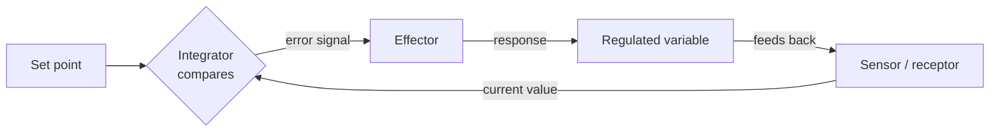

# Physiology and Homeostasis

Physiology is the study of how living systems *function* — how organs, tissues, and
[cells](the-cell.md) work together to keep an organism running. Its central organizing
idea is **homeostasis**: the maintenance of a stable internal environment despite a
changing, often hostile, external one. Body temperature, blood glucose, blood pH,
fluid balance, and blood oxygen are all held within narrow ranges even as the outside
world swings wildly. Homeostasis is what lets a complex organism decouple its internal
chemistry — the [metabolism](biochemistry-and-metabolism.md) that depends on stable
conditions and stable [pH](../chemistry/acids-and-bases.md) — from environmental noise.

## Homeostasis is a control loop

Mechanistically, homeostasis is **negative feedback**: a deviation from a set point
triggers a response that opposes the deviation and pushes the variable back. This is
exactly the control loop studied in [cybernetics](../systems-thinking/cybernetics.md)
and formalized as a [feedback loop](../systems-thinking/feedback-loops.md) in systems
thinking — the body is a cybernetic system that happened to evolve before engineers
described the mathematics.

The loop has four parts:

- **Sensor** — detects the current value of the variable.
- **Integrator (control center)** — compares it against the set point and computes an
  error.
- **Effector** — acts to reduce the error.
- **Feedback** — the effect changes the variable, which the sensor re-reads, closing
  the loop.

Thermoregulation is the textbook case. If core temperature rises above ~37 °C, the
hypothalamus (integrator) triggers sweating and vasodilation (effectors) to shed heat;
if it falls, it triggers shivering and vasoconstriction. Blood glucose works the same
way through insulin (lowers glucose) and glucagon (raises it) — two opposing effectors
straddling a set point.

**Positive feedback** also occurs but is rarer and usually time-limited: it amplifies
rather than corrects, and it needs an external stop signal. Childbirth contractions
and blood clotting are examples — useful precisely because they run to completion and
then halt.

## Two channels of regulation: neural and hormonal

Organisms coordinate these loops through two communication systems that differ mainly
in speed and reach:

| | Neural | Hormonal (endocrine) |
| --- | --- | --- |
| Signal | electrical impulses along nerves | chemical messengers in the blood |
| Speed | milliseconds | seconds to hours |
| Reach | targeted, point-to-point | broadcast to all cells bearing the receptor |
| Duration | brief | sustained |

The nervous system handles fast, precise responses (pulling a hand from heat); the
endocrine system handles slower, longer, body-wide states (growth, metabolic rate,
stress). They interlock at the hypothalamus–pituitary axis, where neural signals
become hormonal ones. (For the nervous side in depth, see
[../neuroscience/index.md](../neuroscience/index.md).)

## Organ systems as division of labor

Homeostasis in a large body is distributed across organ systems, each maintaining
some subset of variables: circulatory (transport), respiratory (gas exchange), renal
(fluid, ion, and pH balance — a key regulator of [acid–base](../chemistry/acids-and-bases.md)
status), digestive (nutrient intake), endocrine and nervous (coordination), and the
[immune system](immunology.md) (defense of internal integrity). No system is
self-sufficient; stability is an emergent property of their coupling — the recurring
lesson of complex adaptive systems.

## Why it matters

Framing the body as a set of interacting control loops is powerful because it makes
disease legible: many pathologies are broken loops. Diabetes is a failure of the
glucose loop; fever is a *reset* set point, not a broken one; hypertension is a
mis-tuned pressure loop. It also connects biology to
[cybernetics](../systems-thinking/cybernetics.md) and to engineering control theory,
letting the same feedback vocabulary describe a thermostat, a servo, and a kidney.
General references: [Campbell Biology](campbell-biology.md) for organismal physiology
and [Molecular Biology of the Cell](alberts-molecular-biology-of-the-cell.md) for the
cellular signaling underneath it.

## References

- [Campbell Biology](campbell-biology.md)
- [Molecular Biology of the Cell (Alberts)](alberts-molecular-biology-of-the-cell.md)
