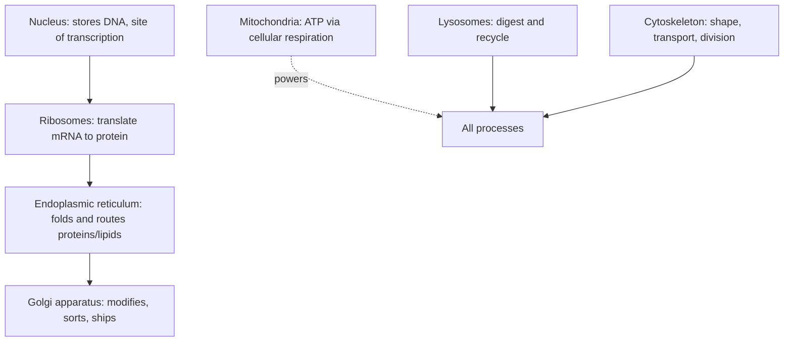

# The Cell

The cell is the smallest unit that satisfies every criterion of life: it is bounded,
metabolizes, responds to its environment, and reproduces. Everything larger — a tissue, an
organism, a forest — is ultimately an arrangement of cells, and everything smaller (an
organelle, a protein, a strand of DNA) depends on the cell for the environment that keeps
it working. This is the organizing insight of biology, and it is why so many other topics
here — [biochemistry-and-metabolism](biochemistry-and-metabolism.md),
[molecular-biology-and-the-central-dogma](molecular-biology-and-the-central-dogma.md),
[cell-division-and-reproduction](cell-division-and-reproduction.md) — are really about
what happens inside or between cells.

## Cell theory

Cell theory, assembled over the 1800s from the microscopy of Schleiden, Schwann, and
Virchow, makes three claims:

1. **All living things are made of one or more cells.**
2. **The cell is the basic unit of structure and function in life.**
3. **All cells arise from pre-existing cells** (*omnis cellula e cellula*) — cells do not
   spontaneously appear; they divide (see
   [cell-division-and-reproduction](cell-division-and-reproduction.md)).

The third claim is the historically decisive one: it killed spontaneous generation and
tied every cell alive today to an unbroken lineage of division reaching back to the origin
of life, which is also the premise of the
[the-tree-of-life-and-taxonomy](the-tree-of-life-and-taxonomy.md).

## Two architectures: prokaryotic vs. eukaryotic

Cells come in two fundamental designs, distinguished by whether the genome is walled off
inside a nucleus.

| Feature | Prokaryotic | Eukaryotic |
|---|---|---|
| Nucleus | None — DNA sits free in the cytoplasm (nucleoid) | Membrane-bound nucleus |
| Size | Small (~1–5 µm) | Large (~10–100 µm) |
| Organelles | Few, no membrane-bound ones | Many membrane-bound (mitochondria, ER, etc.) |
| Genome | Usually one circular chromosome | Multiple linear chromosomes |
| Examples | Bacteria, archaea (see [microbiology](microbiology.md)) | Plants, animals, fungi, protists |

Prokaryotes are the older and vastly more numerous design. Eukaryotes arose later, and the
best-supported explanation for their organelles is **endosymbiosis**: a host cell engulfed
free-living bacteria that became mitochondria (and, in the plant lineage, chloroplasts).
The evidence — those organelles carry their own DNA and divide on their own schedule — is
one of the cleaner illustrations of [evolution-by-natural-selection](evolution-by-natural-selection.md)
operating at the scale of whole cells.

## The membrane: what makes a cell a cell

Every cell is defined by its **plasma membrane**, a bilayer of phospholipids. Each
phospholipid has a hydrophilic phosphate head and two hydrophobic fatty-acid tails; in
water the tails hide inward and the heads face out, self-assembling into a two-layer sheet.
This is a direct consequence of the polarity rules covered in
[../chemistry/organic-chemistry](../chemistry/organic-chemistry.md) and
[../chemistry/chemical-bonding](../chemistry/chemical-bonding.md) — the membrane is
essentially chemistry folding itself into a container.

The membrane is **selectively permeable**: small nonpolar molecules cross freely, but ions
and large or polar molecules need embedded **transport proteins**. This gate-keeping is
what lets a cell hold an internal state different from its surroundings — the basis of
[physiology-and-homeostasis](physiology-and-homeostasis.md), and, when the transported ions
are managed to store voltage, the basis of the signaling in a
[../neuroscience/neuron](../neuroscience/neuron.md).

## Organelles and their jobs

A eukaryotic cell is a division-of-labor economy. The major compartments:

- **Nucleus** — houses the chromosomes and is where DNA is transcribed to RNA (see
  [molecular-biology-and-the-central-dogma](molecular-biology-and-the-central-dogma.md)).
- **Ribosomes** — read mRNA and build proteins; the actual machines of translation.
- **Endoplasmic reticulum (ER)** — rough ER (studded with ribosomes) folds and threads
  membrane and secreted proteins; smooth ER makes lipids and detoxifies.
- **Golgi apparatus** — the shipping department: it modifies proteins and tags them for
  their destinations.
- **Mitochondria** — the power plants, generating ATP through cellular respiration; central
  to [biochemistry-and-metabolism](biochemistry-and-metabolism.md).
- **Lysosomes** — acidic recycling centers full of digestive enzymes.
- **Chloroplasts** (plants) — capture light energy in photosynthesis.
- **Cytoskeleton** — protein filaments that give shape, move cargo, and pull chromosomes
  apart during [cell-division-and-reproduction](cell-division-and-reproduction.md).

## Why it matters

Because every process in biology bottoms out in a cell, understanding the cell is the
prerequisite for everything else. Disease is very often a cellular malfunction — a broken
membrane channel, a failed organelle, an unregulated division. Drugs mostly act by hitting
a specific cellular target. And the fact that all cells share this basic toolkit — membrane,
ribosome, genetic code — is itself the strongest single piece of evidence that all life is
related.

## References

- [alberts-molecular-biology-of-the-cell](alberts-molecular-biology-of-the-cell.md) — the
  anchoring text on cell structure and function.
- [campbell-biology](campbell-biology.md) — introductory treatment of the cell.
- [lehninger-principles-of-biochemistry](lehninger-principles-of-biochemistry.md) — the
  chemistry of membranes and organelle function.
