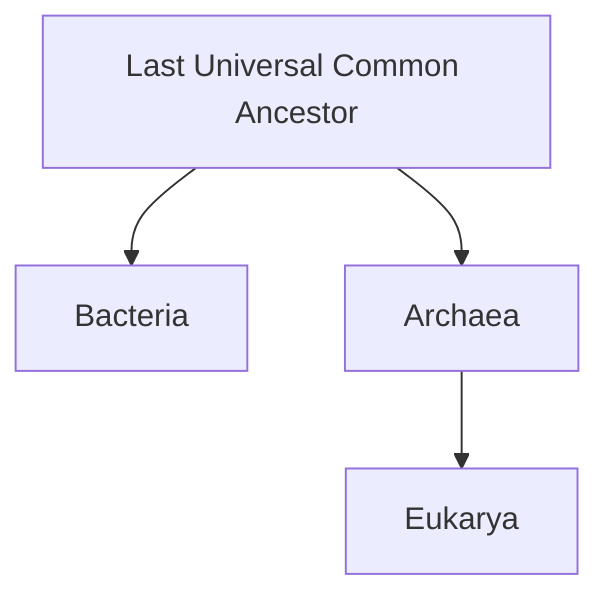

# The Tree of Life and Taxonomy

Life is bewilderingly diverse — millions of species, most still undescribed. Taxonomy is
the discipline of naming and classifying that diversity; **phylogenetics** is the deeper
project of reconstructing the actual historical relationships among organisms. The two
became one science once biologists accepted that the goal of classification is not to
sort life into convenient boxes but to *recover the branching pattern of
[common descent](evolution-by-natural-selection.md)* — the single tree that connects
every living thing to shared ancestors.

## Nomenclature and the classical hierarchy

Carl Linnaeus gave us **binomial nomenclature**: every species gets a two-part Latin name
(genus + species, e.g. *Homo sapiens*), and species nest inside a ranked hierarchy —
domain, kingdom, phylum, class, order, family, genus, species. The names are a shared
global vocabulary; the ranks, however, are somewhat arbitrary conventions laid over a
tree that is really continuous branching.

## The three domains

The most consequential modern revision was the recognition — driven by Carl Woese's work
on ribosomal RNA — that all life falls into **three domains**, not the old
two-kingdom (plant/animal) or five-kingdom schemes:

- **Bacteria** — prokaryotes, the familiar microbes.
- **Archaea** — prokaryotes that look bacterial but are biochemically distinct, and are
  in fact *more closely related to us* than to bacteria (see
  [microbiology](microbiology.md)).
- **Eukarya** — everything with a nucleus: protists, fungi, plants, animals.

A striking result: the visible living world — every plant and animal — is a small,
recent twig on a tree whose deep structure is overwhelmingly microbial.

## Phylogenetics and cladistics

A **phylogenetic tree** (or cladogram) is a hypothesis about ancestry. Modern
classification is **cladistic**: it groups organisms by *shared derived characters*
(synapomorphies) into **clades** — an ancestor plus *all* its descendants. Only such
monophyletic groups are considered valid. This rules out familiar-but-invalid groupings:
"reptiles" excluding birds is *paraphyletic* (birds are dinosaurs, hence reptiles);
"warm-blooded animals" lumping birds and mammals is *polyphyletic* (the trait evolved
twice). Cladistics forces classification to mirror history rather than surface similarity.

## How molecular data rewrote the tree

For two centuries, classification relied on morphology — visible form. Convergent
evolution (unrelated lineages arriving at similar forms) made this treacherous. The
revolution came from reading the molecules themselves: DNA and protein sequences
(see [molecular-biology-and-the-central-dogma](molecular-biology-and-the-central-dogma.md)).
Because mutations accumulate roughly with time, sequence differences are a **molecular
clock** and a far more reliable signal of relatedness than anatomy. Ribosomal RNA
comparisons revealed the archaea as a separate domain; whole-genome data continue to
prune and rearrange branches. Molecular phylogenetics also complicated the tidy tree
picture: **horizontal gene transfer**, especially among microbes, means the deep tree is
partly a *web*, with genes crossing between lineages rather than only descending within
them.

## Why it matters

The tree is the organizing framework of all biology. It tells us which model organisms
inform human medicine, how pathogens are related and likely to behave, where an unknown
sequence belongs, and how traits and diseases are distributed across life. It is the
literal genealogy that [natural selection](evolution-by-natural-selection.md) produced.

## References

- [On the Origin of Species](darwin-origin-of-species.md) — Darwin's single illustration was a tree of descent.
- [Campbell Biology](campbell-biology.md) — standard college reference for systematics.
