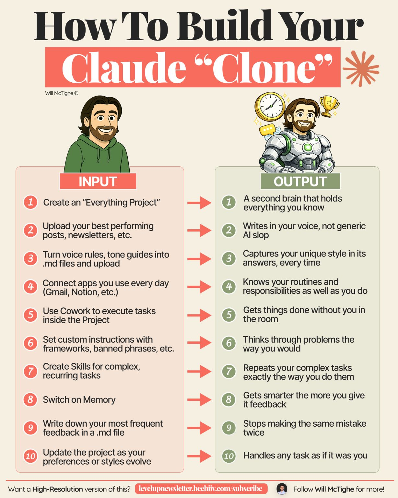

# How to Build Your Claude "Clone"

An input → output recipe (Will McTighe) for building a personal AI that acts like a
second brain in your voice.

| # | Input (do this) | Output (you get) |
|---|---|---|
| 1 | Create an "Everything Project" | A second brain holding everything you know |
| 2 | Upload your best posts, newsletters, etc. | Writes in your voice, not generic AI slop |
| 3 | Turn voice rules / tone guides into `.md` files | Captures your style in every answer |
| 4 | Connect daily apps (Gmail, Notion…) | Knows your routines and responsibilities |
| 5 | Use Cowork to execute tasks in the project | Gets things done without you in the room |
| 6 | Set custom instructions (frameworks, banned phrases) | Thinks through problems the way you would |
| 7 | Create Skills for complex, recurring tasks | Repeats your complex tasks your way |
| 8 | Switch on Memory | Gets smarter the more feedback you give |
| 9 | Write frequent feedback into a `.md` file | Stops making the same mistake twice |
| 10 | Update the project as preferences evolve | Handles any task as if it were you |

## Cross-links

The same voice/memory/skills building blocks as
[Four Files to Save You Two Hours a Day](four-files-ai-workflow.md) — `.md` files for
voice, Skills for recurring tasks, Memory for compounding learning.

## References

- 
