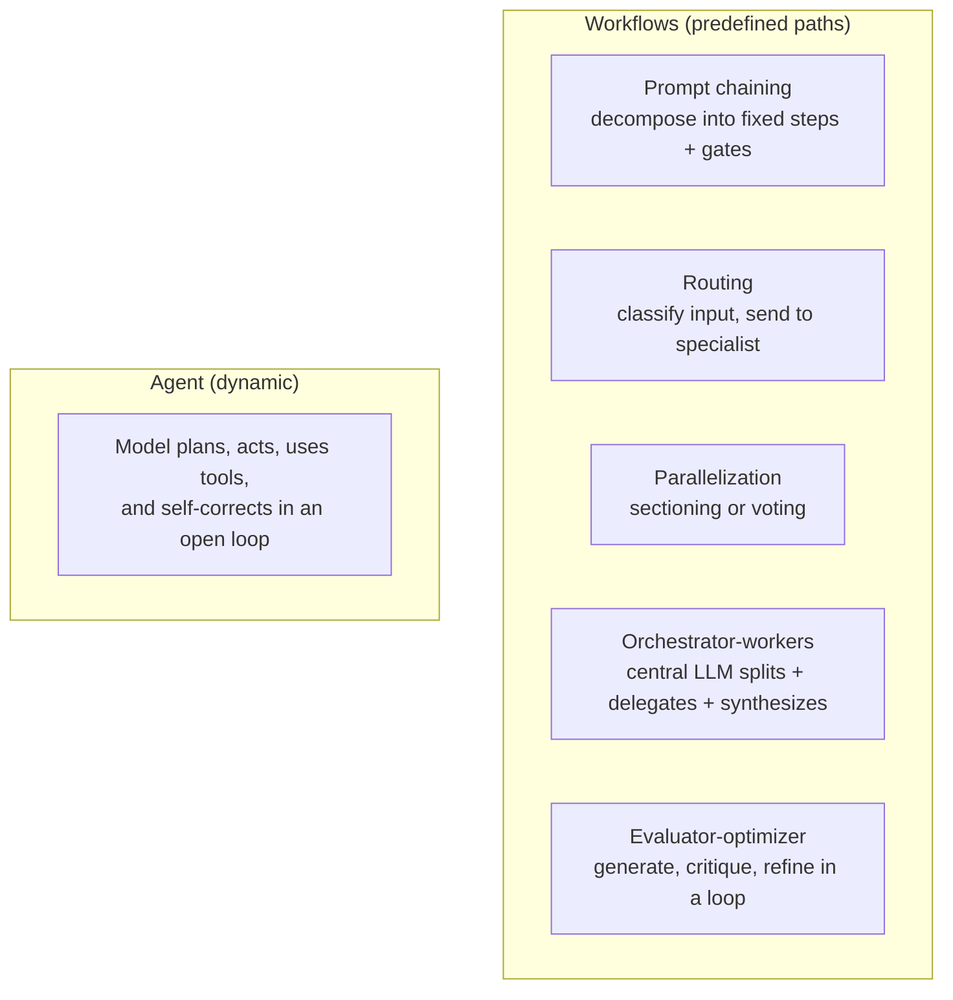

# Building Effective Agents (Anthropic)

Anthropic's engineering guide (Dec 2024) distilled from working with dozens of
teams. The core finding: **the most successful implementations use simple,
composable patterns — not complex frameworks.** This is the canonical source for
the patterns summarized in [agent patterns quick reference](agent-patterns-quick-reference.md).

## Workflows vs. agents

A key distinction:

- **Workflows** — LLMs and tools orchestrated through **predefined code paths**.
  Predictable and cheaper; reach for these first.
- **Agents** — the LLM **dynamically directs its own process and tool use**,
  keeping control over how it accomplishes the task.

Everything is built on the **augmented LLM**: a model with retrieval, tools, and
memory. Add complexity only when it demonstrably improves outcomes.

## The building blocks

- **Prompt chaining** — split a task into ordered steps, optionally gate between
  them. For tasks that decompose cleanly.
- **Routing** — classify the input and hand it to a specialized prompt/flow.
- **Parallelization** — *sectioning* (independent subtasks) or *voting* (same
  task multiple times for confidence).
- **Orchestrator-workers** — a central LLM dynamically breaks work into subtasks,
  delegates to workers, and synthesizes results. Best when you **can't predict**
  the subtasks up front — e.g. coding changes across an unknown number of files.
  (The shape Cursor scaled to hundreds of agents in
  [Cursor's agent swarm](cursor-agent-swarm-browser.md).)
- **Evaluator-optimizer** — one LLM generates, another critiques against clear
  criteria, and the loop refines. The generator/evaluator core of
  [the loop-engineering playbook](loop-engineering-playbook.md) and the
  independent-verifier rule in [loop engineering](loop-engineering.md).

## When to use agents, and the practical advice

Use agents for **open-ended problems where you can't predict the number of steps**
and can't hardcode the path — and where you can trust the model's decisions.
Weigh the cost: agents trade latency and compute for autonomy.

Three durable rules: keep the design **simple**; be **transparent** about the
agent's planning steps; and invest in the **agent-computer interface (ACI)** —
document and test tools as carefully as you'd design a human UI. The inner
gather-act-verify cycle described here is exactly the loop that
[loop engineering](loop-engineering.md) wraps an outer goal-seeking loop around.

## References
- [Building Effective AI Agents — Anthropic](https://www.anthropic.com/engineering/building-effective-agents)
