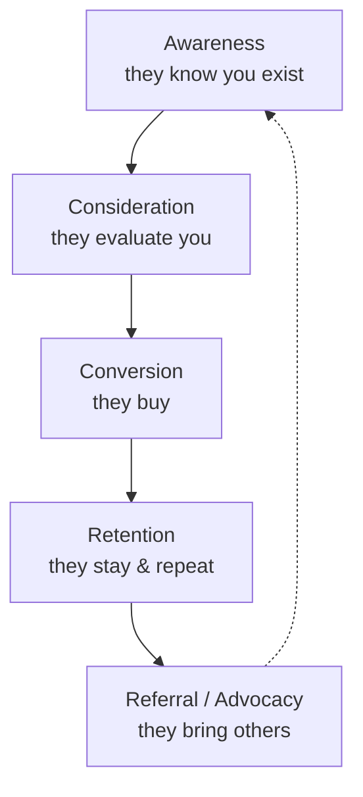

# Brand and Growth Marketing

If [marketing-and-positioning](marketing-and-positioning.md) decides *who you serve and
what you stand for*, brand and growth marketing are the two engines that turn that
position into remembered meaning and measurable revenue. They pull in tension — brand
plays the long game of memory and meaning, growth plays the short game of measurable
acquisition — and the craft is holding both at once.

## Brand as a promise and an asset

A **brand** is not a logo; it is the set of associations that live in a customer's head
and the *promise* those associations imply. Managed well, a brand is a balance-sheet-worthy
**asset**: it lowers acquisition cost (people already know and trust you), supports
pricing power, and survives product missteps. Two ideas from **Byron Sharp**'s
evidence-based marketing dominate modern brand thinking:

- **Mental availability (salience)** — the brand should come to mind easily in the buying
  situation. Growth comes mostly from reaching *light and non-buyers* and being the brand
  they think of first, not from deepening loyalty among a small core. This is why broad
  reach beats narrow targeting for most established brands.
- **Distinctive assets** — colours, logos, characters, jingles, taglines that let people
  *recognise* you fast and cheaply (the Nike swoosh, the Intel chime). These are built by
  consistency over years; changing them resets the memory clock.

Brand works through the same recognition-and-recall machinery as
[../psychology/cialdini-influence.md](../psychology/cialdini-influence.md) and rests on
how associations form in memory — see
[../psychology/social-psychology.md](../psychology/social-psychology.md).

## The funnel

The classic mental model for acquisition is the **funnel** — prospects narrow as they
move toward purchase and, ideally, into a lasting relationship:

The funnel is a useful diagnostic (where do people drop off?) but it has a flaw: it treats
each customer as a one-way trip that *ends* at a sale.

## Growth loops vs funnels

**Growth loops** fix the funnel's flaw. A loop is a closed system where the *output of
one cycle becomes the input of the next*, so growth compounds instead of requiring
ever-more top-of-funnel spend:

- **Viral loop** — users invite users (Dropbox referral storage, messaging apps).
- **Content loop** — users generate content that ranks in search and pulls in new users,
  who create more content.
- **Paid loop** — revenue from acquired users funds acquisition of the next cohort, viable
  only when unit economics support it (see below).

The strategic difference: funnels are linear and demand constant fuel; loops reinvest
their own output and can compound. The strongest growth businesses have a loop, often
reinforced by network effects
([../economics/information-economics-and-network-effects.md](../economics/information-economics-and-network-effects.md)).

## Channels, content, and performance marketing

Growth is executed across **channels** — search, social, email, paid ads, content/SEO,
partnerships, sales. Two broad modes:

- **Content marketing** — earn attention by being useful (articles, tools, video),
  compounding but slow.
- **Performance marketing** — buy attention with directly measurable, optimisable spend
  (paid search/social), fast but rented.

Channel fit is not universal: a $20/month product cannot afford a field sales team; an
enterprise deal won't close from a banner ad. Matching channel to product economics and
to the customer's buying behaviour is the core allocation problem.

## Metrics: measuring the machine

Growth marketing is quantitative. The load-bearing metrics:

| Metric | Meaning | Why it matters |
|--------|---------|----------------|
| **CAC** | customer acquisition cost | fully-loaded cost to win one customer |
| **LTV** | lifetime value | total margin a customer yields over their life |
| **LTV:CAC** | the ratio | rule of thumb ≥ 3:1 for a healthy business |
| **ROAS** | return on ad spend | revenue per dollar of ad spend, the performance lever |
| **Payback period** | months to recover CAC | how long capital is tied up per customer |
| **Retention / churn** | % who stay / leave | the denominator of everything compounding |

**Cohort analysis** is the sharpest tool here: group customers by when they joined and
track each cohort's behaviour over time. It reveals whether retention is improving,
whether later cohorts monetise better, and whether apparent "growth" is just churn masked
by new spend. These metrics feed directly into
[business-models-and-unit-economics](business-models-and-unit-economics.md) — CAC and LTV
*are* the unit economics of a growth business.

## The brand-vs-performance tension

The central management tension: **performance marketing is measurable and short-horizon;
brand is powerful and long-horizon but hard to attribute.** Attribution tools reward what
they can measure, so budgets drift toward performance — starving the brand that makes
performance cheaper over time (higher click-through, lower CAC, better conversion). The
evidence-based consensus (Les Binet and Peter Field's "60/40" as a rough anchor) is that
sustainable growth needs *both*: brand building to expand future demand and mental
availability, performance to harvest existing demand now. Optimising only for the
attributable metric is a classic case of measuring what is easy rather than what matters —
a trap that also shows up in
[../ai-org/product-engineer-manifesto.md](../ai-org/product-engineer-manifesto.md)'s
argument for outcomes over vanity output.

## Why it matters

A great product with weak brand and growth motion stays a secret; strong growth motion on
a leaky (poorly-retained) product just burns money faster. Brand lowers the cost of every
future sale; growth loops compound; metrics keep the whole machine honest. Together they
convert the *position* the company chose into durable, profitable demand.

## References

- [Marketing Management](kotler-marketing-management.md) — Kotler on brand equity,
  communications, and the promotion mix that underpins these engines.
