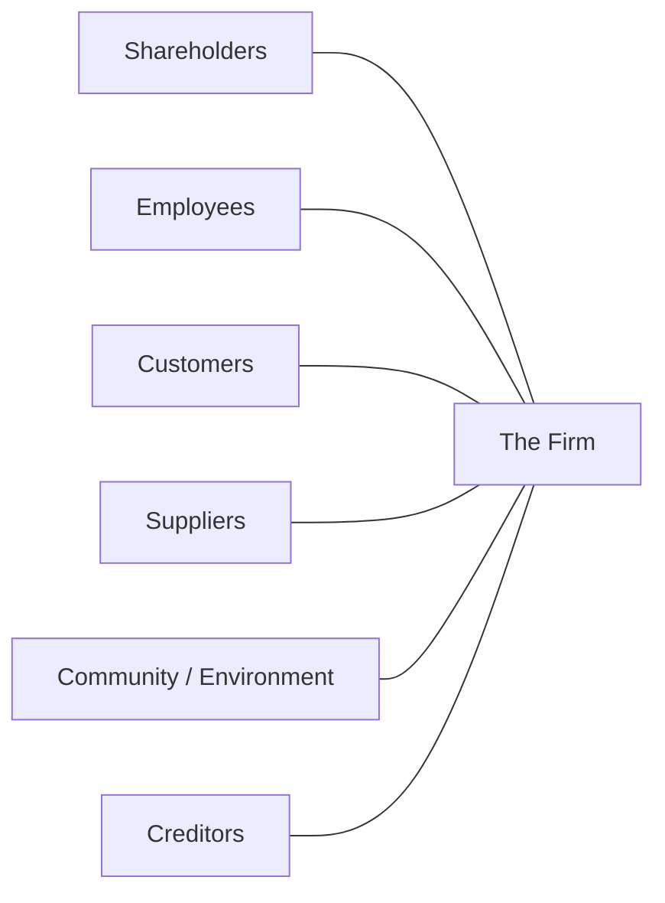

# Business Ethics

Business ethics is the study of what it means to do business *rightly* — how firms
should treat shareholders, employees, customers, suppliers, communities, and the
natural world, and how the pursuit of profit is squared with obligations that profit
alone does not capture. It is applied ethics: the general theories of
[ethics](../philosophy/ethics.md) — consequentialism, deontology, virtue — pushed
into the concrete decisions of pricing, hiring, disclosure, and risk. It overlaps with
[engineering ethics](../engineering/engineering-ethics.md), which asks the same of the
people who build the product, and with [leadership and management](leadership-and-management.md),
since culture is set from the top and ethics that the leadership does not model does not
survive contact with a quota.

## The central debate: shareholders vs stakeholders

The organizing controversy of the field is *whose interests the firm serves*.

**The shareholder view (Milton Friedman, 1970).** In his famous *New York Times*
essay, Friedman argued that the social responsibility of a business is to increase its
profits, within the rules of the game — open competition, no fraud, no deception. A
manager is an *agent* of the owners; spending their money on social causes they did not
choose is, in his framing, a kind of taxation without representation. The market, not
the executive, should allocate social spending. Note the constraint that critics often
drop: Friedman explicitly demanded legality and the absence of deception.

**The stakeholder view (R. Edward Freeman, 1984).** A stakeholder is anyone who can
affect or is affected by the firm — employees, customers, suppliers, communities,
creditors, not just equity holders. Freeman argued that a business succeeds only by
creating value for all of them jointly, and that treating them as mere means is both
ethically wrong and, over time, bad strategy: alienated employees, gouged customers, and
angry communities eventually show up in the numbers. The 2019 U.S. Business Roundtable
statement redefining "the purpose of a corporation" around stakeholders is the
high-water mark of this view in practice.

The two views are less opposed than they look. Long-horizon shareholder value and
stakeholder value converge; they diverge mainly under short-termism, where a manager can
book a gain today by imposing a cost on a stakeholder that the market has not yet priced.

## CSR and ESG

**Corporate social responsibility (CSR)** is the umbrella idea that firms have duties
beyond the balance sheet. **ESG** — Environmental, Social, and Governance — is its
measurable, investor-facing successor: a set of factors used to rate how a company
manages carbon, labor, safety, board independence, and the like. ESG's promise is that
it makes externalities legible to capital; its critique is that it invites *box-ticking*
and *greenwashing* — the appearance of virtue without the substance. Good ESG is
material: it tracks the factors that genuinely bear on long-run risk and value for that
specific business.

## Common ethical failure modes

Most corporate misconduct is not cartoon villainy; it is structural. A few recurring
mechanisms explain a large share of it:

| Failure mode | Mechanism | Example |
|---|---|---|
| Misaligned incentives | Rewarding a proxy metric drives behavior that harms the real goal | Wells Fargo sales quotas producing millions of fake accounts |
| Principal–agent problem | The agent (manager/employee) pursues their own interest over the principal's (owner/customer) | Executives chasing short-term stock-linked bonuses at the firm's long-run expense |
| Externalities | Costs pushed onto third parties who never consented | Pollution; addictive design that harms users |
| Information asymmetry | One side knowingly exploits what the other cannot see | Concealing defects, burying terms, misleading disclosures |
| Diffusion of responsibility | "Everyone was doing it / it wasn't my call" spreads accountability to no one | Compliance failures where no single owner exists |

The principal–agent problem and misaligned incentives are the deep engine here: people
respond to what they are measured and paid on, so an unethical *system* reliably produces
unethical *acts* from ordinary people. This connects directly to
[The Goal](../process-and-teams/the-goal.md) — measure the wrong thing and you optimize
the wrong behavior.

## Honesty and trust as economic assets

Trust is not only a virtue; it is a lubricant that lowers transaction costs. A firm
known to deal honestly needs less legal armor, closes deals faster, and commands a
reputation premium. Trust is slow to build and fast to destroy, which is precisely why
it functions as an asset: it is costly to counterfeit. Honesty is thus both the right
thing and, on a long enough horizon, the profitable thing — the strongest available
reconciliation of the shareholder and stakeholder views.

## Applied AI-business ethics

AI sharpens every failure mode above. A recommender optimized for engagement is a
misaligned-incentive machine; a model trained on biased data launders discrimination
into a "neutral" score; opaque systems deepen information asymmetry between the firm and
the people it decides about. The governing questions — accountability for automated
decisions, transparency, bias, data consent, and who bears the downside when a model is
wrong — are the subject of [AI governance](../ai-governance/index.md). The ethical
demand is the same one Freeman made: do not treat the people affected by your system as
mere inputs to a metric.

## Why it matters

Ethics is not a constraint bolted onto strategy; over a long horizon it *is* strategy.
Reputational collapse, regulatory penalty, and talent flight are the delayed invoices for
ethical shortcuts. The practical discipline is to design incentives and disclosures so
that the profitable path and the right path are the same path — and to treat the cases
where they diverge as a signal that the system, not just the person, needs fixing.

## References

- Cross-links: [ethics](../philosophy/ethics.md),
  [engineering ethics](../engineering/engineering-ethics.md),
  [AI governance](../ai-governance/index.md),
  [leadership and management](leadership-and-management.md),
  [The Goal](../process-and-teams/the-goal.md).
