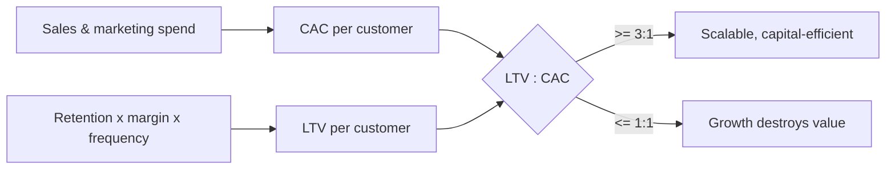

# Business Models and Unit Economics

A **business model** is the logic by which a firm **creates, delivers, and captures
value** — who it serves, what it offers them, how it reaches and keeps them, and how the
money flows. **Unit economics** is the arithmetic underneath: whether serving one more
customer makes or loses money once you strip away the shared overhead. A great product with
broken unit economics is not a business; it's a subsidy. This concept is where
[business-strategy](business-strategy.md) meets the ledger of
[finance-and-accounting-basics](finance-and-accounting-basics.md).

## The business model canvas

Alexander Osterwalder's **Business Model Canvas** is the standard one-page map of the
model — nine building blocks that must fit together:

| Value side | Efficiency side |
|---|---|
| **Customer segments** — who you serve | **Key activities** — what you must do well |
| **Value propositions** — the job you solve | **Key resources** — assets you rely on |
| **Channels** — how you reach them | **Key partners** — who does the rest |
| **Customer relationships** — how you keep them | **Cost structure** — what you spend |
| **Revenue streams** — how you capture value | |

The right half generates cost; the left half generates revenue; the model works only when
value created (left) exceeds value delivered (right) with margin to spare. The **value
proposition** anchors it — the job the customer is really hiring the product to do, the
demand-side view developed in
[customer-empathy-and-jobs-to-be-done](customer-empathy-and-jobs-to-be-done.md).

## Revenue models

*How* you capture value is a strategic choice, not a detail:

- **Transactional / one-time sale** — pay per unit purchased.
- **Subscription / recurring** — pay per period for continued access; the SaaS default,
  prized for predictable revenue and compounding retention.
- **Usage-based / metered** — pay for what you consume (cloud, API calls, AI inference).
- **Marketplace / take rate** — a cut of transactions you intermediate; a two-sided
  platform (see
  [../economics/information-economics-and-network-effects.md](../economics/information-economics-and-network-effects.md)).
- **Advertising / freemium** — the product is free; attention or a paid upgrade is the
  revenue. Free is a customer-acquisition strategy, not the model.

## Unit economics: the core metrics

Unit economics asks: **for one customer (or one unit sold), does the business make money?**

- **Contribution margin** — revenue per unit minus the *variable* cost of that unit. What's
  left to cover fixed costs and profit. If it's negative, more sales dig a deeper hole.
- **CAC (Customer Acquisition Cost)** — total sales & marketing spend divided by customers
  acquired. What it costs to win one customer.
- **LTV (Lifetime Value)** — the total contribution margin a customer generates over their
  lifetime, driven by margin, purchase frequency, and **retention** (how long they stay).
- **LTV : CAC ratio** — the headline health check. A common rule of thumb is **≥ 3:1**;
  below ~1:1 you lose money on every customer, and "we'll make it up in volume" makes it
  worse.
- **Payback period** — how many months of contribution margin it takes to recover CAC.
  Shorter payback means the business self-funds growth instead of burning capital to grow.

## The difference between a product and a business

A **product** solves a problem for a user. A **business** does that *and* captures enough
value, repeatably and profitably, to sustain and grow itself. The gap between them is where
most startups die, and it is exactly what unit economics measures:

- A product can be loved and still lose money on every customer (negative contribution
  margin, CAC above LTV) — usage that grows the loss.
- A business needs the value it *captures* to exceed the value it *spends*, per unit, with a
  moat that keeps rivals from competing the margin to zero (see
  [competitive-advantage](competitive-advantage.md)).

This is why "growth at all costs" is dangerous: growth on broken unit economics scales the
losses. Healthy unit economics is what lets growth *fund itself*.

## Why it matters — and the AI ties

Unit economics is the discipline that separates a fundable business from a demo, and it is
the through-line from strategy to finance: the model must produce a positive contribution
margin, an LTV that comfortably clears CAC, and a payback the balance sheet can survive. AI
businesses put this front-and-centre because **inference is a real, usage-scaling variable
cost** — every query costs compute — so contribution margin can erode as usage grows unless
priced and engineered for. That tension (token costs, usage-based pricing, ROI) is the
central subject of [../ai-business/index.md](../ai-business/index.md). Reasoning about the
model and its unit economics *before* scaling is the core habit of
[entrepreneurship-and-lean-startup](entrepreneurship-and-lean-startup.md).

## References

- Draws on Alexander Osterwalder & Yves Pigneur, *Business Model Generation* (the Canvas);
  the unit-economics framing is standard venture-finance practice (David Skok's SaaS metrics
  and related work).
