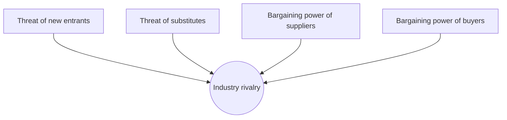

# Business Strategy

Strategy is one of the most abused words in business — used to dress up goals, budgets,
and aspirations that are none of them a strategy. A **strategy is a coherent set of
choices about where to play and how to win**: which customers and needs to serve, which
to ignore, and what configuration of activities will let the firm create more value than
rivals can. It is fundamentally about *doing different things, or the same things
differently*, in a way competitors cannot easily copy.

## Good strategy vs bad strategy (Rumelt)

Richard Rumelt draws the sharpest line here. **Bad strategy** is fluff and goals dressed
as a plan — "be the leading provider," "grow 20%," a list of aspirations with no theory
of how they will be achieved. **Good strategy** has a hard core of three parts, the
**kernel**:

1. **Diagnosis** — a clear account of what the challenge actually is, simplifying a messy
   reality to its crux.
2. **Guiding policy** — the overall approach chosen to cope with the diagnosis.
3. **Coherent action** — coordinated steps that reinforce one another and actually deploy
   resources against the crux.

The test of a strategy is not whether the goals are ambitious but whether the choices are
coherent, focused, and grounded in a real source of advantage.

## Porter's five forces

Michael Porter reframed strategy around **industry structure**: long-run profitability is
set less by how well you operate than by the forces shaping the industry you compete in.
Five forces determine how much of the value created gets captured by firms rather than
competed away or claimed by others.

- **Rivalry among existing competitors** — intense when growth is slow, exit is costly, or
  products are undifferentiated (price wars).
- **Threat of new entrants** — held back by barriers to entry: scale, capital, brand,
  regulation, network effects.
- **Threat of substitutes** — different products meeting the same need cap what you can
  charge.
- **Supplier power** — concentrated or unique suppliers extract margin.
- **Buyer power** — concentrated or price-sensitive buyers push margin down.

The strategic move is to position the firm where the forces are weakest, or to *reshape*
them in your favour. This structural view connects directly to
[../economics/index.md](../economics/index.md) — the forces are microeconomic bargaining
positions — and to
[../economics/information-economics-and-network-effects.md](../economics/information-economics-and-network-effects.md),
which explains why the entry barrier in tech markets is so often a network effect.

## Generic strategies

Porter argued a firm must make a fundamental choice about *how* it competes, and that
being "stuck in the middle" — neither cheapest nor distinctive — is the weakest place:

| Strategy | How you win | Risk |
|---|---|---|
| **Cost leadership** | Lowest cost producer; win on price or fat margins at market price | A cheaper rival or a demand shift |
| **Differentiation** | A distinctive offering buyers pay a premium for | Imitation; premium not worth it to buyers |
| **Focus** | Serve a narrow segment better than broad players can | Segment too small; broad players encroach |

Focus can itself be cost- or differentiation-based within its niche. The unifying idea is
**deliberate trade-offs**: choosing what *not* to do is what makes an advantage defensible.

## The resource-based view

Where Porter looks outward at industry structure, the **resource-based view (RBV)** looks
inward: sustainable advantage comes from resources and capabilities that are **valuable,
rare, inimitable, and non-substitutable** (the VRIN test). A patent, a brand, proprietary
data, an entrenched culture, or a hard-won capability explains why two firms in the same
industry earn persistently different returns. The two views are complements — RBV explains
the firm-specific side of the [competitive-advantage](competitive-advantage.md) that
Porter's positioning locates in the market.

## Strategy vs operational effectiveness

Porter's most-quoted warning: **operational effectiveness is not strategy.** Doing the
same activities better than rivals (leaner ops, faster cycle time, best practices) is
necessary but not sufficient — best practices diffuse, and everyone converges on the same
productivity frontier, competing away profit. Strategy is *choosing a different set of
activities* to deliver a unique mix of value. Operational excellence you can benchmark and
copy; strategic positioning, by design, you cannot. This distinction is why disruption is
so dangerous to incumbents — see [disruptive-innovation](disruptive-innovation.md) and
Christensen's [christensen-innovators-dilemma](christensen-innovators-dilemma.md) — and why
some strategists argue for creating uncontested space rather than fighting on the frontier
at all ([blue-ocean-strategy](blue-ocean-strategy.md)).

## Why it matters

A firm without a strategy makes locally sensible decisions that fail to add up — it lacks
the coherence that turns activity into advantage. Strategy is the theory of how a set of
choices will win; everything downstream — the [business-models-and-unit-economics](business-models-and-unit-economics.md),
the [marketing-and-positioning](marketing-and-positioning.md), the
[product-management](product-management.md) roadmap — should trace back to it. Peter
Drucker's insistence that management start from *what business are we in?* is the same
question in a different key ([drucker-effective-executive](drucker-effective-executive.md)).

## References

- Draws on Michael Porter, *Competitive Strategy* and *"What Is Strategy?"*
  ([porter-competitive-strategy](porter-competitive-strategy.md)); Richard Rumelt, *Good
  Strategy / Bad Strategy*; and the resource-based view (Wernerfelt, Barney).
