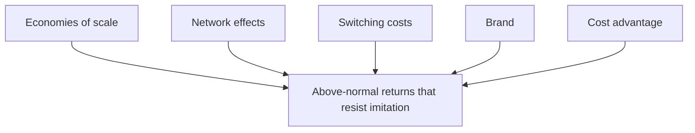

# Competitive Advantage

A firm has a **competitive advantage** when it can create more value than its rivals and
capture some of it as above-normal profit — sustainably, not for a quarter. The economics
is relentless: profit attracts imitation, imitation competes profit away, and most
advantages therefore **erode**. The strategic question is not "how do we get ahead once?"
but "what stops rivals from catching up?" The durable structural answer is what investors
call a **moat** — a barrier that protects returns over time. Advantage is the payoff that
[business-strategy](business-strategy.md) is designed to produce.

## The sources of durable advantage

There are only a handful of structural moats; nearly every durable business traces to one
or a combination.

- **Economies of scale.** Fixed costs spread over more volume mean lower unit cost. Bigger
  is cheaper, so the leader can out-price or out-invest rivals. Strongest where fixed costs
  dominate — the whole story of information goods (see
  [../economics/information-economics-and-network-effects.md](../economics/information-economics-and-network-effects.md)).
- **Network effects.** The product gets more valuable as more people use it, so the
  leader's lead compounds and markets tip toward a single winner — the most powerful moat
  in software.
- **Switching costs.** Once a customer's data, workflows, integrations, or habits live in
  your product, leaving is costly — so they don't, even for a better rival. Enterprise
  software and platforms live here.
- **Brand.** A trusted name lets you charge a premium and lowers the customer's search and
  perceived-risk cost. Slow to build, hard to copy — see
  [brand-and-growth-marketing](brand-and-growth-marketing.md).
- **Cost advantage.** A structurally lower cost position — from a unique process, location,
  proprietary technology, or privileged input access — not merely being temporarily leaner.
- **Regulatory / intangible barriers.** Patents, licences, and exclusive contracts that
  legally fence off the position.

## The value chain

Advantage doesn't come from the firm as a blob; it comes from specific **activities**.
Porter's **value chain** disaggregates the firm into the activities it performs to design,
produce, market, deliver, and support its product — **primary activities** (inbound
logistics, operations, outbound logistics, marketing & sales, service) supported by
**support activities** (procurement, technology, HR, firm infrastructure). Advantage arises
when a firm performs these activities *more cheaply* or *better* than rivals, and it is
durable when the activities **fit together** into a mutually reinforcing system that a rival
would have to copy wholesale, not piecemeal. Analysing the chain tells you *where* your cost
or differentiation advantage actually lives — and where a rival's does.

## Why most advantages erode

The default gravity of markets is **competitive convergence**. Advantages decay because:

- **Imitation** — rivals copy the product, process, or price once they see it works.
- **Substitution** — a different technology meets the same customer need (see
  [disruptive-innovation](disruptive-innovation.md), where the substitute enters from below
  and the incumbent's own advantages become liabilities).
- **Diffusion of best practice** — operational improvements spread through consultants,
  hiring, and benchmarking until everyone is on the same productivity frontier.
- **Complacency and disruption** — the incumbent optimises its existing model while the
  ground shifts, the theme of Christensen's
  [christensen-innovators-dilemma](christensen-innovators-dilemma.md).

This is why the *self-reinforcing* moats — scale and network effects — are prized: they get
**stronger** with success rather than being eroded by it. They are positive feedback loops,
the same reinforcing dynamics studied in
[../systems-thinking/complex-adaptive-systems.md](../systems-thinking/complex-adaptive-systems.md).

## Why it matters

An advantage you can't defend is a temporary profit, not a strategy. Reasoning explicitly
about *which moat* protects a business — and whether it is widening or eroding — is the core
of competitive analysis, investment theses, and the "how to win" half of
[business-strategy](business-strategy.md). It also sets the terms for
[business-models-and-unit-economics](business-models-and-unit-economics.md): a real moat is
what lets a business earn a return above its cost of capital instead of racing it to zero.
The instinct to escape competition altogether by opening uncontested space rather than
defending a moat is the argument of [blue-ocean-strategy](blue-ocean-strategy.md).

## References

- Draws on Michael Porter, *Competitive Advantage* and *Competitive Strategy*
  ([porter-competitive-strategy](porter-competitive-strategy.md)); the moats framing owes to
  Warren Buffett and Hamilton Helmer, *7 Powers*.
