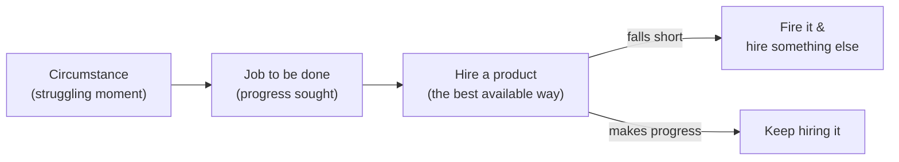

# Customer Empathy and Jobs-to-be-Done

Most products fail not because they were built badly but because they solved a problem
nobody urgently had. Customer empathy is the discipline of understanding the people you
serve deeply enough to build the *right* thing — and its sharpest framework is
**Jobs-to-be-Done (JTBD)**, most associated with **Clayton Christensen**
([christensen-competing-against-luck](christensen-competing-against-luck.md)).

## Customer discovery and interviews

You cannot empathise from a conference room. **Customer discovery** — a term from Steve
Blank's lean tradition ([ries-lean-startup](ries-lean-startup.md)) — is the practice of
getting out of the building and talking to real people *before and while* you build.
Good discovery interviews follow a few hard-won rules (Rob Fitzpatrick's *The Mom Test*
is the canonical guide):

- **Ask about their life and past behaviour, not your idea.** "Would you use this?" gets
  polite lies; "Tell me about the last time you faced this problem" gets facts.
- **Dig for specifics** — what they actually did, what it cost them, what they tried and
  abandoned. Concrete past behaviour predicts; hypothetical future intent flatters.
- **Talk less, listen more.** The goal is to learn, not to pitch.

## The say-do gap

The reason discovery is so unintuitive is the **say-do gap**: what customers *say* they
want reliably diverges from what they *do*. People overstate willingness to pay,
underestimate the pull of habit, and rationalise decisions after the fact. This is not
dishonesty — it is how minds work, and it is rooted in the biases catalogued in
[../psychology/cognitive-biases-and-heuristics.md](../psychology/cognitive-biases-and-heuristics.md)
(availability, social desirability, post-hoc rationalisation). Empathy means weighting
*revealed behaviour* over *stated preference*.

## Jobs-to-be-Done

Christensen's core reframe: **customers don't buy products; they "hire" them to make
progress on a job in a particular circumstance.** A "job" is the progress a person is
trying to make — functional, emotional, and social dimensions together — not a demographic
attribute. The unit of analysis shifts from *the customer* to *the job in its context*.

### The milkshake story

The famous illustration: a fast-food chain wanted to sell more milkshakes and optimised
on the obvious levers — sweeter, chunkier, cheaper — with no effect. Studying *when* people
bought them revealed the job: a large share were bought early in the morning by lone
commuters who "hired" the milkshake to make a long, boring drive more bearable and stave
off mid-morning hunger. The real competitors were bananas, bagels, and boredom — not other
milkshakes. Once you see the job, the product roadmap changes completely: make it thicker
(lasts the whole drive), easier to buy one-handed, faster to grab. The demographic profile
("married, 40s") was useless; the *job in the circumstance* was everything.

## Empathy maps

An **empathy map** is a simple synthesis tool for structuring what discovery reveals about
a customer's world — typically quadrants for what they **Say, Think, Do, and Feel**, plus
their **Pains** and **Gains**. It forces the team to separate observable behaviour (Say/Do)
from inferred inner state (Think/Feel) — exactly the say-do gap made visible — and to hold
the customer as a whole person rather than a feature request. It is a bridge from raw
interviews to design decisions, complementing the usability lens of
[../ux-design/dont-make-me-think.md](../ux-design/dont-make-me-think.md), where empathy
means removing the friction and thinking a real user should never have to spend.

## Avoiding the build trap

Melissa Perri named the **build trap**: organisations stuck measuring success by *features
shipped* rather than *value delivered and problems solved*. Teams in the trap conflate
output with outcome — they ship faster and faster while customers get no closer to their
job. Empathy and JTBD are the escape hatch: anchor every initiative to a real, evidenced
job, measure whether customers make progress on it, and kill work that doesn't. This is
the same outcomes-over-output principle that drives
[product-management](product-management.md) and
[entrepreneurship-and-lean-startup](entrepreneurship-and-lean-startup.md)'s
build-measure-learn loop — you validate that you're solving a real job before scaling the
solution.

## Why it matters

Customer empathy is the cheapest risk reduction in business: a week of honest interviews
can save a year of building the wrong thing. JTBD gives that empathy a durable structure —
it tells you what to build, who your real competitors are, and how to know whether you're
winning. Get the job right and marketing, product, and growth all have a true north; get
it wrong and no amount of execution rescues you.

## References

- [Competing Against Luck](christensen-competing-against-luck.md) — Christensen's full
  development of Jobs-to-be-Done, the milkshake case, and hiring/firing products.
