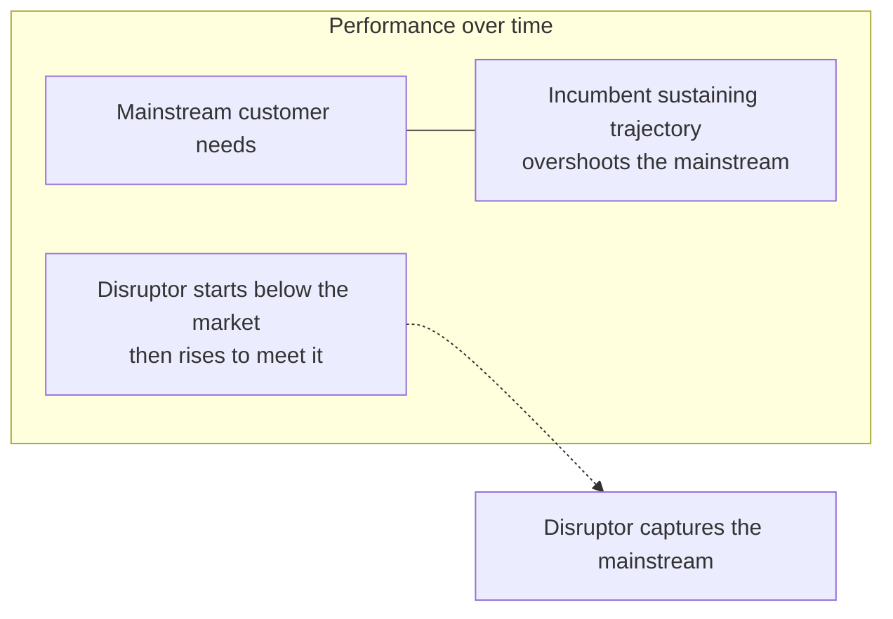

# Disruptive Innovation

**Disruptive innovation** is Clayton Christensen's theory of *why great, well-run companies
fail* — not despite doing everything right, but *because* they do. The counterintuitive
core: the very practices that make an incumbent excellent — listening to its best
customers, investing where margins are highest, killing low-return projects — are exactly
what blind it to the innovation that eventually destroys it. This is the **innovator's
dilemma**, and it reframes the [competitive-advantage](competitive-advantage.md) discussion:
an incumbent's strengths become the mechanism of its downfall.

## Sustaining vs disruptive innovation

Christensen's key distinction is not "big innovation vs small," but *which direction on the
performance curve* an innovation moves.

- **Sustaining innovation** makes an existing product *better along the dimensions
  mainstream customers already value* — faster, more reliable, higher capacity. Incumbents
  almost always win these battles: they have the customers, the resources, and every
  incentive to move upmarket.
- **Disruptive innovation** starts *worse* on the mainstream metrics but *better* on a new
  dimension (cheaper, simpler, more convenient, more accessible). It serves customers the
  incumbent doesn't want or can't reach — then improves until it is good enough for the
  mainstream, at which point it takes the market.

## The two footholds

A disruptor gains its beachhead in one of two ways:

- **Low-end disruption.** Incumbents, chasing their most profitable customers, keep adding
  features and moving upmarket, eventually *overshooting* what ordinary customers need. That
  opens the low end for a cheaper, "good enough" entrant the incumbent is happy to cede
  (steel minimills vs integrated mills; discount retail).
- **New-market disruption.** The entrant serves people who were **non-consumers** — priced
  or skilled out of the existing product entirely — creating a new market beside the old
  one (the PC vs the minicomputer; the transistor radio for teenagers). Because it competes
  against *non-consumption*, the incumbent doesn't even see it as a rival until too late.

## Why great companies fail

The dilemma is a **resource-allocation** trap, not a failure of vision or intelligence:

1. Disruptive products are **less profitable** and serve **smaller, unproven** markets.
2. An incumbent's best customers *don't want them* — so customer-driven processes reject
   them.
3. Rational managers allocate capital to the higher-margin sustaining projects their
   biggest customers are demanding.
4. By the time the disruption is obviously important, the entrant has scale, learning, and
   momentum the incumbent can no longer catch.

Every step is locally correct. The failure is systemic — which is why it recurs across
industries and why simply "trying harder" or "being less complacent" doesn't fix it. It
ties directly to [business-strategy](business-strategy.md): the incumbent optimises its
existing model on the current productivity frontier while the frontier itself is being
redrawn from below.

## The common misuse of the term

"Disruptive" has become a marketing synonym for "new, big, or successful" — which
Christensen resisted. In the strict theory:

- A better, pricier product that beats incumbents head-on is **sustaining**, not disruptive
  (Christensen argued the original iPhone-vs-phones story was largely sustaining; the
  disruption was the App Store vs the laptop as a computing platform).
- Not every startup that wins is a "disruptor." Precision matters because the theory makes a
  specific, testable prediction — *entrants win when they attack from below or from
  non-consumption; incumbents win the sustaining fight* — and that prediction is only useful
  if the term keeps its meaning.

## Why it matters — and the AI ties

Disruption theory is the standard lens for reading technology upheavals, and generative AI
fits the pattern almost too neatly: cheap, "good enough," initially error-prone tools that
serve tasks and users the incumbent products ignore, improving fast. Whether a given AI
product is a *sustaining* improvement to existing software or a genuine *low-end / new-market*
disruption is exactly the question that decides who wins — a recurring theme across
[../ai-business/index.md](../ai-business/index.md). For a startup, deliberately choosing the
foothold the incumbent will rationally ignore is a core move, connecting this concept to
[entrepreneurship-and-lean-startup](entrepreneurship-and-lean-startup.md) and to the demand-
side view of what customers are really hiring a product to do,
[customer-empathy-and-jobs-to-be-done](customer-empathy-and-jobs-to-be-done.md) — Christensen's
own later framework for spotting where new markets will form.

## References

- Draws on Clayton Christensen, *The Innovator's Dilemma*
  ([christensen-innovators-dilemma](christensen-innovators-dilemma.md)) and *The Innovator's
  Solution*, and Christensen, Raynor & McDonald, *"What Is Disruptive Innovation?"* (HBR 2015).
