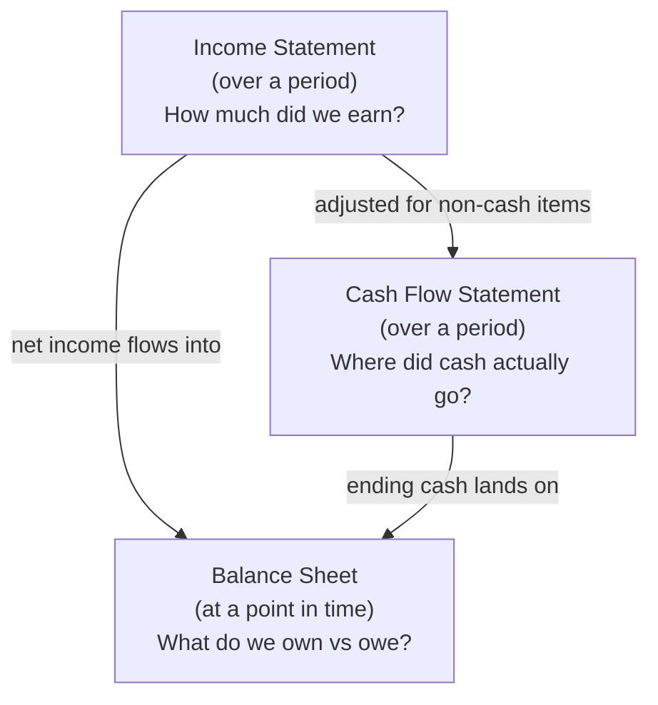

# Finance and Accounting Basics

Accounting is the language a business uses to describe itself in numbers; finance is the
discipline of deciding what to do with money over time. Together they let you *read a
business* — its health, its risks, and its worth — without being inside it. Three
financial statements do most of the work, and one recurring surprise trips up nearly
everyone new to the subject: **profit and cash are not the same thing.**

## The three financial statements

Each statement answers a different question, and they interlock: the income statement and
balance sheet together *reconcile* to the change in cash.

**Income statement (P&L).** Revenue minus expenses over a period, ending in net income.
It follows the *accrual* principle: revenue is booked when *earned* and expenses when
*incurred*, regardless of when cash changes hands. Key lines: revenue → gross profit
(after cost of goods sold) → operating income → net income.

**Balance sheet.** A snapshot at an instant, governed by the identity **Assets =
Liabilities + Equity**. Assets are what the firm controls; liabilities are what it owes;
equity is the owners' residual claim. It always balances by construction.

**Cash flow statement.** The reconciliation from accrual earnings back to actual cash,
split into operating, investing, and financing activities. It exists precisely because
the income statement can show a profit while the bank account drains.

## Cash vs profit — the distinction that kills companies

A profitable company can run out of money and die. The gap comes from *timing* and
*non-cash* items:

- **Timing.** You book revenue when you invoice, but the customer pays in 60 days
  (accounts receivable). Meanwhile you must pay suppliers, rent, and payroll *now*. Fast
  growth makes this worse — every new sale ties up more cash in receivables and inventory
  before it pays off. This is a *working capital* squeeze.
- **Non-cash charges.** Depreciation reduces reported profit without any cash leaving;
  conversely, buying equipment drains cash without hitting profit all at once.

Hence the maxim: **profit is an opinion, cash is a fact.** More businesses fail from
insufficient cash than from insufficient profit — a growing, "profitable" firm can starve
between the sale and the collection. This links directly to a startup's *runway* in
[entrepreneurship and the lean startup](entrepreneurship-and-lean-startup.md) and to the
[business models and unit economics](business-models-and-unit-economics.md) that
determine how quickly each customer turns cash-positive.

## Margins

Margins express profit as a percentage of revenue and let you compare businesses of
different sizes:

| Margin | Formula | What it tells you |
|---|---|---|
| Gross margin | (Revenue − COGS) / Revenue | Profitability of the product itself, before overhead |
| Operating margin | Operating income / Revenue | Profitability of running the whole operation |
| Net margin | Net income / Revenue | What's left for owners after everything |

High gross margins are what make software and other scalable
[business models](business-models-and-unit-economics.md) so attractive: each additional
sale is nearly pure contribution.

## Time value of money

A dollar today is worth more than a dollar next year — it can be invested, and inflation
and risk erode future value. This is the foundation of finance. A future cash flow is
worth its **present value** today:

`PV = FV / (1 + r)^n`

where `r` is the discount rate and `n` the number of periods. The higher the risk or the
longer the wait, the more you discount. This single idea explains interest rates, loan
pricing, and why investors prize near-term, certain cash over distant, speculative cash;
it is developed further in [money and finance](../economics/money-and-finance.md).

## Basic valuation

To value a business is to estimate what its future is worth *today*. The main approaches:

- **Discounted cash flow (DCF).** Project the firm's future free cash flows and discount
  each back to present value; their sum is the intrinsic value. The most principled
  method and the most sensitive to its assumptions — small changes in the growth rate or
  discount rate swing the answer widely.
- **Multiples (comparables).** Value the firm relative to peers using a ratio such as
  price-to-earnings (P/E) or enterprise-value-to-revenue. Fast and market-anchored, but
  only as good as the comparison set.

Both are estimates of the same underlying truth — a business is worth the present value of
the cash it will throw off over its life — which is why the time value of money and cash
(not accounting profit) sit at the center of valuation.

## Why it matters

Financial statements are the instrument panel of a business. A leader who cannot read cash
flow flies blind, mistaking a paper profit for solvency until the payroll bounces.
Understanding these basics turns "we're doing great, we're profitable" into the sharper,
survivable question: *how many months of cash do we have, and when does each dollar of
revenue actually arrive?*

## References

- Cross-links:
  [business models and unit economics](business-models-and-unit-economics.md),
  [money and finance](../economics/money-and-finance.md),
  [entrepreneurship and the lean startup](entrepreneurship-and-lean-startup.md).
