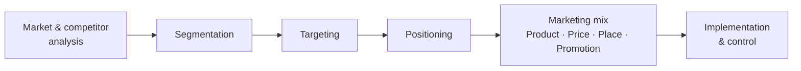

# Marketing Management (Philip Kotler)

Philip Kotler's *Marketing Management* — first published in 1967 and now co-authored with
Kevin Lane Keller and Alexander Chernev across many editions — is the standard graduate-
level text of the marketing discipline, so influential that Kotler is often called the
"father of modern marketing." Its scope is comprehensive: it treats marketing not as
advertising or selling but as the **analysis, planning, implementation, and control** of
programs designed to create, communicate, and deliver value to chosen markets in order to
achieve organizational objectives.

## Analysis, then strategy, then tactics

The book organizes marketing as a disciplined progression from understanding the market to
acting on it:

1. **Analyze the context.** Borrowing tools from economics and competitive strategy —
   Porter's five forces, strategic-group analysis, value-chain analysis, SWOT — the
   marketer profiles the industry, competitors' cost structures and positioning, and
   customer behavior through market research.
2. **Choose a strategy (STP).** The strategic core is **Segmentation, Targeting, and
   Positioning**: divide the market into meaningful segments, select which segments to
   serve, and design a distinct position in the target customer's mind relative to
   competitors.
3. **Execute through the marketing mix.** Tactics are organized by the **four Ps** —
   Product, Price, Place (distribution), and Promotion — aligned to deliver the chosen
   positioning.

The text also covers building customer relationships and equity, brand management, pricing,
channel design, integrated marketing communications, and measuring performance along a
continuum from tactical to strategic metrics — closing the loop with implementation
planning and control.

*Marketing Management* is the anchor reference for
[marketing and positioning](marketing-and-positioning.md) and for
[brand and growth marketing](brand-and-growth-marketing.md). Its analytical front end
borrows directly from [business strategy](business-strategy.md) and Porter's industry
frameworks; its customer-centered core connects to
[customer empathy and jobs-to-be-done](customer-empathy-and-jobs-to-be-done.md); its pricing
and demand foundations draw on [economics](../economics/index.md); and its STP/mix
discipline applies straightforwardly to how [AI businesses](../ai-business/index.md) take
products to market.

## References

- [Marketing Management — Pearson](https://www.pearson.com/en-us/subject-catalog/p/marketing-management/P200000005617)
