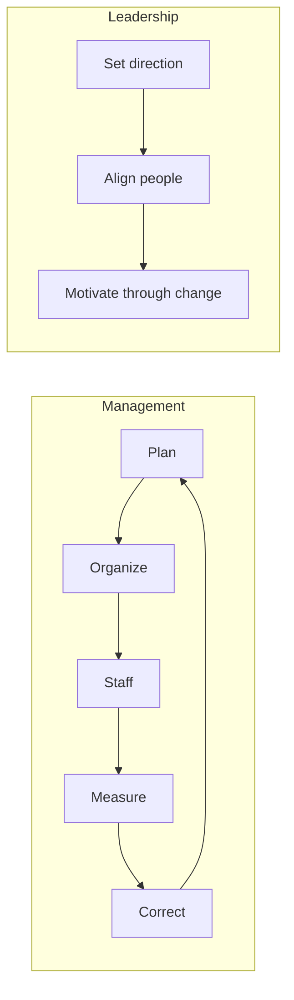

# Leadership and Management

Management and leadership are related but distinct. **Management** is the discipline of
producing predictable results with people and resources — planning, organizing,
staffing, measuring, correcting. **Leadership** is the work of setting direction,
aligning people to it, and motivating them to move through change and uncertainty. Warren
Bennis's aphorism captures the difference: managers do things right; leaders do the
right things. A healthy organization needs both — leadership without management is
vision that never ships; management without leadership is efficient motion toward the
wrong place.

## Drucker: the knowledge worker and management by objectives

Peter Drucker, who effectively invented management as a field of study, anchors this
concept; see [Drucker, *The Effective Executive*](drucker-effective-executive.md). Two
of his ideas dominate modern practice.

**Management by Objectives (MBO).** Rather than directing tasks, the manager and the
person agree on *objectives* — the results to be produced — and leave the *how* to the
person doing the work. This aligns individual effort with organizational goals while
preserving autonomy. Its descendants include OKRs and most goal-setting frameworks in use
today. The failure mode is measuring the objective badly, which turns MBO into the
incentive traps of [business ethics](business-ethics.md) and
[The Goal](../process-and-teams/the-goal.md).

**Knowledge-worker productivity.** Drucker saw that the twentieth century's great
management achievement was multiplying *manual* productivity, and that the twenty-first
century's task was doing the same for *knowledge* work. Knowledge workers cannot be
supervised the way manual workers were — they know more about their task than their boss
does. So the manager's job shifts from directing to *enabling*: defining the result,
removing obstacles, and asking "what is the task?" before "how hard is everyone working?"
Effectiveness (doing the right things) outranks efficiency (doing things right).

## Delegation

Delegation is the multiplier that lets a manager scale beyond their own hours. It is not
merely handing off tasks; it is transferring *ownership* of an outcome along with the
authority to achieve it. The recurring mistakes are delegating the task but not the
decision (creating a bottleneck), and delegating without clear success criteria (creating
rework). Stephen Covey's distinction between *gofer delegation* (do exactly this) and
*stewardship delegation* (own this result) in the
[Seven Habits](../personal-development/seven-habits-of-highly-effective-people.md) is the
canonical treatment: stewardship delegation trades short-term control for long-term
capacity.

## Organizational design

Structure is a tool, not a given. The classic forms trade off in predictable ways:

| Structure | Organized by | Strength | Weakness |
|---|---|---|---|
| Functional | Discipline (eng, sales, finance) | Deep expertise, clear craft ladders | Slow cross-team delivery, silos |
| Divisional | Product / market / geography | End-to-end ownership, accountability | Duplicated functions, less depth |
| Matrix | Function × project (dual reporting) | Flexibility, shared specialists | Conflicting priorities, two bosses |

Conway's Law — organizations ship their communication structure — means org design is
also, quietly, product design. Structure the teams the way you want the system to look.

## Culture

Culture is the set of behaviors an organization actually rewards, punishes, and tolerates
— not the values printed on the wall. It is the strongest control system a company has,
because it operates when no one is watching. Leaders shape culture far less through
statements than through what they *pay attention to, measure, and model*, and especially
through whom they promote and whom they let go. A stated value contradicted by an
incentive loses to the incentive every time.

## The manager's role in outcomes and leading through change

The manager owns the *conditions* under which results are produced: clear goals, the
right people in the right roles, feedback, and the removal of impediments. This makes the
manager accountable for the system, not just the individuals — most underperformance is a
system problem wearing a personal disguise.

Leading through change is where leadership proper is tested. John Kotter's model — create
urgency, build a guiding coalition, form a vision, communicate it relentlessly, empower
action, generate short-term wins, consolidate, and anchor the change in the culture —
codifies why most change efforts fail: they under-invest in urgency and communication and
declare victory too early. Change surfaces hard, high-stakes conversations, which is why
the skills in [Crucial Conversations](../personal-development/crucial-conversations.md)
are a core part of the manager's toolkit. As organizations increasingly manage
mixed teams of humans and AI agents, these same questions of direction, delegation, and
accountability recur; see [AI org](../ai-org/index.md).

## Why it matters

Individual contributors produce value linearly; managers and leaders produce value
through the *multiplier* they apply to everyone around them. A good manager can lift the
output of a whole team; a bad one can neutralize excellent people. Because the effect is
leveraged, the return on getting leadership and management right is one of the highest in
any organization.

## References

- Anchor: [Drucker, *The Effective Executive*](drucker-effective-executive.md).
- Cross-links:
  [Seven Habits of Highly Effective People](../personal-development/seven-habits-of-highly-effective-people.md),
  [Crucial Conversations](../personal-development/crucial-conversations.md),
  [AI org](../ai-org/index.md),
  [business ethics](business-ethics.md),
  [The Goal](../process-and-teams/the-goal.md).
