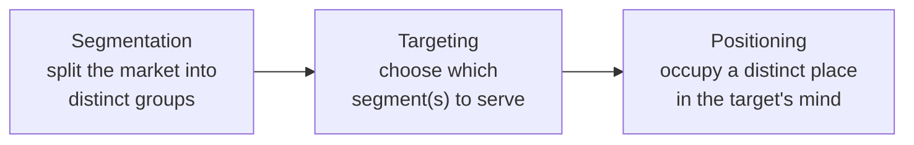

# Marketing and Positioning

Marketing is not advertising, and it is not the same thing as sales. In the discipline's
own definition — most associated with **Philip Kotler**, whose textbook is the field's
canonical anchor ([kotler-marketing-management](kotler-marketing-management.md)) —
marketing is the process of **understanding a market and creating, communicating, and
delivering value to it profitably**. Promotion is one slice of that (the "P" for
promotion below); the larger job is figuring out *who* you serve, *what* they actually
need, and *how* your offering fits into their lives better than the alternatives. Peter
Drucker put the endpoint sharply: the aim of marketing is to make selling superfluous —
to understand the customer so well that the product fits and sells itself. That customer
understanding is developed in depth in
[customer-empathy-and-jobs-to-be-done](customer-empathy-and-jobs-to-be-done.md).

## STP: segmentation, targeting, positioning

The workhorse framework of strategic marketing is **STP**. You cannot serve everyone, so
you divide, choose, and place:

- **Segmentation** — carve a heterogeneous market into groups whose members respond
  similarly. Bases include demographic (age, income), geographic, psychographic (values,
  lifestyle), and behavioral (usage, loyalty, the *job* they are trying to get done).
- **Targeting** — evaluate segments on size, growth, competitive intensity, and fit with
  your capabilities, then choose. A firm can target broadly (mass), pick a few segments
  (differentiated), or specialise deeply (concentrated/niche). This choice is a strategy
  decision, tied directly to [business-strategy](business-strategy.md) and where the firm
  can build [competitive-advantage](competitive-advantage.md).
- **Positioning** — decide the specific, defensible place you want to occupy in the
  target customer's mind relative to competitors.

## Positioning: owning a place in the mind

**Al Ries and Jack Trout** reframed positioning as a *battle for the mind*, not a
property of the product. Their key insight: the market is over-communicated, minds are
finite, and people file brands into simple mental slots. Positioning is the deliberate
act of choosing which slot you want and then relentlessly reinforcing it. Volvo owns
"safety"; a brand cannot also credibly own "fastest" — the mind rejects the
contradiction. Corollaries:

- **Be first, or create a new category** where you can be first. It is far cheaper to
  own a new ladder in the mind than to out-shout the leader on an existing one.
- **Focus beats breadth.** A sharp position ("the overnight package") sticks; a diffuse
  one ("we do everything") occupies no slot at all.
- Positioning is fundamentally about **perception**, which links it to the mechanics of
  [../psychology/social-psychology.md](../psychology/social-psychology.md) and the
  shortcuts people use under limited attention
  ([../psychology/cialdini-influence.md](../psychology/cialdini-influence.md)).

A **positioning statement** operationalises this: *For [target] who [need], [brand] is
the [category] that [key benefit], because [reason to believe].*

## Differentiation

Positioning requires something true to hang on — **differentiation**. You can
differentiate on the product (features, performance, durability), on services
(delivery, support, ease), on people, on channel, or on image/brand. The test of good
differentiation is that it is *meaningful* (customers care), *distinctive* (competitors
don't match it), and *defensible* (hard to copy). Differentiation is where marketing and
strategy meet: a durable point of difference is the customer-visible face of a
[competitive-advantage](competitive-advantage.md).

## The marketing mix (4Ps → 7Ps)

Once positioned, a firm executes through the **marketing mix** — the controllable levers,
classically the **4Ps** (McCarthy) and, for services, extended to **7Ps**:

| P | Lever | Question it answers |
|---|-------|---------------------|
| **Product** | the offering itself | what are we selling, with what features and quality? |
| **Price** | what the customer pays | how do we capture value (see [business-models-and-unit-economics](business-models-and-unit-economics.md))? |
| **Place** | distribution channels | how does it reach the customer? |
| **Promotion** | communication | how do they learn about and are persuaded to buy it? |
| **People** | staff who deliver | (services) who represents the brand at the moment of truth? |
| **Process** | how service is delivered | is the experience consistent and smooth? |
| **Physical evidence** | tangible cues | (services) what signals quality when the product is intangible? |

The mix must be **internally coherent** and consistent with the position: a luxury
position with discount pricing and mass-market channels self-destructs. Execution of
promotion and the channels/metrics side is developed in
[brand-and-growth-marketing](brand-and-growth-marketing.md).

## Category design

A modern extension of "create a new category where you can be first": **category design**
treats the most powerful marketing move as *defining a new market category and being
recognised as its leader* — not fighting for share in an existing one. Instead of a better
CRM, Salesforce evangelised "no software" and cloud SaaS; instead of a better taxi,
ride-hailing. The category creator sets the criteria buyers use to evaluate everyone
else, and reaps a disproportionate share of the category's value. This is positioning at
the level of the whole market, and it connects to
[disruptive-innovation](disruptive-innovation.md) — new categories often open below or
beside incumbents rather than head-on.

## Why it matters

Marketing is the bridge between what a company can make and what a market will pay for.
Without segmentation you build for a phantom "average" customer who doesn't exist; without
positioning you are a commodity competing on price; without a coherent mix you leak the
value your product creates. Get STP and positioning right and the rest of the business —
[product-management](product-management.md), [brand-and-growth-marketing](brand-and-growth-marketing.md),
pricing — has a clear target to aim at.

## References

- [Marketing Management](kotler-marketing-management.md) — Kotler's canonical treatment of
  STP, the marketing mix, and value creation.
