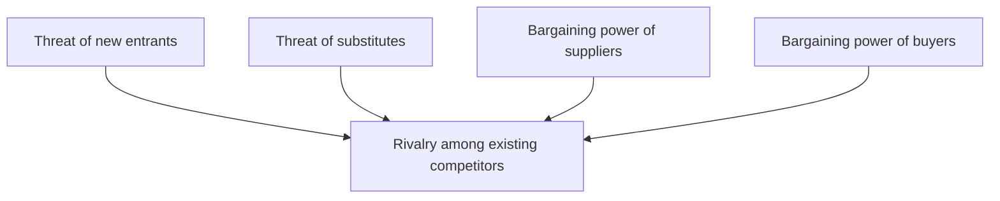

# Competitive Strategy (Michael Porter)

Michael Porter's *Competitive Strategy: Techniques for Analyzing Industries and
Competitors* (1980) is the foundational text of modern strategic analysis. Its central
claim is that a firm's profitability is determined less by whether it is well run than by
the **structure of the industry it competes in**, and that structure can be analyzed
rigorously rather than intuited. Strategy, in Porter's framing, is the deliberate choice
of how to position a firm within — or to reshape — that structure.

## The five forces

Porter reduces industry structure to five competitive forces that jointly set the ceiling
on how much profit an industry can sustain. Where the forces are strong, profit is
competed away; where they are weak, incumbents can earn returns above the industry
average.

- **Threat of new entrants** — held down by entry barriers: economies of scale, capital
  requirements, brand loyalty, switching costs, access to distribution.
- **Bargaining power of suppliers** — high when inputs are concentrated, differentiated,
  or costly to switch away from (the sole flour seller can dictate terms to the baker).
- **Bargaining power of buyers** — high when buyers are concentrated, purchase in volume,
  or face low switching costs and can integrate backward.
- **Threat of substitutes** — alternatives from *outside* the industry that cap the price
  ceiling.
- **Rivalry among existing competitors** — intensified by numerous equal-sized rivals,
  slow growth, high fixed costs, and low differentiation. Porter's airline example shows
  how high fixed and low variable costs drive ruinous price competition.

## Three generic strategies

To defend against the forces, Porter argues a firm must commit to one of three positions
rather than being "stuck in the middle":

- **Cost leadership** — become the lowest-cost producer, using scale and efficiency to
  out-price or out-margin rivals.
- **Differentiation** — offer something buyers value enough to pay a premium for (brand,
  quality, service, design).
- **Focus** — serve a narrow segment better than broad competitors, via either cost focus
  or differentiation focus.

A follow-on idea developed in his later work is the **value chain** — decomposing the firm
into discrete activities to locate where cost advantage or differentiation actually
originates.

Porter's frameworks give a firm a disciplined way to assess industry attractiveness and to
choose a defensible position — the analytical backbone of [business strategy](business-strategy.md)
and the classic account of how durable [competitive advantage](competitive-advantage.md) is
built and defended. The structural, economics-rooted view of profitability connects to
[industry economics and market structure](../economics/index.md), and applies directly when
[AI businesses](../ai-business/index.md) weigh where in a fast-moving value chain they can hold
an edge.

## References

- [Michael Porter — Harvard Business School faculty profile](https://www.hbs.edu/faculty/Pages/profile.aspx?facId=6532)
