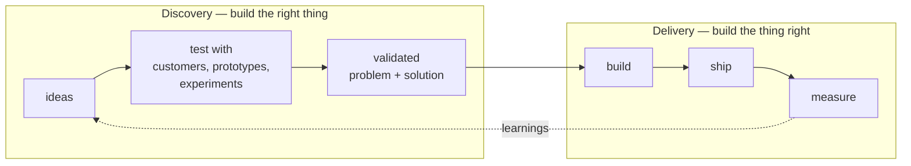

# Product Management

Product management is the discipline of **building the right thing** — deciding what to
build, for whom, and why, so that engineering effort produces customer and business value
rather than just working software. Where engineering owns *building it right*, product
management owns *building the right it*. Marty Cagan's *Inspired* and *Empowered* are the
field's touchstones; the practice rests directly on
[customer-empathy-and-jobs-to-be-done](customer-empathy-and-jobs-to-be-done.md).

## The PM role: four risks

A useful definition of the product manager's job is to ensure a product is **valuable,
viable, feasible, and usable** — the four risks every idea must survive:

| Risk | Question | Primary partner |
|------|----------|-----------------|
| **Value** | will customers buy / use it? | the customer (via discovery) |
| **Viability** | does it work for the *business* (legal, financial, brand)? | business stakeholders |
| **Feasibility** | can we actually build it? | engineering |
| **Usability** | can users figure out how to use it? | design ([../ux-design/index.md](../ux-design/index.md)) |

The PM does not command these; they *orchestrate* the team that owns them. The role is
influence without authority — aligning design, engineering, and stakeholders around a
shared understanding of the problem worth solving.

## Product-market fit

The single most important milestone is **product-market fit (PMF)** — the point at which a
product satisfies a strong market demand well enough that it pulls itself forward: users
retain, refer, and would be "very disappointed" without it (Sean Ellis's 40% test). Before
PMF, the job is *search* — rapid, cheap experiments to find the fit
([entrepreneurship-and-lean-startup](entrepreneurship-and-lean-startup.md)). After PMF,
the job shifts to *execution and scaling*. Confusing the two — scaling before fit — is the
most expensive mistake in product, and the core warning of
[ries-lean-startup](ries-lean-startup.md).

## Discovery vs delivery

Modern product work runs on **two tracks in parallel**, a model from Marty Cagan and Jeff
Patton (dual-track):

- **Discovery** validates *what* to build cheaply, before expensive engineering — rapid
  prototypes, interviews, and experiments to de-risk value and usability.
- **Delivery** builds and ships the validated work reliably.

Keeping discovery continuous (not a one-time upfront phase) is what separates
product-led teams from feature factories.

## Prioritization

There is always more to build than capacity allows, so **prioritization** is the daily
craft. Common lenses — used as thinking aids, not oracles:

- **RICE** — Reach × Impact × Confidence ÷ Effort.
- **Value vs Effort** (2×2) — chase high-value/low-effort first.
- **Opportunity/impact scoring** against a small set of outcome goals.
- **Cost of delay / WSJF** — weight by the economic cost of *not* doing it now.

The frameworks impose discipline, but judgement about which problems matter most —
informed by real customer jobs — is what makes prioritization good.

## Roadmaps and outcomes over output

Traditional roadmaps are lists of features with dates — which quietly turn a team into a
**feature factory** measured by shipping, the "build trap" of
[customer-empathy-and-jobs-to-be-done](customer-empathy-and-jobs-to-be-done.md). The
modern alternative is the **outcome-based roadmap**: commit to *problems to solve and
outcomes to move* (activation rate, retention, revenue per user) rather than to a fixed
feature list. The team is then free to discover the best solution. This
**outcomes-over-output** stance is the through-line of good product management and is the
same principle championed in
[../ai-org/product-engineer-manifesto.md](../ai-org/product-engineer-manifesto.md):
measure whether the customer's life got better, not how much you shipped.

## The empowered product team

Cagan's *Empowered* draws the sharpest structural line in the field: **feature teams** are
handed a prioritized list of features to build (output), while **empowered product teams**
are handed *problems to solve* and given the autonomy, context, and accountability to find
the best solution (outcomes). Empowered teams are cross-functional (product, design,
engineering as peers), durable (they stay with a problem space long enough to build deep
knowledge), and trusted with the *why*. This is also where product management meets team
process — the shared understanding an empowered team needs is built through practices like
[../process-and-teams/user-stories-applied.md](../process-and-teams/user-stories-applied.md),
which keep the conversation on the user's need rather than a spec to implement.

## Why it matters

Engineering capacity is expensive and the biggest waste in software is building the wrong
thing well. Product management is the function that protects against that waste: it finds
product-market fit before scaling, runs discovery so most bad ideas die cheaply, prioritises
ruthlessly, and steers by outcomes rather than output. Done well it is the difference
between a team that ships a lot and a team that matters.

## References

- [Competing Against Luck](christensen-competing-against-luck.md) — the Jobs-to-be-Done
  foundation product discovery depends on.
- [The Lean Startup](ries-lean-startup.md) — validated learning and the search for
  product-market fit that frames pre-PMF product work.
