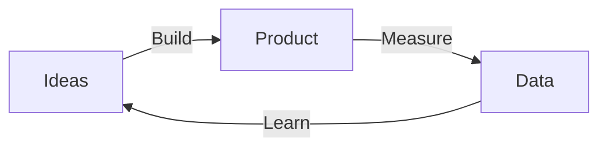

# The Lean Startup (Eric Ries)

Eric Ries's *The Lean Startup* (2011) reframes entrepreneurship as a **management
discipline** rather than an act of vision or luck. A startup, in Ries's definition, is a
human institution built to create something new under conditions of *extreme uncertainty* —
and the way to succeed under uncertainty is to treat the business as a series of
experiments and steer by the results. Startup success, he argues, can be engineered by
following a process, which means it can be learned and taught.

## Validated learning

The unit of progress for a startup is not features shipped, money raised, or customers
served — it is **validated learning**: empirically demonstrated knowledge about what
customers actually want, obtained by running experiments that test the risky assumptions
in the founder's vision. Anything that does not contribute to that learning is waste.

## The Build–Measure–Learn loop

The core activity is a feedback loop: turn ideas into a product, measure how customers
respond, and learn whether to *pivot or persevere*. The goal is to minimize the total time
through the loop.

- **Minimum Viable Product (MVP)** — the smallest thing that starts the learning loop, not
  the smallest version of the final product. Its purpose is to begin measuring customer
  behavior as fast as possible, not to be complete.
- **Innovation accounting** — a rigorous way to measure progress, set milestones, and
  prioritize under uncertainty, using *actionable* metrics that show cause and effect
  rather than flattering vanity numbers.
- **Pivot or persevere** — when the metrics show the current hypothesis isn't working, make
  a structured course correction (a pivot) to test a new fundamental hypothesis while
  keeping what has been learned. Techniques like the "Five Whys" trace problems to root
  causes.

The through-line: entrepreneurs are everywhere (not only in garages), and entrepreneurship
*is* management — a startup is an institution that requires its own kind of management
geared to uncertainty.

The Lean Startup is the canonical modern reference for
[entrepreneurship and the lean-startup method](entrepreneurship-and-lean-startup.md). Its
insistence on testing what customers truly want makes it a natural companion to
[customer empathy and jobs-to-be-done](customer-empathy-and-jobs-to-be-done.md). The
experiment-driven, evidence-first stance connects to
[economics](../economics/index.md) and is now standard operating logic for
[AI businesses](../ai-business/index.md) iterating quickly on new products.

## References

- [The Lean Startup — Eric Ries](http://theleanstartup.com/)
