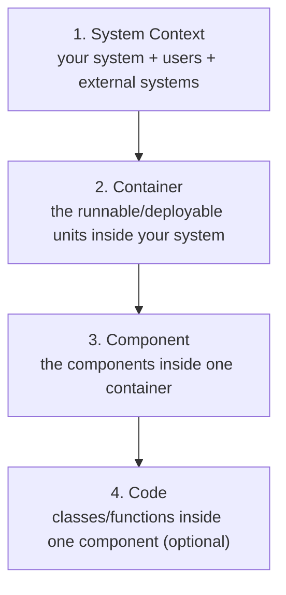

# The C4 Model

Simon Brown's **C4 model** is a lightweight, developer-friendly way to *visualise software
architecture*. It fixes the common problem where architecture diagrams are inconsistent
boxes-and-lines with no shared meaning — nobody agrees what a box is or what a line implies.
C4 gives you a small vocabulary of abstractions and a set of zoom levels, like Google Maps for
code: you can zoom from the whole landscape down to individual code.

## The four abstractions (the "C4")

The model is built on a strict hierarchy of four abstractions, from coarse to fine:

1. **Software System** — the highest level; something that delivers value to its users. It is
   what you are building (or an external system you depend on).
2. **Container** — a separately runnable/deployable unit that executes code or stores data:
   a web app, an API, a mobile app, a database, a file system, a shell script. (This is
   *not* a Docker container specifically — it predates that usage; think "something that hosts
   code or data.")
3. **Component** — a grouping of related functionality behind a well-defined interface, living
   *inside* a container. Not a separately deployable thing.
4. **Code** — how a component is implemented: classes, functions, interfaces. Usually you let
   the IDE/UML generate this and rarely draw it by hand.

## The four core diagrams

Each abstraction gets a corresponding diagram, and each is a zoom-in of the previous one:

- **System Context** — the big picture: your system as one box, the people who use it, and the
  other systems it talks to. Audience: everyone, technical and non-technical.
- **Container** — zoom into your system to show the high-level technical building blocks (apps,
  services, data stores) and how they communicate. This is the most useful day-to-day diagram.
- **Component** — zoom into one container to show its components and their responsibilities.
- **Code** — zoom into one component; optional and often auto-generated.

## Supporting diagrams

Beyond the four core levels, C4 offers **system landscape** (multiple systems in an enterprise),
**dynamic** (runtime collaboration / sequence-style), and **deployment** (how containers map to
infrastructure).

## Principles

- **Notation independent** — C4 does not prescribe a specific shape language. Any notation works
  as long as each diagram has a clear title, an explicit legend/key, and unambiguous labels on
  boxes and lines.
- **Tooling independent** — draw it on a whiteboard, in diagrams-as-code (e.g. Structurizr,
  Mermaid, PlantUML), or in any diagramming tool.
- **Abstraction first, notation second** — agree on the mental model (system → container →
  component → code) before arguing about how to draw it.

## Takeaways

- Most architecture diagrams fail because the abstractions aren't shared; C4 fixes the
  *abstractions*, then lets you pick any notation.
- Use the **container diagram** as your default working diagram — it's the sweet spot of detail.
- Don't over-produce: system context and container diagrams cover most needs; component and code
  diagrams only when they earn their keep.
- Every diagram must stand alone: title, legend, and clearly labelled relationships.

Related notes in HAL: [Design It! From Programmer to Software Architect](design-it.md),
[Clean Architecture](clean-architecture.md), [Domain-Driven Design](domain-driven-design.md),
[The Mother of All Architecture Diagrams](mother-of-all-architecture-diagrams.md),
[Documenting Architecture Decisions](documenting-architecture-decisions.md).

## References

- [The C4 model for visualising software architecture — Simon Brown](https://c4model.com)
