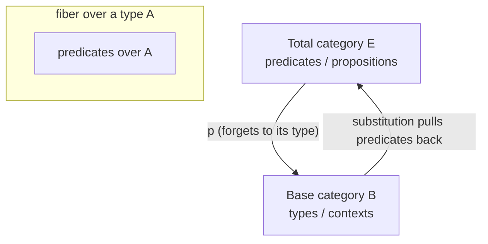

# Categorical Logic and Type Theory

Bart Jacobs's 1999 monograph (North-Holland, *Studies in Logic and the Foundations of Mathematics* 141) is the reference survey of **categorical logic** — the program of describing logics and type theories in the language of category theory. Its organizing idea is that both predicate logic and dependent type theory are best understood through a single structure: the **fibration**. It is kept here as the rigorous top of the stack that begins with [naive set theory](naive-set-theory.md): where Halmos gives sets, relations, and functions, Jacobs gives the categorical grammar in which *types and the propositions about them* are the same kind of object.

## The core move: predicates as a fibration

A fibration is a functor `p : E → B` where the base category `B` holds **types** (or contexts) and the total category `E` holds **predicates / propositions indexed by those types**. Above each type sits a fiber — the collection of predicates over that type. Substitution along a morphism in the base (renaming a variable, instantiating a context) pulls predicates back to predicates, functorially. This one picture captures the intuition that "a property is always a property *of* something."

## Quantifiers as adjoints, connectives as structure

Within this frame the logical apparatus falls out as categorical structure rather than being bolted on:

- **Connectives** (`∧`, `∨`, `⊃`) are fiberwise structure — products, coproducts, and exponentials inside each fiber.
- **Quantifiers** are **adjoints to substitution**: `∃` is left adjoint and `∀` is right adjoint to the pullback functor along a projection. This is the Lawvere insight that Jacobs develops systematically — quantification is not a primitive, it is the adjoint to the operation of forgetting a variable.
- **Equality** is itself a left adjoint, along a diagonal.

The book then climbs the ladder of type theories — simple, polymorphic, dependent, and higher-order — showing which categorical structure each one demands (cartesian closed categories, then locally cartesian closed categories and comprehension categories for dependent types), and treats the Curry–Howard–Lambek correspondence as the throughline: **proofs are programs, propositions are types, and both are morphisms in the right category.**

## Why it matters here

This is the theoretical ceiling above HAL's practical type notes. The claim that a type checker is a proof checker — that a well-typed program is a constructive proof of its own specification — is exactly the Curry–Howard–Lambek correspondence Jacobs formalizes. That is the deep reason types are a reliability tool for AI-generated change: a compiler rejecting an ill-typed program is rejecting an invalid proof. It connects downward to [naive set theory](naive-set-theory.md) (the set-theoretic model of functions the categorical account generalizes) and sits alongside [predicate calculus and program semantics](predicate-calculus-and-program-semantics.md), where Dijkstra treats predicates over program states operationally; Jacobs supplies the categorical semantics for those same predicates and their quantifiers.

## References

- [Categorical Logic and Type Theory — Bart Jacobs (Radboud University book page)](https://www.cs.ru.nl/B.Jacobs/CLT/bookinfo.html)
