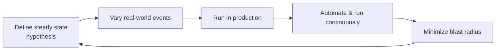

# Chaos Engineering

Casey Rosenthal and Nora Jones (with contributors from Netflix, Google, Slack, and others)
define chaos engineering as **the discipline of experimenting on a system in order to
build confidence in its ability to withstand turbulent conditions in production.** The
insight is that in complex distributed systems, failure is not an edge case to be tested
away — it is a permanent property. So rather than hope the system is resilient, you inject
controlled turbulence and *measure* whether it holds. Chaos engineering is empirical:
it verifies **that** the system works, not how it is supposed to work on paper.

## Why it exists

Complex systems fail in ways no individual can fully predict, as
[How Complex Systems Fail](how-complex-systems-fail.md) argues and as the wider
[resilience engineering](resilience-engineering-woods.md) tradition studies. Unit and
integration tests cover known failure modes; chaos engineering targets the emergent,
systemic uncertainty that only appears at real scale and real traffic.

## The principles

- **Build a hypothesis around steady-state behavior.** Focus on measurable *output* of the
  system (throughput, error rate, latency percentiles) as a proxy for health, not internal
  attributes. Hypothesize that steady state continues in both the control and experimental
  groups.
- **Vary real-world events.** Inject events that actually happen — server crashes, network
  latency, dependency failures, traffic spikes — prioritized by likelihood and impact.
- **Run experiments in production.** Only production has the real traffic, state, and
  cardinality; staging cannot reproduce it. This is the same testing-in-production logic as
  [Observability Engineering](observability-engineering.md).
- **Automate experiments to run continuously.** Manual chaos doesn't scale; automate so
  resilience is verified on an ongoing basis, not once.
- **Minimize blast radius.** Contain the potential customer harm — small experiments,
  guardrails, automatic aborts — because experimenting in production can cause real pain.

## Game days

A **game day** is a scheduled, deliberate exercise where a team runs failure experiments
together (often against a defined hypothesis), observes the system and the people/process
responses, and captures what breaks. Game days build organizational muscle and feed
straight into [blameless post-mortems](blameless-post-mortems.md), complementing the
reliability discipline of [Site Reliability Engineering](site-reliability-engineering.md)
and the fast-feedback culture of [The DevOps Handbook](devops-handbook.md).

## References

- [Chaos Engineering — O'Reilly](https://www.oreilly.com/library/view/chaos-engineering/9781492043850/)
- [Principles of Chaos Engineering](https://principlesofchaos.org/)
