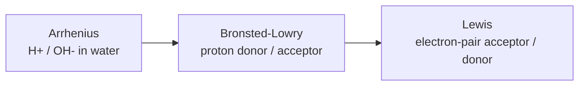

# Acids and Bases

Acid–base chemistry is [chemical equilibrium](chemical-equilibrium.md) applied to one
particular particle: the proton (H⁺). Three definitions, each broader than the last,
describe what "acid" and "base" mean, and a single equilibrium framework predicts pH,
strength, buffering, and the shape of a titration curve.

## Three definitions, widening in scope

- **Arrhenius** — an acid releases H⁺ in water; a base releases OH⁻. Simple, but limited to
  aqueous solutions.
- **Brønsted–Lowry** — an acid is a **proton donor**, a base a **proton acceptor**. Every
  acid has a **conjugate base** (what remains after it loses H⁺), and reactions are proton
  transfers between conjugate pairs. This is the workhorse model.
- **Lewis** — an acid is an **electron-pair acceptor**, a base an electron-pair donor. This
  generalizes acidity to reactions with no proton at all (e.g. BF₃, metal cations), and
  connects directly to [chemical-bonding.md](chemical-bonding.md), since a Lewis acid–base
  reaction *is* the formation of a coordinate covalent bond.

## pH, pOH, and the water equilibrium

Water self-ionizes: $2H_2O \rightleftharpoons H_3O^+ + OH^-$, with
$K_w = [H^+][OH^-] = 1.0\times10^{-14}$ at 25 °C. Because concentrations span many orders of
magnitude, we use a log scale:

$$\text{pH} = -\log_{10}[H^+], \qquad \text{pOH} = -\log_{10}[OH^-], \qquad \text{pH} + \text{pOH} = 14$$

Each unit of pH is a tenfold change in H⁺. Neutral is pH 7 (at 25 °C), acidic below,
basic above.

## Strong vs weak — Ka and Kb

Strength is about the *position of the proton-transfer equilibrium*, not concentration.

- A **strong acid** (HCl, HNO₃, H₂SO₄) ionizes essentially completely — the equilibrium
  lies fully to the right.
- A **weak acid** (acetic acid, HF) ionizes only partially; its extent is captured by the
  acid dissociation constant:

$$K_a = \frac{[H^+][A^-]}{[HA]}, \qquad \text{pK}_a = -\log_{10} K_a$$

A larger Kₐ (smaller pKₐ) means a stronger acid. The analogous **Kb** describes bases, and
for a conjugate pair $K_a \cdot K_b = K_w$ — a strong acid necessarily has a very weak
conjugate base.

## Buffers — negative feedback for pH

A **buffer** is a mixture of a weak acid and its conjugate base (or a weak base and its
conjugate acid). It resists pH change: added H⁺ is soaked up by the conjugate base, added
OH⁻ is neutralized by the weak acid. This is Le Chatelier's principle
([negative feedback](../systems-thinking/feedback-loops.md)) doing biological and chemical
work. The **Henderson–Hasselbalch** equation gives the pH:

$$\text{pH} = \text{pK}_a + \log_{10}\frac{[A^-]}{[HA]}$$

Buffering is strongest when $[A^-] \approx [HA]$, i.e. near pH = pKₐ. Blood is buffered near
pH 7.4 by the bicarbonate system, and enzymes depend on tightly held pH — the reason
acid–base balance is central to
[biochemistry and metabolism](../biology/biochemistry-and-metabolism.md).

## Titration

A titration adds a base of known concentration to an acid (or vice versa) to find the
unknown amount. Plotting pH against volume added produces a characteristic S-curve:

- The **equivalence point** is where moles of added base equal moles of acid — a steep
  vertical jump in pH.
- For a **weak** acid, the midpoint to the equivalence point is the **half-equivalence
  point**, where $\text{pH} = \text{pK}_a$ (half neutralized ⇒ $[A^-]=[HA]$) and buffering
  is maximal.
- A strong acid–strong base titration has its equivalence point at pH 7; weak-acid/strong-
  base titrations end above 7 because the conjugate base is itself weakly basic.

## Connection to redox

Both acid–base and redox chemistry are transfer reactions — protons in one case, electrons
in the other. Many biological and industrial processes couple the two (proton-coupled
electron transfer), which is why acid–base thinking recurs in
[redox-and-electrochemistry.md](redox-and-electrochemistry.md).

## References

- [Brown & LeMay, *Chemistry: The Central Science*](brown-lemay-chemistry-the-central-science.md)
- [Atkins, *Physical Chemistry*](atkins-physical-chemistry.md)
