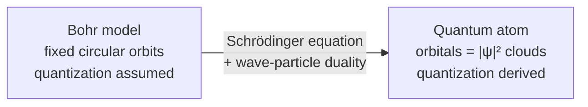

# Atomic Structure

An atom is a tiny, dense, positively charged **nucleus** — protons and neutrons — surrounded
by **electrons**. Nearly all the mass sits in the nucleus; nearly all the volume is the
electron cloud. Chemistry is almost entirely the behavior of those outer electrons, and their
behavior is governed by [quantum mechanics](../physics/quantum-mechanics.md). In a real sense,
**chemistry is quantum mechanics applied to electrons around nuclei**.

## Anatomy of the atom

- **Protons** carry charge `+1` and set the element's identity. The number of protons is the
  **atomic number** `Z`; changing it changes the element.
- **Neutrons** are electrically neutral and add mass. Atoms of one element with differing
  neutron counts are **isotopes**.
- **Electrons** carry charge `−1`. A neutral atom has as many electrons as protons; gaining or
  losing them makes **ions**.

The number and arrangement of electrons drive [the periodic table](the-periodic-table.md),
[chemical bonding](chemical-bonding.md), and essentially all reactivity.

## From Bohr to the quantum atom

Rutherford's 1911 scattering experiment revealed the nuclear atom, but a classical electron
orbiting a nucleus would radiate energy and spiral in almost instantly. Bohr's 1913 model
patched this by *decreeing* that electrons occupy discrete circular orbits of fixed energy and
jump between them by absorbing or emitting a photon of exactly the energy difference. This
neatly reproduced the hydrogen spectrum — but it was an ad hoc rule with no deeper
justification, and it failed for multi-electron atoms.

The resolution came with wave–particle duality (de Broglie) and the **Schrödinger equation**
(1926). An electron is not a point on an orbit but a standing **wavefunction** `ψ` bound to the
nucleus. Solving `Ĥψ = Eψ` for the hydrogen atom yields discrete allowed energies *automatically*
— the quantization Bohr had to assume falls out of the boundary conditions. The orbits become
**orbitals**: three-dimensional probability clouds, `|ψ|²`, describing where the electron is
likely to be found.

## Quantum numbers and orbitals

Each bound electron state is labeled by four **quantum numbers**:

| Symbol | Name | Values | Meaning |
|--------|------|--------|---------|
| `n` | principal | 1, 2, 3, … | shell; size and energy |
| `ℓ` | azimuthal | 0 … n−1 | subshell / orbital shape (s, p, d, f) |
| `mₗ` | magnetic | −ℓ … +ℓ | orbital orientation in space |
| `mₛ` | spin | ±½ | intrinsic electron spin |

`ℓ = 0,1,2,3` correspond to **s** (spherical), **p** (dumbbell), **d**, and **f** orbitals.
The set `(n, ℓ, mₗ)` names one orbital; each orbital holds at most two electrons of opposite
spin. The **Pauli exclusion principle** forbids any two electrons from sharing all four
numbers — this is *the* reason electrons stack into shells rather than all collapsing into the
lowest state, and thus the reason matter has structure at all.

## Electron configuration

The ground-state arrangement of an atom's electrons follows three rules:

- **Aufbau principle** — fill orbitals from lowest energy upward (1s, 2s, 2p, 3s, 3p, 4s, 3d, …).
- **Pauli exclusion** — at most two electrons per orbital, opposite spins.
- **Hund's rule** — within a subshell, singly occupy each orbital before pairing.

So oxygen (`Z = 8`) is `1s² 2s² 2p⁴`. The outermost, highest-energy electrons — the **valence
electrons** — are the ones that participate in bonding. Because configuration recurs periodically
as `Z` grows, it is the organizing principle behind [the periodic table](the-periodic-table.md)
and predicts which [bonds](chemical-bonding.md) an atom will form.

## Why it matters

The quantum model of the atom explains atomic spectra, the shape of the periodic table, why
elements combine in fixed ratios, and the geometry of molecules. Every downstream idea in
chemistry — periodicity, bonding, reactivity, spectroscopy — is a consequence of how electrons
fill quantized states around a nucleus.

## References

- [General Chemistry](mcquarrie-general-chemistry.md) — McQuarrie, a quantum-first treatment of the atom
- [Chemistry: The Central Science](brown-lemay-chemistry-the-central-science.md) — Brown & LeMay
- [Introduction to Quantum Mechanics](../physics/griffiths-introduction-to-quantum-mechanics.md) — the hydrogen-atom solution
