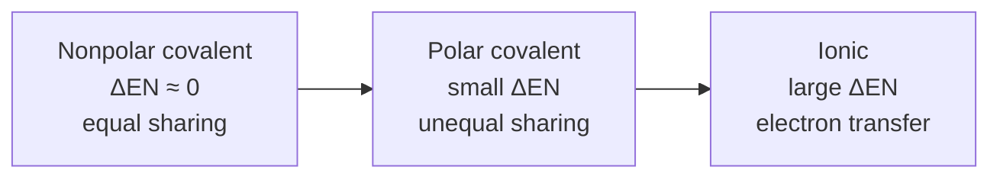

# Chemical Bonding

A chemical bond is the attractive force that holds atoms together in molecules and solids. Atoms
bond because doing so lowers their total energy — most often by achieving a stable, filled
valence shell (the **octet rule**: eight electrons in the outer `s` and `p` orbitals, matching a
noble-gas configuration). The available bonds and the atoms' willingness to form them follow
directly from valence [electron configuration](atomic-structure.md) and the periodic trend in
[electronegativity](the-periodic-table.md). Linus Pauling's *The Nature of the Chemical Bond*
unified these ideas and is the anchoring work here.

## Electronegativity and the bonding spectrum

Electronegativity is an atom's pull on shared electrons. The **difference** in electronegativity
between two bonded atoms places the bond on a continuous spectrum — there are no sharp categories,
only a gradient:

## The three main bond types

- **Ionic** — one atom (low ionization energy, a metal) transfers electrons to another (high
  electronegativity, a nonmetal), forming `+` and `−` **ions** held by electrostatic attraction
  (see [electromagnetism](../physics/electromagnetism.md)). Yields brittle, high-melting
  crystalline lattices like NaCl.
- **Covalent** — atoms **share** electron pairs. Equal sharing (ΔEN ≈ 0) is nonpolar; unequal
  sharing gives a **polar** bond with partial charges. Produces discrete molecules with specific
  shapes.
- **Metallic** — metal atoms pool their valence electrons into a delocalized "sea" flowing around
  fixed positive cores, explaining electrical/thermal conductivity, malleability, and luster.

## Models of the covalent bond

Chemistry uses a ladder of increasingly quantum-mechanical models, each more accurate than the last:

- **Lewis structures** — dots and lines track valence electrons and lone pairs; a quick bookkeeping
  tool for checking the octet rule.
- **VSEPR** (Valence Shell Electron Pair Repulsion) — electron pairs around a central atom repel and
  spread out, predicting molecular **shape**: linear, trigonal planar, tetrahedral, bent, and so on.
  Shape sets the molecule's polarity and much of its behavior.
- **Hybridization** — atomic orbitals mix into equivalent hybrids (`sp`, `sp²`, `sp³`) that point
  toward bonding partners, reconciling orbital shapes with observed geometry (e.g. carbon's
  tetrahedral `sp³`).
- **Molecular orbital (MO) theory** — the fully quantum picture: atomic orbitals combine into
  **bonding** and **antibonding** molecular orbitals spread over the whole molecule. MO theory
  explains what Lewis structures cannot — bond order, the paramagnetism of O₂, and the delocalized
  electrons of benzene. It is [quantum mechanics](../physics/quantum-mechanics.md) applied to
  many-atom systems.

## The octet rule and its exceptions

The octet rule is a strong first guide but not a law. Real exceptions include: **incomplete octets**
(boron, beryllium), **odd-electron species** (NO, with an unpaired electron), and **expanded octets**
for period-3-and-below atoms (SF₆, PCl₅) that can use `d` orbitals to hold more than eight electrons.
These are exactly the cases where the simple valence picture breaks and MO theory earns its keep.

## Why it matters

Bonding determines everything about a substance: its shape, polarity, melting point, solubility,
conductivity, and reactivity. The polarity of covalent bonds sets up the
[intermolecular forces](states-of-matter-and-intermolecular-forces.md) that govern bulk properties,
and the making and breaking of bonds *is* [chemical reaction](chemical-reactions.md). Bonding is the
bridge from the quantum behavior of single atoms to the macroscopic properties of matter.

## References

- [The Nature of the Chemical Bond](pauling-nature-of-the-chemical-bond.md) — Linus Pauling, the foundational text
- [General Chemistry](mcquarrie-general-chemistry.md) — McQuarrie, quantum-first treatment of bonding
- [Chemistry: The Central Science](brown-lemay-chemistry-the-central-science.md) — Brown & LeMay
