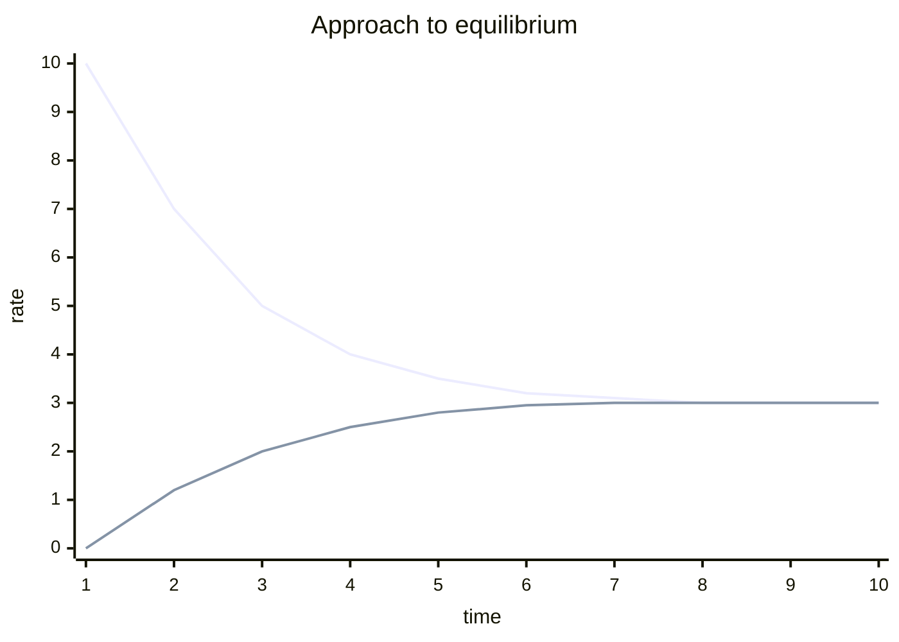

# Chemical Equilibrium

Most reactions do not run to completion and stop. They run *both ways*. A reversible
reaction reaches **chemical equilibrium** when the forward and reverse reactions proceed
at equal rates, so the concentrations of reactants and products stop changing. Crucially,
equilibrium is **dynamic**, not static: molecules are still reacting in both directions;
the two flows simply cancel. Nothing has "stopped" — it has *balanced*.

## Dynamic equilibrium

Consider a generic reversible reaction:

$$aA + bB \rightleftharpoons cC + dD$$

Early on, reactants are abundant, so the forward rate is high; there is little product, so
the reverse rate is near zero. As product accumulates, the forward rate falls and the
reverse rate climbs. They meet. From then on, macroscopic properties (color, pressure,
concentration) are constant even though individual molecules keep interconverting. This
"two opposing rates that meet" picture is why equilibrium sits at the intersection of
[chemical-kinetics.md](chemical-kinetics.md) (which sets *how fast* each direction goes)
and [chemical-thermodynamics.md](chemical-thermodynamics.md) (which sets *where* the
balance point lies).

When the lines merge, the system is at equilibrium — both reactions continue at the shared
rate.

## The equilibrium constant K

At equilibrium the ratio of product to reactant concentrations, each raised to its
stoichiometric coefficient (see [stoichiometry-and-the-mole.md](stoichiometry-and-the-mole.md)),
is a constant at a given temperature:

$$K = \frac{[C]^c[D]^d}{[A]^a[B]^b}$$

- **Large K (≫ 1):** equilibrium lies far to the right — products dominate.
- **Small K (≪ 1):** equilibrium lies far to the left — reactants dominate.
- **K ≈ 1:** appreciable amounts of both.

K is temperature-dependent (and *only* temperature-dependent). It is tied to the standard
free-energy change by $\Delta G^\circ = -RT \ln K$ — the thermodynamic bridge that makes
equilibrium position a consequence of energy and entropy, not an accident.

## The reaction quotient Q

Q has the same algebraic form as K but uses the *current* (not necessarily equilibrium)
concentrations. Comparing Q to K tells you which way the reaction must shift:

| Comparison | Meaning | Net direction |
|---|---|---|
| Q < K | too few products | shifts forward (→) |
| Q = K | at equilibrium | no net change |
| Q > K | too many products | shifts reverse (←) |

Q is the diagnostic; K is the target.

## Le Chatelier's principle — a chemical negative-feedback loop

**If a system at equilibrium is disturbed, it shifts in the direction that partially
counteracts the disturbance.** This is precisely a negative-feedback loop in the
[systems-thinking sense](../systems-thinking/feedback-loops.md): a perturbation is met by
a response that opposes it, restoring balance. Concretely:

- **Add reactant** → shifts forward to consume it.
- **Remove product** → shifts forward to replace it (the basis of driving reactions by
  removing a gas or precipitate).
- **Increase pressure** (gas-phase) → shifts toward the side with fewer moles of gas.
- **Increase temperature** → shifts in the *endothermic* direction (heat treated as a
  reactant or product); this actually changes K, unlike concentration or pressure changes.

The system cannot fully undo the disturbance — it only *partially* offsets it, which is the
signature of proportional negative feedback rather than perfect cancellation.

## Why equilibrium is not "stopped"

The single most common misconception is that equilibrium means the reaction has finished.
It has not. Radioactive- or isotope-labelling experiments show reactant and product
molecules continuously trading places at equilibrium. The constancy is a steady state of
two busy, opposing processes — the same conceptual move that underlies buffers and weak-acid
behavior in [acids-and-bases.md](acids-and-bases.md), where a proton-transfer equilibrium
resists changes in pH.

## References

- [Brown & LeMay, *Chemistry: The Central Science*](brown-lemay-chemistry-the-central-science.md)
- [Atkins, *Physical Chemistry*](atkins-physical-chemistry.md)
