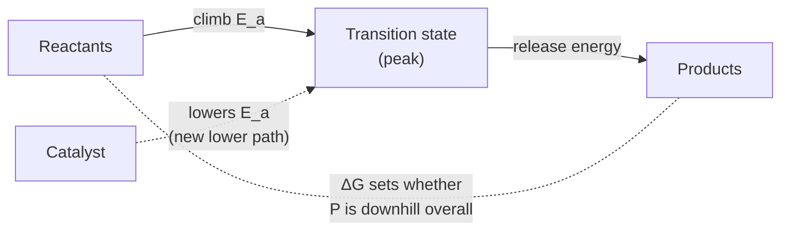

# Chemical Kinetics

If [thermodynamics](chemical-thermodynamics.md) says *whether* a reaction will go, kinetics
says *when* — and the two answers can disagree wildly. A mixture of hydrogen and oxygen is
enormously favored thermodynamically to become water, yet it sits inert on the bench for
years until a spark arrives. Thermodynamics governs the destination; kinetics governs the
journey and how long it takes. Kinetics is the study of reaction **rates** and the molecular
pathways behind them.

## Reaction rate

The rate is how fast concentrations change over time — the disappearance of reactants or
appearance of products, in mol L⁻¹ s⁻¹. It is a *derivative*, so kinetics is naturally the
domain of [differential equations](../math/differential-equations.md): a rate law is an ODE
in concentration, and integrating it gives the concentration-versus-time curve you actually
measure.

## Rate laws and order

Experiment shows that rate usually depends on reactant concentrations raised to some powers:

$$ \text{rate} = k\,[\mathrm{A}]^{m}[\mathrm{B}]^{n}. $$

Here $k$ is the **rate constant** (temperature-dependent), and the exponents $m, n$ are the
**orders** with respect to each reactant; their sum is the overall order. Crucially, the
orders are *not* read off the balanced equation — they are found by experiment, because they
reflect the mechanism, not the overall stoichiometry. Integrating the rate law gives clean
signatures: a **first-order** reaction decays exponentially with a constant half-life
(the mathematics of radioactive decay and drug clearance); a **second-order** reaction's
inverse concentration rises linearly.

## Mechanism and the rate-determining step

Most reactions are not the single collision the overall equation suggests; they proceed
through a **mechanism** of elementary steps. The slowest step — the **rate-determining
step** — throttles the whole sequence, the way the narrowest point on a road sets the traffic
flow. The observed rate law reflects the species involved up to and including that bottleneck,
which is why the experimental orders can differ from the overall coefficients.

## Activation energy and the Arrhenius equation

Every elementary step must climb an energy barrier — the **activation energy** $E_a$ — to
reach the transition state before rolling down to products. Only the fraction of collisions
with enough energy clears the barrier, and that fraction is exquisitely sensitive to
temperature. The **Arrhenius equation** captures it:

$$ k = A\,e^{-E_a / RT}, $$

where $A$ is the frequency/orientation factor and $R$ is the gas constant. The exponential
means a modest rise in $T$ can multiply the rate several-fold — roughly the "10 °C doubles the
rate" rule of thumb. Note what the barrier does *not* touch: $E_a$ affects the rate but not
whether the reaction is favorable (that is ΔG), which is exactly why kinetics and
thermodynamics answer different questions.

## Catalysis and enzymes

A **catalyst** speeds a reaction by opening a new pathway with a lower activation energy,
without being consumed. It changes the *route*, not the *destination*: it accelerates forward
and reverse equally, so it leaves the [equilibrium](chemical-equilibrium.md) position and ΔG
untouched — it only lets the system reach equilibrium sooner. **Enzymes** are nature's
catalysts, protein machines that bind substrates in a shaped active site and can accelerate
reactions by factors of a million or more, giving biology precise control over which
thermodynamically-favorable reactions actually proceed, and how fast.

## Why it matters

Kinetics is where chemistry meets time. It sets reactor throughput and shelf life, explains
why favorable reactions can be indefinitely stalled (and how a catalyst rescues them), and
underlies the entire logic of metabolism, where enzymes decide the pace of life. Together with
[thermodynamics](chemical-thermodynamics.md) it gives the complete practical picture: *can it
go, and will it get there in time?*

## References

- [Physical Chemistry](atkins-physical-chemistry.md) — Atkins, the standard treatment of kinetics for chemists
- [Chemistry: The Central Science](brown-lemay-chemistry-the-central-science.md) — Brown & LeMay
