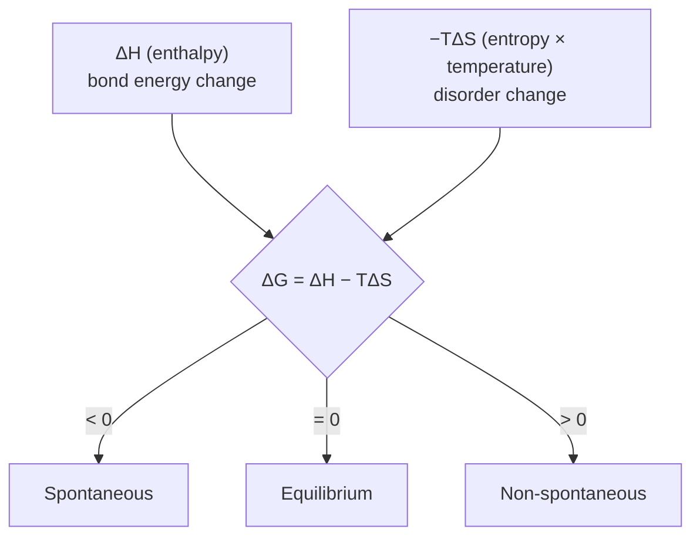

# Chemical Thermodynamics

Chemical thermodynamics answers one deceptively simple question: **will this reaction go?**
Not how fast — that is [kinetics](chemical-kinetics.md) — but whether the reaction is
*spontaneous*, meaning it can proceed on its own without a continuous input of energy. The
answer comes from applying the general laws of [thermodynamics](../physics/thermodynamics.md)
to the specific case of atoms rearranging into new substances. It is the chemistry face of the
physics laws.

## Enthalpy: the energy bookkeeping

Most reactions happen in open beakers at constant pressure, so the natural energy accounting
is **enthalpy**, $H = U + pV$. The reaction enthalpy $\Delta H$ is the heat exchanged at
constant pressure: negative (exothermic) when product bonds are stronger than reactant bonds,
positive (endothermic) when the reverse. Because $H$ is a **state function** — it depends only
on the start and end, not the path — reaction enthalpies add like vectors (**Hess's law**):
you can sum the enthalpies of a sequence of steps, or of formation reactions, to get the
enthalpy of a reaction you never measured directly.

## Entropy: the missing half

Enthalpy alone predicts the wrong things — endothermic reactions like ice melting or salts
dissolving happen readily. The missing factor is **entropy** $S$, a measure of how many
microscopic arrangements the system can occupy. The
[statistical-mechanical picture](../physics/statistical-mechanics-and-entropy.md) makes this
concrete: entropy counts microstates, and systems drift toward the macrostates with
overwhelmingly more of them. Dissolving a crystal, mixing gases, and splitting one molecule
into two all raise entropy, and that gain can drive a reaction uphill in energy.

## Gibbs free energy: the verdict

The Second Law says the *total* entropy of the universe must rise, but tracking the
surroundings is inconvenient. At constant temperature and pressure, all of that bookkeeping
collapses into a single system-only quantity, the **Gibbs free energy**:

$$ \Delta G = \Delta H - T\,\Delta S. $$

The sign of $\Delta G$ is the verdict:

- $\Delta G < 0$ — **spontaneous** (the reaction can proceed as written).
- $\Delta G > 0$ — non-spontaneous (the reverse is spontaneous).
- $\Delta G = 0$ — at [equilibrium](chemical-equilibrium.md), no net drive either way.

Because temperature multiplies the entropy term, $T$ can flip the verdict. A reaction that is
enthalpy-opposed but entropy-favored (ΔH > 0, ΔS > 0) becomes spontaneous only above a
threshold temperature $T = \Delta H / \Delta S$ — which is exactly why ice melts above 0 °C and
not below.

## Coupling: driving the unfavorable

A reaction with $\Delta G > 0$ will not go alone, but it can be **coupled** to a strongly
favorable one that shares a common intermediate, so the combined $\Delta G$ is negative. This
is the central trick of biochemistry: the hydrolysis of ATP (very negative ΔG) is coupled to
otherwise-uphill syntheses throughout the cell. Thermodynamics is additive, so favorable
reactions can pay for unfavorable ones as long as the ledger nets out negative — the same
logic as Hess's law, applied to spontaneity.

## Why it matters

Chemical thermodynamics tells you which reactions are even *possible* before you waste effort
trying to run them, sets the maximum useful work extractable from a battery or fuel cell (see
[redox-and-electrochemistry.md](redox-and-electrochemistry.md)), and, through the ΔG = 0
condition, fixes the position of every [chemical equilibrium](chemical-equilibrium.md). It is
the difference between chemistry as trial-and-error and chemistry as prediction.

## References

- [Physical Chemistry](atkins-physical-chemistry.md) — Atkins, the standard treatment of thermodynamics for chemists
- [Chemistry: The Central Science](brown-lemay-chemistry-the-central-science.md) — Brown & LeMay
