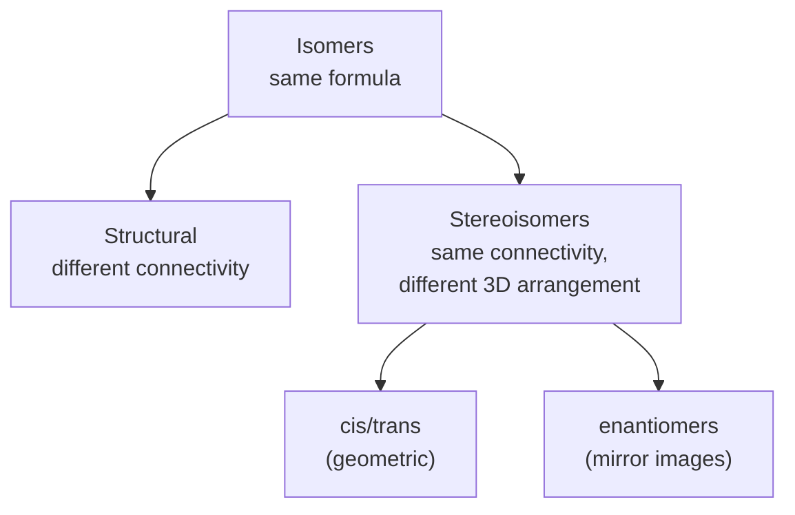

# Organic Chemistry

Organic chemistry is the chemistry of **carbon compounds**. From a handful of elements —
mostly carbon, hydrogen, oxygen, and nitrogen — it builds millions of molecules, including
every molecule of life. It is the bridge from the general principles of
[chemical bonding](chemical-bonding.md) to
[biochemistry and metabolism](../biology/biochemistry-and-metabolism.md) and the machinery
of [the cell](../biology/the-cell.md).

## Why carbon

Carbon's four valence electrons let it form **four covalent bonds**, and — uniquely among
the light elements — it bonds strongly to *itself*, chaining into stable long backbones,
rings, and branches (catenation). Those bonds are strong enough to be stable yet weak enough
to be made and broken under mild, biological conditions. Carbon also forms single, double,
and triple bonds, giving an enormous space of stable architectures from one element. This
combinatorial reach is why carbon, not silicon, is the scaffold of life.

## Functional groups

The insight that makes the millions of compounds tractable: reactivity is governed less by
the whole molecule than by small, recurring **functional groups**. Learn the group, and you
predict the chemistry regardless of the size of the attached carbon skeleton.

| Group | Formula | Family |
|---|---|---|
| Hydroxyl | –OH | alcohols |
| Carbonyl | C=O | aldehydes, ketones |
| Carboxyl | –COOH | carboxylic acids |
| Amino | –NH₂ | amines |
| Ester | –COO– | esters |
| Amide | –CONH– | amides (the peptide bond) |

The carboxyl group ties directly to [acids and bases](acids-and-bases.md) (it is a weak
acid), and the amide/peptide bond is the link that builds proteins.

## Isomers

**Isomers** are molecules with the same molecular formula but different arrangements — and
often dramatically different properties.

Stereochemistry matters intensely in biology: two enantiomers can smell different, or one
can be a medicine while its mirror image is inert or harmful, because biological receptors
are themselves chiral.

## Nomenclature basics

Systematic (IUPAC) names encode structure. The **root** gives the longest carbon chain
(meth-, eth-, prop-, but-, pent-, …), a **suffix** names the principal functional group
(-ane, -ene, -yne, -ol, -al, -one, -oic acid), and **prefixes** with locant numbers place
substituents. So *2-propanol* is a three-carbon chain with an –OH on the middle carbon. The
name is a compressed drawing.

## Major reaction types

Most organic transformations fall into a few families:

- **Substitution** — one atom or group replaces another (e.g. a halide displaced by a
  nucleophile). Common in alkanes and alkyl halides.
- **Addition** — atoms add across a double or triple bond, converting it to single bonds
  (e.g. hydrogenation of an alkene). Characteristic of unsaturated compounds.
- **Elimination** — the reverse of addition: a small molecule leaves and a double bond
  forms.

These are driven by the same energetics and rates as any reaction — see
[chemical kinetics](chemical-kinetics.md) and
[chemical thermodynamics](chemical-thermodynamics.md) — but organic chemists reason with
**mechanisms**: the step-by-step movement of electron pairs (curved arrows) from
electron-rich sites (nucleophiles) to electron-poor sites (electrophiles).

## Polymers

Small repeating units (**monomers**) link into giant chains (**polymers**). *Addition
polymers* form by adding across double bonds (polyethylene from ethylene); *condensation
polymers* form by joining groups with loss of a small molecule like water (nylon, polyester).
Nature runs the same play: proteins are condensation polymers of amino acids, nucleic acids
of nucleotides, and polysaccharides of sugars.

## The bridge to the molecules of life

Every major class of biomolecule is an organic compound built from these principles: a few
functional groups, chiral centers, and condensation polymerization produce proteins, lipids,
carbohydrates, and nucleic acids. Organic chemistry is thus the vocabulary in which
[biochemistry and metabolism](../biology/biochemistry-and-metabolism.md) and the workings of
[the cell](../biology/the-cell.md) are written.

## References

- [Clayden, *Organic Chemistry*](clayden-organic-chemistry.md)
- [Brown & LeMay, *Chemistry: The Central Science*](brown-lemay-chemistry-the-central-science.md)
