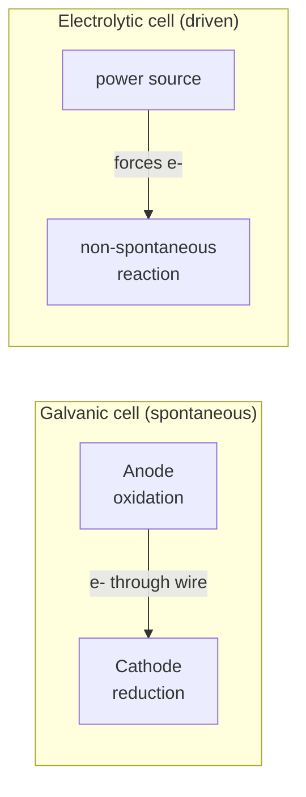

# Redox and Electrochemistry

Where [acid–base chemistry](acids-and-bases.md) moves protons, **redox chemistry moves
electrons**. Oxidation–reduction reactions are the transfer of electrons from one species
to another, and **electrochemistry** is the study of harnessing (or driving) that transfer
through an external circuit — the direct link between chemistry and the electron flow of
[electromagnetism](../physics/electromagnetism.md).

## Oxidation and reduction

Two half-processes always occur together — you cannot have one without the other:

- **Oxidation** — loss of electrons (oxidation state increases).
- **Reduction** — gain of electrons (oxidation state decreases).

A useful mnemonic: **OIL RIG** — *Oxidation Is Loss, Reduction Is Gain* (of electrons). The
species that gets oxidized is the **reducing agent** (it donates electrons); the species
reduced is the **oxidizing agent**. This is one of the fundamental categories of
[chemical reactions](chemical-reactions.md).

## Oxidation states

An **oxidation state** (oxidation number) is a bookkeeping charge assigned as if every bond
were fully ionic. The rules (free elements = 0; monatomic ion = its charge; O usually −2, H
usually +1; the sum equals the overall charge) let you track *which atoms lost or gained
electron density* even in covalent molecules. A change in oxidation state across a reaction
is the signature that redox occurred.

## Half-reactions

Splitting a redox reaction into two **half-reactions** — one oxidation, one reduction —
makes electron accounting explicit and is the basis of balancing. For example, zinc
displacing copper:

$$\text{Zn} \rightarrow \text{Zn}^{2+} + 2e^- \quad(\text{oxidation})$$
$$\text{Cu}^{2+} + 2e^- \rightarrow \text{Cu} \quad(\text{reduction})$$

Electrons produced by one half must be consumed by the other; balancing means matching the
electron count between them.

## Electrochemical cells

Physically separating the two half-reactions forces the electrons to travel through a wire —
a current we can use or supply.

- **Galvanic (voltaic) cell** — a *spontaneous* redox reaction ($\Delta G < 0$) drives
  electrons through the circuit, generating electrical energy. A battery is a galvanic cell.
- **Electrolytic cell** — an external power source *forces* a non-spontaneous reaction
  ($\Delta G > 0$), consuming electrical energy. Electroplating, aluminum smelting, and
  water electrolysis are examples.

In both, **oxidation occurs at the anode, reduction at the cathode** (mnemonic: *An Ox, Red
Cat*). A salt bridge keeps each half-cell electrically neutral.

## Cell potential

The **cell potential** (voltage, $E_{cell}$) measures the driving force for electron
transfer, tabulated as standard reduction potentials $E^\circ$. For a whole cell:

$$E^\circ_{cell} = E^\circ_{cathode} - E^\circ_{anode}$$

A positive $E^\circ_{cell}$ means the reaction is spontaneous as written, tying redox to
[chemical thermodynamics](chemical-thermodynamics.md) through $\Delta G^\circ = -nFE^\circ_{cell}$
(where n is moles of electrons and F is Faraday's constant). The **Nernst equation** extends
this to non-standard concentrations, connecting cell voltage back to
[chemical equilibrium](chemical-equilibrium.md): as a battery discharges toward equilibrium,
its voltage falls to zero (a dead battery is a cell at equilibrium).

## Batteries and corrosion

- **Batteries** package galvanic reactions for portable power — from the lead–acid car
  battery to lithium-ion cells, each chosen for a favorable $E_{cell}$ and rechargeability
  (recharging is running the cell electrolytically in reverse).
- **Corrosion** (e.g. iron rusting) is unwanted spontaneous redox: iron is oxidized by
  oxygen and water in an electrochemical process. Understanding it as a galvanic cell
  explains protective strategies — galvanizing (a sacrificial zinc anode) and cathodic
  protection deliberately oxidize a cheaper metal to spare the structural one.

Redox is also the engine of life: cellular respiration and photosynthesis are chains of
electron transfers, the reason this chemistry is inseparable from
[biochemistry and metabolism](../biology/biochemistry-and-metabolism.md).

## References

- [Brown & LeMay, *Chemistry: The Central Science*](brown-lemay-chemistry-the-central-science.md)
- [Atkins, *Physical Chemistry*](atkins-physical-chemistry.md)
