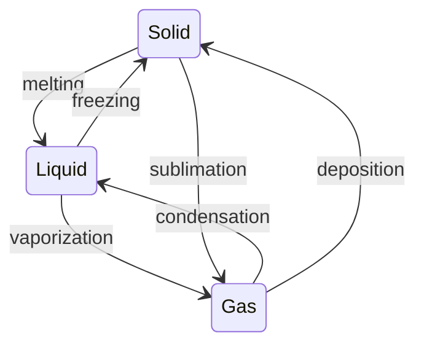

# States of Matter and Intermolecular Forces

Whether a substance is a solid, liquid, or gas at a given temperature is a contest between two
things: the **kinetic energy** of its particles (thermal jostling, which pulls them apart) and the
**intermolecular forces** holding them together. The same molecules that form strong internal
[chemical bonds](chemical-bonding.md) attract *one another* through weaker forces, and it is those
weaker forces — not the bonds inside each molecule — that decide bulk properties like boiling point,
viscosity, and surface tension.

## The states and phase transitions

- **Solid** — particles locked in fixed positions (ordered in a crystal, disordered in a glass);
  definite shape and volume.
- **Liquid** — particles touching but mobile; definite volume, no fixed shape.
- **Gas** — particles far apart and fast; fills its container, highly compressible.
- **Plasma** — a gas hot enough to ionize; charged particles respond to
  [electromagnetic fields](../physics/electromagnetism.md). Most of the visible universe.

Transitions between states are driven by temperature and pressure. Each transition absorbs or
releases **latent heat** at constant temperature while the forces are overcome or reformed — a
direct application of [thermodynamics](../physics/thermodynamics.md).



A **phase diagram** maps which state is stable at each temperature and pressure, with lines marking
transitions, a **triple point** where all three coexist, and a **critical point** beyond which
liquid and gas become indistinguishable.

## The ideal gas law

Gases are simple because their particles barely interact, so one equation captures them:

```
PV = nRT
```

pressure `P`, volume `V`, moles `n` (see [stoichiometry and the mole](stoichiometry-and-the-mole.md)),
gas constant `R`, temperature `T`. It assumes point particles with no intermolecular forces and no
volume — an idealization that holds well at low pressure and high temperature. Real gases deviate
precisely *because* of the intermolecular forces below; the van der Waals equation corrects for
molecular volume and attraction. Microscopically, the law is explained by the kinetic theory of
gases, a founding result of [statistical mechanics](../physics/statistical-mechanics-and-entropy.md):
temperature is proportional to average molecular kinetic energy.

## Intermolecular forces

From weakest to strongest, these forces determine how tightly molecules cling — and thus how much
heat it takes to separate them:

| Force | Origin | Present in |
|-------|--------|------------|
| **London dispersion** | fleeting, induced dipoles | *all* molecules; dominant in nonpolar ones |
| **Dipole–dipole** | permanent polar molecules aligning | polar molecules |
| **Hydrogen bonding** | H bonded to N, O, or F attracting a lone pair | water, alcohols, DNA, proteins |

All three are electrostatic in origin and far weaker than a covalent bond — but they are why matter
condenses at all. Their strength depends on **polarity** (set by
[electronegativity](chemical-bonding.md)) and on molecular size (bigger, more polarizable clouds give
stronger dispersion forces).

## How forces set bulk properties

Stronger intermolecular forces mean higher boiling and melting points, higher viscosity, and higher
surface tension. The textbook case is **water**: its extensive hydrogen bonding gives it an
anomalously high boiling point for such a small molecule, high surface tension, and the rare property
that its solid (ice) is *less* dense than its liquid — the hydrogen-bonded lattice is more open — so
ice floats. Life depends on these anomalies.

## Why it matters

Intermolecular forces bridge the molecular and the macroscopic: they explain why substances are solid
or liquid or gas at room temperature, why water behaves the way it does, how boiling and melting
points are predicted, and how gases can be treated with a single clean law. They connect
[bonding](chemical-bonding.md) to the observable properties of matter, and to the
[thermodynamics](../physics/thermodynamics.md) of phase change.

## References

- [Chemistry: The Central Science](brown-lemay-chemistry-the-central-science.md) — Brown & LeMay, states of matter and IMFs
- [General Chemistry](mcquarrie-general-chemistry.md) — McQuarrie
