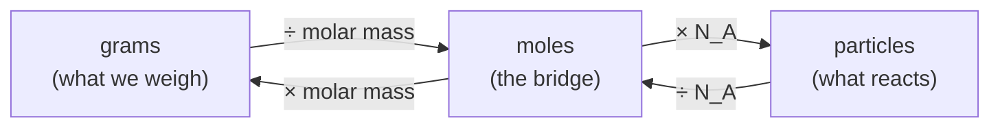

# Stoichiometry and the Mole

Chemistry happens one particle at a time — a molecule of methane meets two molecules of
oxygen — but we can only weigh matter in grams, never count atoms directly. Stoichiometry
is the bookkeeping that bridges that gap: it lets us translate between the countable world
of particles and the weighable world of the balance. The **mole** is the unit of the bridge.

## The mole and Avogadro's number

A mole is simply a count, like a dozen but enormous: one mole is
$N_A = 6.022 \times 10^{23}$ particles (**Avogadro's number**). This particular number is
chosen so that the mass of one mole of a substance in grams equals the mass of one of its
particles in unified atomic mass units. A carbon-12 atom has mass 12 u; one mole of carbon-12
weighs exactly 12 g. That is the whole point of the mole — it makes the periodic table's
atomic masses do double duty as gram-per-mole conversion factors.

Every stoichiometry problem is a walk across this diagram: convert what you measured
(grams, or volume × concentration, or gas volume) into moles, use the reaction to relate
moles of one species to moles of another, then convert back to whatever you want to report.

## Molar mass and formulas

**Molar mass** (g/mol) is the sum of the atomic masses of the atoms in a formula unit. Water
is $2(1.008) + 16.00 = 18.02$ g/mol. Two kinds of formula describe a compound:

- **Empirical formula** — the smallest whole-number *ratio* of atoms. Found from mass
  percent composition: convert each element's mass to moles, divide by the smallest, round
  to integers. Hydrogen peroxide's empirical formula is HO.
- **Molecular formula** — the *actual* count of atoms per molecule, an integer multiple of
  the empirical formula. You need the measured molar mass to find the multiplier. Hydrogen
  peroxide is H₂O₂.

## Balancing equations

A balanced chemical equation is a statement of conservation of mass and atoms: matter is
neither created nor destroyed, so every atom on the left reappears on the right. Balancing
means choosing coefficients so the atom counts match. For combustion of methane:

$$ \mathrm{CH_4 + 2\,O_2 \rightarrow CO_2 + 2\,H_2O} $$

The coefficients are the heart of stoichiometry: they are **mole ratios**. This equation says
1 mol CH₄ reacts with 2 mol O₂ to give 1 mol CO₂ and 2 mol H₂O — nothing about grams
directly, everything about counts. See [chemical-reactions.md](chemical-reactions.md) for the
reaction types these equations describe.

## Limiting reagent and yield

Reactants rarely arrive in the exact ratio the equation calls for. The **limiting reagent** is
the one that runs out first; it caps how much product can form, and the others are left in
**excess**. To find it, convert each reactant to moles, divide by its coefficient, and the
smallest result is the limiting one.

Yield closes the loop between prediction and reality:

- **Theoretical yield** — the maximum product the limiting reagent allows, from the mole
  ratios.
- **Actual yield** — what you actually recover (side reactions, losses, incomplete reaction).
- **Percent yield** — $\dfrac{\text{actual}}{\text{theoretical}} \times 100\%$, a measure of
  how cleanly the reaction ran.

## Why it matters

Stoichiometry is what makes chemistry *quantitative* rather than merely descriptive. It sizes
industrial reactors, doses medications, balances the redox half-reactions of a battery, and
tells a chemist how much starting material to weigh out. Every downstream quantitative
idea — the extent of a reaction at [equilibrium](chemical-equilibrium.md), the heat released
per mole in [thermodynamics](chemical-thermodynamics.md), the concentration terms in a
[rate law](chemical-kinetics.md) — is expressed in moles, and it is stoichiometry that puts
the moles there.

## References

- [Chemistry: The Central Science](brown-lemay-chemistry-the-central-science.md) — Brown & LeMay, the standard general-chemistry text
