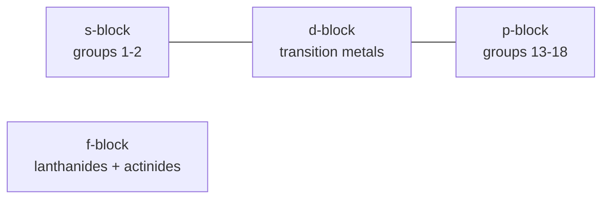

# The Periodic Table

The periodic table arranges the elements so that their chemical behavior repeats in a regular
pattern. Mendeleev (1869) built the first version by ordering elements by mass and noticing
recurring properties — he even left gaps and correctly predicted undiscovered elements. The
modern table orders by **atomic number** `Z` (proton count) and, crucially, we now know *why*
the periodicity exists: it mirrors the recurring pattern of **electron configuration** worked
out in [atomic structure](atomic-structure.md).

## How configuration builds the table

As `Z` increases, electrons fill orbitals in a fixed order. Every time a new valence shell begins
filling, a new **period** (row) starts; elements with the same valence configuration line up in
the same **group** (column) and behave similarly. The table's blocks map directly onto orbital
types:

- **s-block** (groups 1–2): filling an `s` subshell — reactive metals.
- **p-block** (groups 13–18): filling `p` — nonmetals, metalloids, and the noble gases with
  full shells.
- **d-block**: filling `d` — the transition metals.
- **f-block**: filling `f` — lanthanides and actinides, pulled out below the main body.

The table's odd shape (2, then 8, then 8, then 18, …) is just the capacities of the subshells
being filled: 2 for `s`, 6 for `p`, 10 for `d`, 14 for `f`.

## Periodic trends

Three trends drive most of chemistry, and all follow from two competing effects: increasing
nuclear charge pulls electrons in, while additional inner shells **shield** the outer electrons
and push them out.

| Trend | Across a period (→) | Down a group (↓) | Why |
|-------|--------------------|------------------|-----|
| **Atomic radius** | decreases | increases | more nuclear pull vs. more shells |
| **Ionization energy** | increases | decreases | harder to remove a tightly held electron |
| **Electronegativity** | increases | decreases | pull on *shared* bonding electrons |

- **Atomic radius** — how big the atom is. Left to right, growing nuclear charge with no new
  shell contracts the cloud; top to bottom, each new shell adds size.
- **Ionization energy** — the energy to strip off an electron. Peaks at the noble gases (stable
  full shells) and bottoms at the alkali metals (one loosely held valence electron).
- **Electronegativity** — an atom's pull on electrons *in a bond*. Fluorine is the highest;
  this trend governs bond polarity in [chemical bonding](chemical-bonding.md).

## Reading behavior off the table

Because valence configuration sets reactivity, position predicts chemistry: alkali metals (group
1) lose one electron readily; halogens (group 17) grab one; noble gases (group 18) are inert with
full shells. This lets you anticipate which [bonds](chemical-bonding.md) form and how an element
behaves in [reactions](chemical-reactions.md) without memorizing each element individually.

## Why it matters

The periodic table is chemistry's master reference chart: a single glance at an element's position
tells you its likely valence, the bonds it forms, and how its size, ionization energy, and
electronegativity compare to its neighbors. It turned a catalog of unrelated substances into a
predictive, quantum-grounded system.

## References

- [Chemistry: The Central Science](brown-lemay-chemistry-the-central-science.md) — Brown & LeMay, standard treatment of periodicity
- [General Chemistry](mcquarrie-general-chemistry.md) — McQuarrie
