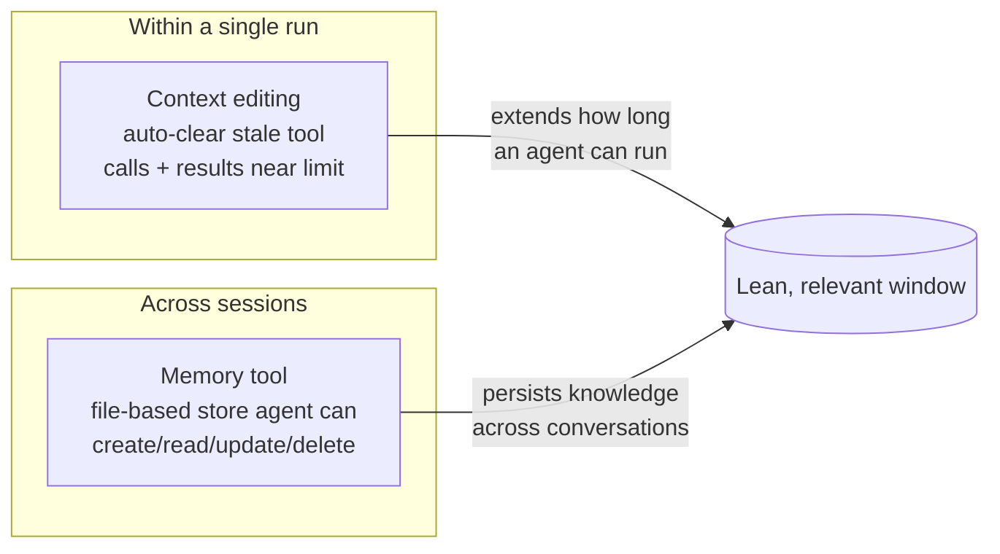

# Managing Context on the Claude Developer Platform

Anthropic's platform post introduces two primitives that make **context
management** a first-class capability rather than something each team hand-rolls:
**context editing** and the **memory tool**. The framing: context windows have
limits, but real work doesn't — production agents accumulate tool results and
either force developers to cut transcripts or accept degraded performance. These
two features address both sides.

## Context editing

Automatically **clears stale tool calls and results** from within the window as
the agent approaches token limits. As tool results accumulate, it removes the
stale content while preserving conversation flow — extending how long agents run
without manual intervention. A side benefit: clearing noise **raises effective
model performance**, because Claude focuses only on relevant context. (Anthropic
reports ~84% fewer tokens in a 100-turn evaluation.)

## The memory tool

Lets Claude **store and consult information outside the context window** via a
file-based system. Claude can create, read, update, and delete files in a
dedicated memory directory **stored in your infrastructure** that persists across
conversations. This lets agents build knowledge bases over time, maintain project
state across sessions, and reference previous learnings without keeping
everything in context.

## Why it matters

These are the platform-level versions of the techniques described in
[Effective context engineering
(Anthropic)](effective-context-engineering-anthropic.md) — compaction/editing to
*shed* stale context, and memory to *persist* what outlives a window — and they
directly implement the "shed what's no longer needed" half of
[context engineering](context-engineering.md). They also mirror what practitioners
like Dex Horthy build by hand in [No Vibes Allowed](no-vibes-allowed-dex-horthy.md).

## Related

- [Effective context engineering for AI agents (Anthropic)](effective-context-engineering-anthropic.md)
- [Context engineering](context-engineering.md)
- [No Vibes Allowed (Dex Horthy)](no-vibes-allowed-dex-horthy.md) — hand-rolled compaction and memory-on-disk.

## References
- [Managing context on the Claude Developer Platform — Claude by Anthropic](https://claude.com/blog/context-management)
