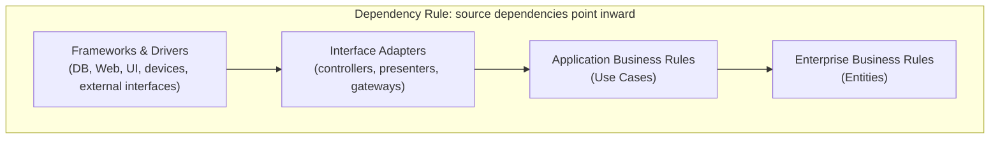

# Clean Architecture

Robert C. Martin's argument, distilled: the goal of software architecture is to
**minimize the human resources required to build and maintain a system**. Architecture is
not about frameworks, databases, or the web — those are details. It is about drawing the
lines (boundaries) that let you defer and change those details cheaply. Good architecture
maximizes the number of decisions *not* made, and keeps them reversible for as long as
possible.

The book builds up in three layers of scale: the SOLID principles (how to arrange
functions and classes), the component principles (how to group and couple those classes
into deployable units), and architecture (how components and boundaries form a whole
system).

## SOLID — arranging classes

Five principles for making mid-level structure tolerant of change:

- **SRP — Single Responsibility.** A module should have one, and only one, reason to
  change — meaning it answers to a single actor/stakeholder. It is about people, not about
  "doing one thing."
- **OCP — Open/Closed.** Software should be open for extension but closed for
  modification. New behavior is added by adding code, not editing existing code, achieved
  by arranging dependencies so that stable policy never depends on volatile detail.
- **LSP — Liskov Substitution.** Subtypes must be usable anywhere their base type is
  expected without breaking the contract. Violations force the caller to special-case
  behavior.
- **ISP — Interface Segregation.** Don't force clients to depend on methods they don't
  use; depending on things you don't need creates needless coupling and rebuilds.
- **DIP — Dependency Inversion.** Depend on abstractions, not concretions. Source-code
  dependencies should point toward high-level policy, never toward volatile
  implementations. This is the lever that makes the Dependency Rule below possible.

## Component principles

Once classes are sound, the next question is how to group them into components (the
smallest deployable units — jars, gems, DLLs).

**Cohesion — what goes together:**

- **REP (Reuse/Release Equivalence)** — the granule of reuse is the granule of release;
  components must be versioned and released as coherent, tracked units.
- **CCP (Common Closure)** — gather into one component the classes that change together for
  the same reasons; separate those that change at different times or for different reasons.
  (SRP restated at component scale.)
- **CRP (Common Reuse)** — classes and modules that are reused together belong together;
  don't force a component to depend on things it doesn't use.

These three pull against each other (the "tension triangle"): REP and CRP make components
larger/more inclusive; CCP splits them. Early in a project you weight for closure and
convenience; as it matures you weight for reuse.

**Coupling — how components relate:**

- **ADP (Acyclic Dependencies)** — the component dependency graph must be a DAG; no cycles.
  Break cycles with DIP or by extracting a new component.
- **SDP (Stable Dependencies)** — depend in the direction of stability; a component should
  only depend on components more stable than itself.
- **SAP (Stable Abstractions)** — a component should be as abstract as it is stable. Stable
  components should be abstract (interfaces/policy) so stability doesn't make them rigid;
  volatile components should be concrete.

## The Dependency Rule

The central rule of the concentric-circle model: **source-code dependencies must point
only inward**, toward higher-level, more stable policy. Nothing in an inner circle may
know anything about an outer circle. Data crossing a boundary is always in the form most
convenient for the inner circle. Control flow may cross outward at runtime, but the
compile-time dependency is inverted (via DIP) so the arrow still points in.

- **Entities** — enterprise-wide, most-general business rules; the least likely to change
  when something external changes.
- **Use Cases** — application-specific business rules that orchestrate entities; this is
  what the system *does*.
- **Interface Adapters** — convert data between the use-case form and the outer form
  (controllers, presenters, gateways).
- **Frameworks & Drivers** — the outermost details: the database, the web framework, the
  UI. All plug-ins to the business rules.

## Use cases at the center, details at the edge

Because use cases sit near the core, the business logic has no idea whether it is driven by
the web, a CLI, or a test, or whether it persists to Postgres or a flat file. The database
and the web are **delivery mechanisms** and **I/O details** — decisions to be deferred, not
foundations to be built on. This is the same intent as the ports-and-adapters model in
[hexagonal architecture and DDD](hexagonal-architecture-ddd.md): the domain at the center,
adapters at the boundary, dependencies inverted at the seam.

## Boundaries and keeping options open

Architecture is fundamentally about **boundaries** — the lines you draw and the decisions
you defer across them. A boundary lets you postpone and isolate a decision (which database,
which framework, which UI) so the choice can be made later and changed cheaply. The value
of the architecture is precisely the set of options it keeps open. Draw boundaries where
axes of change diverge; don't pay for boundaries you don't need yet, but leave the seams so
they can be inserted when the need appears.

## Screaming architecture

A system's top-level structure should **scream its intent** — its use cases — not its
framework. Looking at the directory layout of a health-care system should announce "health
care," not "Rails app" or "Spring app." Frameworks are tools to be kept at arm's length, not
architectures to be organized around. If the first thing you see is the framework, the
architecture is speaking for the wrong thing.

## Why it matters

Deferring decisions and inverting dependencies keeps behavior separate from structure, so
the parts that change for different reasons change independently — the same maintainability
payoff that makes code easy to change and safe to test. These ideas underpin the
test-first discipline in [the five practices of TDD](tdd-five-practices.md) and sit within
the broader pursuit of software craftsmanship in
[learning the craft](learning-the-craft.md).

## References

- [Clean Architecture — A Craftsman's Guide to Software Structure and Design (Robert C. Martin)](https://www.oreilly.com/library/view/clean-architecture-a/9780134494272/)
