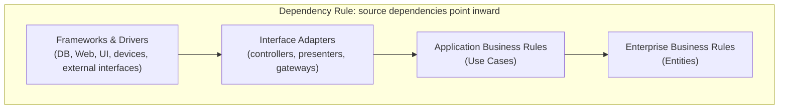

# Clean Architecture

Robert C. Martin (Uncle Bob) opens the book with a claim that reframes the whole
subject: **there is no difference between design and architecture** — only a difference
of scale. Both are about the shapes that let software be built and maintained cheaply.
The goal of software architecture, stated bluntly, is **to minimize the human effort
required to build and maintain the system**. Everything in the book serves that one end.

## A tale of two values

Every system delivers two values to its stakeholders: **behavior** (it does what the
requirements say) and **structure** (it stays soft — easy to change). Business people
always press for behavior, so structure loses the day-to-day fight. But behavior is the
*urgent* value while structure is the *important* one, and Martin frames the developer's
job as fighting for the architecture — because a system that works today but cannot be
changed tomorrow eventually costs more than it earns. This is the "Eisenhower matrix"
tension: never let the urgent crowd out the important.

The book builds in three scales: **SOLID** (arranging functions and classes),
**component principles** (grouping classes into releasable units), and **architecture**
(boundaries across the whole system).

## SOLID — arranging classes

Five mid-level principles that keep code tolerant of change:

- **SRP — Single Responsibility.** A module should have one reason to change, meaning it
  answers to **one actor / stakeholder**. It is about people who request changes, not
  about "doing one thing."
- **OCP — Open/Closed.** Open for extension, closed for modification: add behavior by
  adding code, not by editing working code. Achieved by arranging dependencies so stable
  high-level policy never depends on volatile detail.
- **LSP — Liskov Substitution.** Subtypes must be usable wherever their base type is
  expected without breaking the contract; violations force callers to special-case.
- **ISP — Interface Segregation.** Don't make clients depend on methods they don't use —
  needless dependencies cause needless coupling and rebuilds.
- **DIP — Dependency Inversion.** Depend on abstractions, not concretions. Source-code
  dependencies point toward stable, abstract policy. This is the lever that makes the
  Dependency Rule possible.

## Component principles

Once the classes are sound, how do you group them into **components** — the smallest
deployable, independently-releasable units (jars, gems, DLLs)?

**Cohesion — which classes belong in a component:**

- **REP (Reuse/Release Equivalence)** — the granule of reuse is the granule of release;
  a component must be a coherent, versioned, tracked whole.
- **CCP (Common Closure)** — gather classes that change together for the same reasons;
  separate those that change at different times. (SRP restated at component scale.)
- **CRP (Common Reuse)** — classes reused together belong together; don't force a
  component to carry things its users don't need.

REP and CRP make components larger; CCP splits them — the **tension triangle**. Young
projects weight for closure/convenience; mature ones shift toward reuse.

**Coupling — how components relate:**

- **ADP (Acyclic Dependencies)** — the dependency graph must be a DAG; no cycles. Break
  them with DIP or by extracting a new component.
- **SDP (Stable Dependencies)** — depend in the direction of stability; only depend on
  components more stable than you.
- **SAP (Stable Abstractions)** — a component should be as abstract as it is stable, so
  stability doesn't make it rigid. Stable → abstract; volatile → concrete.

## The Dependency Rule

The core of the concentric-circle model: **source-code dependencies point only inward**,
toward higher-level, more stable policy. Nothing in an inner circle knows anything about
an outer one. Data crossing a boundary is always in the form most convenient to the
inner circle. Control flow may pass outward at runtime, but the compile-time dependency
is inverted (DIP) so the arrow still points in.

- **Entities** — enterprise-wide business rules; least likely to change when something
  external changes.
- **Use Cases** — application-specific rules that orchestrate entities; what the system
  *does*.
- **Interface Adapters** — convert data between the use-case form and the outer form
  (controllers, presenters, gateways).
- **Frameworks & Drivers** — outermost details (database, web framework, UI); all
  plug-ins to the business rules.

## Use cases at the center, details at the edge

Because use cases sit near the core, the business logic has no idea whether it is driven
by the web, a CLI, or a test, nor whether it persists to a SQL database or a flat file.
**The database is a detail. The web is a detail.** They are delivery mechanisms and I/O,
decisions to defer rather than foundations to build on. This is the same intent as the
ports-and-adapters model — see
[Hexagonal Architecture (Ports & Adapters)](hexagonal-architecture-ports-and-adapters.md)
and [Hexagonal Architecture with DDD](hexagonal-architecture-ddd.md): the domain at the
center, adapters at the boundary, dependencies inverted at the seam. Clean Architecture
essentially prescribes the interior that Cockburn left open.

## Boundaries and keeping options open

Architecture is fundamentally about **boundaries** — the lines you draw and the decisions
you defer across them. A boundary lets you postpone and isolate a choice (which database,
which framework, which UI) so it can be made late and changed cheaply. The value of an
architecture is the set of options it keeps open. Draw boundaries where axes of change
diverge; don't pay for a boundary before you need it, but leave the seam so it can be
inserted when the need appears. A good architect **maximizes the number of decisions not
yet made**.

## Screaming architecture

The top-level structure of a system should **scream its intent** — its use cases — not
its framework. The directory layout of a health-care system should announce "health
care," not "Rails app" or "Spring app." Frameworks are tools to keep at arm's length, not
architectures to organize around; the framework is a detail you plug in, and coupling
your design to it is a trap (Martin devotes a chapter to "the framework is a detail" and
to not marrying the framework). If the first thing you see is the framework, the
architecture is speaking for the wrong thing.

## Why it matters

Deferring decisions and inverting dependencies keeps behavior separate from structure, so
parts that change for different reasons change independently — the maintainability payoff
that makes code easy to change and safe to test. These ideas underpin the test-first
discipline in [the five practices of TDD](tdd-five-practices.md) and sit inside the
broader pursuit of software craftsmanship in [learning the craft](learning-the-craft.md).

## References

- [Clean Architecture — A Craftsman's Guide to Software Structure and Design (Robert C. Martin)](https://www.oreilly.com/library/view/clean-architecture-a/9780134494272/)
