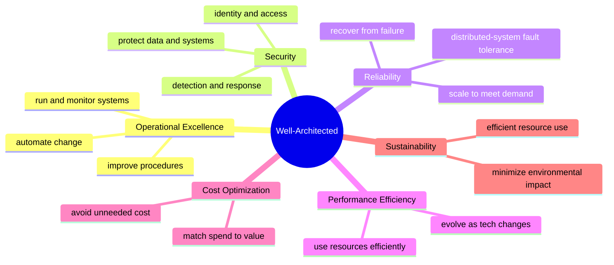

# AWS Well-Architected Framework

The AWS Well-Architected Framework is Amazon's published, prescriptive body of guidance
for evaluating and improving cloud architectures. It has become the de-facto reference
for cloud-architecture review across the industry, and its structure — a small set of
"pillars," each expanded into design principles and concrete best practices — has been
widely imitated by other cloud providers. The framework is vendor-specific in its
examples but the underlying reasoning generalizes well to any public cloud.

## The six pillars

The framework organizes architectural quality into six pillars. A good design is not one
that maximizes any single pillar but one that makes deliberate, documented trade-offs
among all of them for a given workload.

1. **Operational Excellence** — running and monitoring systems, automating change,
   responding to events, and continually refining procedures so daily operations deliver
   business value.
2. **Security** — protecting information, systems, and assets: identity and access
   management, data protection in transit and at rest, and detection/response controls.
   See [cloud-security-and-iam](cloud-security-and-iam.md).
3. **Reliability** — the ability of a workload to perform its function correctly and to
   recover from disruption: fault isolation, redundancy, and elastic scaling.
4. **Performance Efficiency** — using compute, storage, and networking resources
   efficiently and evolving the choice of resources as technology and demand change.
5. **Cost Optimization** — avoiding unnecessary spend and matching expenditure to the
   value delivered, exploiting the cloud's pay-as-you-go economics.
6. **Sustainability** — minimizing the environmental impact of running cloud workloads
   through efficient resource use and right-sizing.

## How it is used

The framework is more than a reading list. AWS ships **domain-specific lenses** (for
example, serverless, machine learning, or SaaS) that adapt the pillars to a particular
workload class, a library of **hands-on labs**, and the free **Well-Architected Tool** in
the AWS console that lets teams review a workload against the pillars, surface high-risk
issues, and track remediation over time. The intended cadence is a repeated review: a
workload is assessed, risks are recorded, improvements are made, and the review is run
again as the system evolves.

## Why it anchors cloud architecture

The pillars formalize the qualities that
[cloud-architecture-patterns](cloud-architecture-patterns.md) exist to achieve —
resilience, elasticity, and cost-efficiency are the outcomes those patterns target, and
the framework gives teams a shared vocabulary for reasoning about the trade-offs. The
security pillar in particular maps directly onto the identity, least-privilege, and data
protection concerns covered in [cloud-security-and-iam](cloud-security-and-iam.md). As an
operational practice — automate change, monitor everything, review continuously — the
framework overlaps heavily with the discipline described in
[../devops-sre/index.md](../devops-sre/index.md).

## References

- [AWS Well-Architected Framework](https://aws.amazon.com/architecture/well-architected/)
